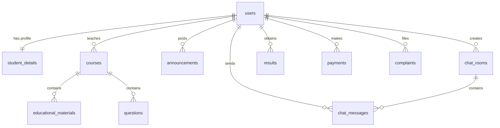

# 📊 تقرير التحليل الشامل لمشروع SASP (بوابة الطالب الأكاديمية الذكية)

## 🏫 الجامعة - UNIVERSITY

---

## 📌 مقدمة عن المشروع (Overview)

مشروع **SASP (Smart Academic Student Portal)** هو نظام أكاديمي متكامل مصمم لخدمة طلاب وأعضاء هيئة التدريس وإدارة الجامعة. يتكون المشروع من شقين أساسيين:

1. **تطبيق الهاتف المحمول (Flutter Mobile App):** تطبيق تفاعلي يدعم العمل بدون اتصال بالإنترنت (Offline-First) لتمكين الطلاب من تصفح المناهج، والكتب الصوتية، وحل الأسئلة، ومتابعة النتائج والمدفوعات والمحادثات مع المزامنة التلقائية فور الاتصال بالسيرفر.
2. **لوحة التحكم والموقع الخلفي (Laravel Web Dashboard & API):** لوحة تحكم كاملة مبنية بإطار العمل Laravel (الإصدار 11) لإدارة شؤون الطلاب، النتائج، المدفوعات، الشكاوى، الإعلانات، ورفع المناهج الدراسية، إلى جانب توفير منافذ RESTful API للمزامنة مع التطبيق.

---

## 🏗️ بنية ومعمارية النظام (System Architecture)

```mermaid
graph TD
    subgraph Mobile_App [تطبيق الهاتف المحمول (Flutter)]
        UI[واجهات المستخدم Flutter UI]
        Sync[خدمة المزامنة SyncService]
        SQLite[(قاعدة البيانات المحلية SQLite)]
    end

    subgraph Backend_Server [الخادم الخلفي ولوحة التحكم (Laravel)]
        API[بوابة الـ API المشتركة]
        AdminUI[لوحة تحكم الإدارة Blade UI]
        MySQL[(قاعدة بيانات MySQL الرئيسية)]
    end

    UI <--> SQLite
    UI <--> Sync
    Sync <-->|REST API / JSON| API
    API <--> MySQL
    AdminUI <--> MySQL
```

---

## 🗄️ هيكل قواعد البيانات والعلاقات (Database Schema)

يتطابق التصميم الهيكلي لقاعدة البيانات المحلية (SQLite) في التطبيق مع قاعدة البيانات المركزية (MySQL) لضمان موثوقية تبادل البيانات ومزامنتها. تتكون قاعدة البيانات من **18 جدولاً** مترابطاً:

### 📐 مخطط العلاقات الكيانية (Entity-Relationship Diagram)



### 📋 تفاصيل الجداول وحقول البيانات

| #      | الجدول                  | الغرض منه                                                          | الحقول الأساسية (Schema Columns)                                                                                                                                                                                            |
| ------ | ----------------------- | ------------------------------------------------------------------ | --------------------------------------------------------------------------------------------------------------------------------------------------------------------------------------------------------------------------- |
| **1**  | `settings`              | إعدادات النظام وتخصيص الاسم والشعار وعنوان الـ IP                  | `key` (PK), `value`                                                                                                                                                                                                         |
| **2**  | `users`                 | الحسابات والصلاحيات (طالب، دكتور، إدارة)                           | `id` (PK), `name`, `email`, `role`, `profile_picture`, `password`                                                                                                                                                           |
| **3**  | `student_details`       | بيانات الطلاب الأكاديمية (علاقة 1:1 مع المستخدمين)                 | `user_id` (PK/FK), `university_id` (Unique), `major`, `level`, `gpa`                                                                                                                                                        |
| **4**  | `courses`               | المواد والمقررات الدراسية                                          | `course_id` (PK), `title`, `description`, `doctor_id` (FK), `credit_hours`, `department`                                                                                                                                    |
| **5**  | `educational_materials` | الكتب الرقمية (PDF) والمحاضرات الصوتية                             | `material_id` (PK), `course_id` (FK), `title`, `type` (pdf/audio), `file_url`, `uploaded_at`, `academic_year`, `semester`, `department`, `description`, `file_path`, `file_size`, `narrator`, `duration`                    |
| **6**  | `questions`             | بنك الأسئلة للمواد الدراسية                                        | `question_id` (PK), `course_id` (FK), `question_text`, `options` (مفصولة بـ `;`), `correct_answer`                                                                                                                          |
| **7**  | `announcements`         | الإعلانات والأخبار الأكاديمية الجامعية                             | `announcement_id` (PK), `title`, `content`, `author_id` (FK), `date_posted`, `target_audience`                                                                                                                              |
| **8**  | `chat_rooms`            | قنوات المحادثة والمنتديات الدراسية                                 | `room_id` (PK), `title`, `type` (Forum/Group/Private), `created_by` (FK)                                                                                                                                                    |
| **9**  | `chat_messages`         | رسائل المحادثة داخل الغرف والمنتديات                               | `message_id` (PK), `room_id` (FK), `sender_id` (FK), `sender_name`, `message_text`, `timestamp`, `is_synced` (للتطبيق)                                                                                                      |
| **10** | `results`               | درجات الطلاب للفصول الدراسية                                       | `result_id` (PK), `student_id` (FK), `course_id` (FK), `course_title`, `grade`, `semester`                                                                                                                                  |
| **11** | `payments`              | سندات وقسائم المدفوعات والرسوم                                     | `payment_id` (PK), `student_id` (FK), `amount`, `payment_status` (Paid/Pending/Overdue), `payment_date`, `receipt_url`, `is_synced` (لالتطبيق)                                                                              |
| **12** | `complaints`            | الشكاوى والاقتراحات المقدمة من الطلاب                              | `complaint_id` (PK), `user_id` (FK), `subject`, `description`, `status` (Pending/Reviewed/Resolved), `submitted_at`, `is_synced` (للتطبيق)                                                                                  |
| **13** | `academic_tools`        | البرمجيات والتطبيقات الأكاديمية المفيدة للطلاب                     | `id` (PK), `name`, `description`, `image_url`, `theme_color`, `version`, `developer`, `category`, `academic_uses`                                                                                                           |
| **14** | `ai_tools`              | أدوات الذكاء الاصطناعي الأكاديمية المقترحة للتعلم                  | `id` (PK), `name`, `description`, `long_description`, `icon_name`, `theme_color`, `category`, `highlight1_title`, `highlight1_desc`, `highlight2_title`, `highlight2_desc`, `key_features`, `website_url`, `play_store_url` |
| **15** | `research_reports`      | أبحاث وتقارير التخرج المرفوعة من الطلاب للمراجعة                   | `id` (PK), `student_id` (FK), `student_name`, `title`, `department`, `file_url`, `status` (قيد المراجعة/مقبول/مرفوض), `feedback`, `created_at`                                                                              |
| **16** | `graduation_projects`   | مشاريع التخرج السابقة والجارية للقسم                               | `id` (PK), `title`, `description`, `students`, `supervisor`, `department`, `year`, `status`                                                                                                                                 |
| **17** | `home_items`            | عناصر وخدمات القائمة الرئيسية القابلة للتخصيص                      | `id` (PK), `title`, `icon`, `route`, `image_url`, `color`, `is_featured`, `sort_order`                                                                                                                                      |
| **18** | `curriculum_options`    | خيارات بوابات التعليم والمنهج (المكتبة، الكتب الصوتية، الاختبارات) | `id` (PK), `title`, `description`, `icon`, `color`, `route`, `button_text`, `button_icon`, `button_color`, `sort_order`                                                                                                     |

---

## 🔄 آلية المزامنة والعمل دون اتصال (Sync & Offline-First)

يتميز النظام بتكامل عالي يتيح للتطبيق العمل بالكامل دون اتصال بالإنترنت، وذلك عبر الخطوات التالية:

1. **تسجيل الدخول غير المتصل (Offline Login Cache):**
   عند تسجيل الدخول لأول مرة بالإنترنت، يتم حفظ التوكن وبيانات المستخدم في جدول `settings` المحلي. في حال انقطاع الشبكة لاحقاً، يتحقق التطبيق من البيانات المخزنة محلياً للسماح للمستخدم بالدخول للواجهات مباشرة.
2. **سحب البيانات الكاملة (Pull Snapshot - `/api/sync`):**
   يقوم السيرفر بتجميع كافة الجداول المرتبطة بالطالب والمقررات والمناهج الدراسية في ملف JSON واحد مضغوط عند طلب المزامنة، ليقوم التطبيق بتحديث الجداول المحلية دفعة واحدة باستخدام المعاملات (`Transactions`) والتبديل الآمن لمنع تداخل البيانات.
3. **دفع المسودات المحلية (Push Local Drafts):**
   عند قيام الطالب بإضافة (رسالة محادثة، شكوى جديدة، أو رفع إيصال دفع) أثناء انقطاع الإنترنت، يتم حفظها محلياً مع وسم `is_synced = 0`. بمجرد عودة الاتصال أو تحديث الصفحة يدوياً، يتم تجميعها وإرسالها عبر النقاط المخصصة:
   - `POST /api/sync/complaints`
   - `POST /api/sync/messages`
   - `POST /api/sync/payments`
     وعند نجاح العملية على السيرفر، يتم وسمها محلياً كـ `is_synced = 1`.

---

## 📂 الفهرس التفصيلي لملفات النظام (Project Files Tree)

### 📱 أولاً: تطبيق الهاتف المحمول (Flutter Project)

يتوزع منطق التطبيق البرمجي في المجلد `lib/` على النحو التالي:

- **`main.dart`**: نقطة البداية للمشروع، ويقوم بتهيئة الاتصال بقاعدة البيانات.
- **`app.dart`**: يحدد إعدادات التطبيق العامة، والثيم الافتراضي، وجدول المسارات (Routing Table) لجميع الشاشات.
- **📂 `theme/`**:
  - `app_theme.dart`: نظام الألوان والخطوط (Inter و Manrope) والتصميم البصري الموحد المتوافق مع Material 3.
- **📂 `core/`** (النواة والمشتركات):
  - 📂 `database/`:
    - `database_helper.dart`: المسؤول عن إنشاء قاعدة SQLite المحلية وترقية الجداول وإنجاز استعلامات الـ CRUD بالكامل.
  - 📂 `models/`: يحتوي على كلاسات النماذج البرمجية مع دوال التحويل من وإلى الخرائط JSON (اللازمة للـ API وقاعدة البيانات):
    - `user_model.dart`, `course_model.dart`, `material_model.dart`, `question_model.dart`, `announcement_model.dart`, `chat_model.dart`, `result_model.dart`, `payment_model.dart`, `complaint_model.dart`, `settings_model.dart`, `home_item_model.dart`.
  - 📂 `network/`:
    - `sync_service.dart`: محرك الاتصال بالسيرفر عبر Dio لإجراء تسجيل الدخول، واختبار الاتصال، ودفع وسحب البيانات.
  - 📂 `widgets/` (عناصر UI متكررة الاستخدام):
    - `top_app_bar.dart`: شريط العنوان العلوي التفاعلي (يعرض الاسم، وصورة الطالب ديناميكياً مع زر الإعدادات والـ IP).
    - `bottom_nav_bar.dart`: شريط التنقل السفلي المطور.
    - `navigation_drawer.dart`: القائمة الجانبية للتنقل السريع.
- **📂 `screens/`** (شاشات التطبيق):
  - 📂 `splash/`: `splash_screen1.dart` (شاشة ترحيبية متحركة).
  - 📂 `auth/`: `login_screen.dart` (شاشة تسجيل دخول الطالب مع واجهة لتعديل IP السيرفر ديناميكياً).
  - 📂 `home/`: `home_screen.dart` (الشاشة الرئيسية التفاعلية، تعرض إحصائيات المعدل والساعات التراكمية، الإعلانات الحية، والخدمات الرئيسية مع ميزة السحب للمزامنة).
  - 📂 `curriculum/` (بوابة المقررات):
    - `curriculum_options_screen.dart`: واجهة اختيار المسار (مكتبة، كتب صوتية، بنك أسئلة) مع عرض لآخر الأنشطة التفاعلية.
    - `books_pdf_screen.dart`: المكتبة الرقمية وقارئ الكتب PDF المدمج (يدعم تعديل حجم الخط والوضع الليلي).
    - `audio_books_screen.dart`: بوابة الكتب الصوتية مع مشغل صوتي مصغر عائم.
    - `questions_screen.dart`: بنك الأسئلة التفاعلي لإجراء الاختبارات الذاتية والحصول على تقرير الأداء المدعوم بالذكاء الاصطناعي التخيلي.
  - 📂 `chat/` (بوابة التواصل):
    - `chat_portal_screen.dart`: بوابة تجمع بين منتدى الطلاب وقناة الإعلانات الأكاديمية العامة.
    - `student_forum_screen.dart` / `academic_channel_screen.dart`: واجهات غرف الشات وإرسال واستقبال الرسائل.
  - 📂 `ai/` & `ai_tools/`:
    - `ai_portal_screen.dart` / `ai_tools_screens.dart`: بوابات خدمات الذكاء الاصطناعي الأكاديمي وعرض تفاصيل الأدوات.
  - 📂 `university/` (الخدمات الطلابية):
    - `university_portal_screen.dart`: واجهة شاملة لجميع الخدمات الجامعية.
    - `payments_portal_screen.dart`: متابعة الرسوم الدراسية ورفع إيصالات الدفع.
    - `complaints_portal_screen.dart`: إرسال ومتابعة حالة الشكاوى والاقتراحات.
    - `results_portal_screen.dart`: عرض كشف الدرجات التفصيلي والتقديرات لكل فصل دراسي.
  - 📂 `doctors/` / `programs/` / `research/` / `graduation/`:
    - شاشات تفاعلية تعرض الكوادر الطبية الأكاديمية، البرامج الدراسية، رفع تقارير الأبحاث، وعرض مشاريع التخرج.
  - 📂 `secondary/`:
    - `secondary_screens.dart`: شاشات الإعدادات، البروفايل، الدعم الفني، و شاشة تغيير عنوان الـ API.

---

### 💻 ثانياً: لوحة التحكم والخادم الخلفي (Laravel Project)

- 📂 **`app/Http/Controllers/`** (المتحكمات الرئيسية):
  - `AuthController.php`: معالجة تسجيل الدخول وعمليات تسجيل الخروج الخاصة بمدراء لوحة التحكم.
  - `DashboardController.php`: إدارة وتوجيه لوحة التحكم بالكامل، ويحتوي على وظائف الـ CRUD لإضافة وتعديل وحذف الطلاب، الدكاترة، النتائج، المدفوعات، الشكاوى، الكتب والمناهج، أدوات الذكاء الاصطناعي، مشاريع التخرج، وإعدادات النظام.
  - `ApiController.php`: يقدم الخدمات البرمجية لتطبيق الهاتف (التحقق من بيانات الدخول، جلب الإعدادات العامة، مزامنة قاعدة البيانات بالكامل عبر `/sync` وتلقي المرفوعات المحلية).
- 📂 **`app/Models/`** (نماذج البيانات وعلاقات Eloquent):
  - `User.php`, `StudentDetail.php`, `Course.php`, `EducationalMaterial.php`, `Question.php`, `Announcement.php`, `ChatRoom.php`, `ChatMessage.php`, `Result.php`, `Payment.php`, `Complaint.php`, `Setting.php`, `AcademicTool.php`, `AiTool.php`, `ResearchReport.php`, `GraduationProject.php`, `HomeItem.php`, `CurriculumOption.php`.
- 📂 **`database/migrations/`** (تأسيس قواعد البيانات):
  - ملفات Migrations التي تؤسس جداول قواعد البيانات (المستخدمين، تفاصيل الأكاديمية، الجداول المضافة للخدمات الإضافية مثل أدوات الذكاء الاصطناعي ومشاريع التخرج والمناهج والمناهج الدراسية المحدثة).
- 📂 **`database/seeders/`**:
  - `DatabaseSeeder.php`: يحتوي على بيانات التأسيس للطلاب التجريبيين والدكاترة والمواد والأسئلة لتبدأ لوحة التحكم والتطبيق بالعمل فوراً.
- 📂 **`routes/`**:
  - `web.php`: يحتوي على مسارات لوحة التحكم الخاصة بالإدارة (محمية بـ `auth`) بالإضافة إلى منافذ الـ API للجوّال تحت بادئة `api/` مستثناة من التحقق لـ CSRF في Laravel 11.
- 📂 **`resources/views/`** (واجهات لوحة التحكم - Blade Engine):
  - واجهات الإدارة لإدخال وعرض وتعديل ومراقبة كل جوانب النظام بشكل منسق وعصري.

---

## 🔑 بيانات الدخول التجريبية (Seeded Credentials)

لبدء الاختبار السريع للتطبيق ولوحة التحكم، تم استخدام البيانات التالية:

### 👤 1. الإدارة / مدير النظام (Admin Dashboard)

- **رابط لوحة التحكم:** [http://127.0.0.1:8000/dashboard](http://127.0.0.1:8000/dashboard)
- **البريد الإلكتروني:** `admin@university.edu.ye`
- **كلمة المرور:** `password`

### 🎓 2. الطالب التجريبي (Student Mobile App & Dashboard)

- **الاسم:** عبد الله صالح العواضي
- **البريد الإلكتروني:** `std.abdullah@university.edu.ye`
- **كلمة المرور:** `password`
- **الرقم الجامعي:** `202210145` (التخصص: هندسة برمجيات - المستوى الثالث - المعدل التراكمي: 3.84)

### 👨‍🏫 3. الدكتور التجريبي (Doctor Account)

- **الاسم:** د. أحمد علي عبد الرحمن
- **البريد الإلكتروني:** `dr.ahmed@university.edu.ye`
- **كلمة المرور:** `password`

---

## 🛠️ كيفية تشغيل المشروع والاتصال (Setup & Running)

### 1. تشغيل السيرفر الخلفي (Laravel Backend):

لتمكين هواتف التطبيق (أو المحاكي) من الاتصال، يجب تشغيل السيرفر ليستقبل الاتصالات من جميع عناوين الشبكة المحلية وليس المضيف المحلي فقط:

```bash
php artisan serve --host=0.0.0.0 --port=8000
```

### 2. ضبط اتصال التطبيق (API IP):

- عند فتح التطبيق، اضغط على **أيقونة الترس** في أعلى يمين شاشة تسجيل الدخول.
- أدخل عنوان الـ IP الخاص بحاسوبك الذي يعمل عليه السيرفر مضافاً إليه منفذ الـ API (مثال: `http://192.168.8.112:8000/api`).
- قم بإجراء اختبار الاتصال للتأكد من نجاحه، ثم احفظ الإعدادات لتستمتع بمزامنة حية وتامة للبيانات!
