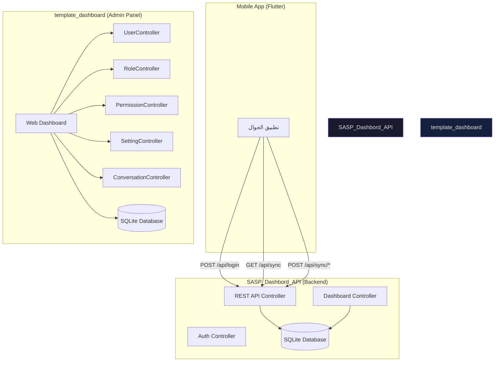
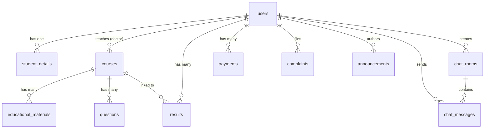
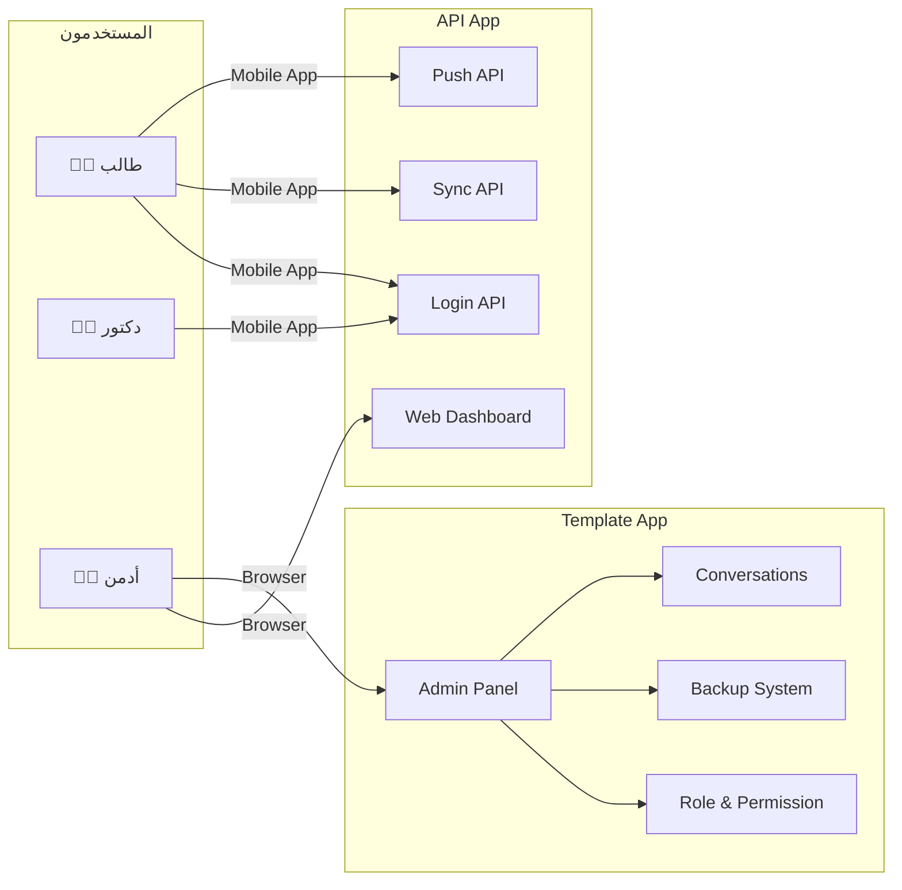

# 📊 تقرير تحليل مشروع SASP Dashboard
**تاريخ التحليل:** 21 يونيو 2026  
**المحلل:** Antigravity AI  
**المسار:** `d:\All My Project\GitHub_Project\GSP Projects\SASP\Dashbord`

---

## 1. 🗂️ نظرة عامة على المشروع

مشروع **SASP** هو نظام إدارة أكاديمي متكامل (Student Academic Support Platform) مبني بإطار عمل **Laravel 12**. يتكون المشروع من **تطبيقين رئيسيين** يعملان بشكل مستقل ولكن متكامل:

```
📁 Dashbord/                         ← المجلد الجذر (فارغ README.md)
├── 📁 SASP_Dashbord_API/            ← تطبيق الـ Backend + REST API
└── 📁 template_dashboard/           ← لوحة تحكم إدارية (Web Dashboard)
```

> [!IMPORTANT]
> ملف `README.md` الجذر **فارغ تماماً** ولا يحتوي على أي توثيق للمشروع. يُنصح بإضافة شرح للمشروع فيه.

---

## 2. 🏗️ المعمارية العامة للنظام



---

## 3. 📦 المشروع الأول: `SASP_Dashbord_API`

### 3.1 الغرض والوظيفة
هذا التطبيق يخدم **تطبيق الجوال (Mobile App)** وهو المصدر الرئيسي للبيانات. يقدم:
- **REST API** لتسجيل الدخول ومزامنة البيانات
- **لوحة تحكم ويب** لإدارة المحتوى الأكاديمي

### 3.2 التقنيات والمكتبات

| الحزمة | الإصدار | الوظيفة |
|--------|---------|---------|
| `laravel/framework` | ^12.0 | إطار العمل الأساسي |
| `laravel/tinker` | ^2.10.1 | أداة التفاعل مع DB |
| `php` | ^8.2 | لغة البرمجة |
| **Dev:** `fakerphp/faker` | ^1.23 | توليد بيانات وهمية |
| **Dev:** `phpunit/phpunit` | ^11.5.50 | الاختبارات |
| **Dev:** `laravel/sail` | ^1.41 | Docker environment |

> [!NOTE]
> التطبيق يعمل على **SQLite** كقاعدة بيانات محلية (مناسب للتطوير والاختبار). ملف `database.sqlite` موجود بحجم ~240KB.

### 3.3 هيكل التطبيق

```
SASP_Dashbord_API/
├── app/
│   ├── Http/
│   │   └── Controllers/
│   │       ├── ApiController.php        (286 سطر)
│   │       ├── AuthController.php       (53 سطر)
│   │       ├── DashboardController.php  (742 سطر)
│   │       └── Controller.php           (77 سطر)
│   ├── Models/                          (19 نموذج)
│   └── Providers/
├── database/
│   ├── migrations/                      (12 ملف migration)
│   └── database.sqlite
└── routes/
    └── web.php                          (94 سطر)
```

### 3.4 نماذج قاعدة البيانات (19 Model)

| # | النموذج | الجدول | الوصف |
|---|---------|--------|-------|
| 1 | `User` | `users` | المستخدمون (طلاب، دكاترة، أدمن) |
| 2 | `StudentDetail` | `student_details` | تفاصيل الطالب (الرقم الجامعي، التخصص، المستوى، GPA) |
| 3 | `Course` | `courses` | المقررات الدراسية |
| 4 | `EducationalMaterial` | `educational_materials` | المواد التعليمية (PDF, audio, video, link) |
| 5 | `Question` | `questions` | أسئلة الاختبارات |
| 6 | `Announcement` | `announcements` | الإعلانات (مع الصور) |
| 7 | `ChatRoom` | `chat_rooms` | غرف الدردشة |
| 8 | `ChatMessage` | `chat_messages` | رسائل الدردشة |
| 9 | `Result` | `results` | نتائج الطلاب والدرجات |
| 10 | `Payment` | `payments` | المدفوعات (Paid/Pending/Overdue) |
| 11 | `Complaint` | `complaints` | الشكاوى (Pending/Reviewed/Resolved) |
| 12 | `Setting` | `settings` | إعدادات التطبيق (key-value) |
| 13 | `AcademicTool` | `academic_tools` | الأدوات الأكاديمية |
| 14 | `AiTool` | `ai_tools` | أدوات الذكاء الاصطناعي |
| 15 | `GraduationProject` | `graduation_projects` | مشاريع التخرج |
| 16 | `GraduationTask` | `graduation_tasks` | مهام التخرج |
| 17 | `ResearchReport` | `research_reports` | التقارير البحثية |
| 18 | `HomeItem` | `home_items` | عناصر الصفحة الرئيسية |
| 19 | `CurriculumOption` | `curriculum_options` | خيارات المنهج الدراسي |

### 3.5 علاقات قاعدة البيانات



### 3.6 REST API Endpoints

#### مسارات المصادقة والبيانات
| Method | Endpoint | Controller | الوصف |
|--------|----------|-----------|-------|
| `POST` | `/api/login` | `ApiController@login` | تسجيل الدخول (بريد أو رقم جامعي) |
| `GET` | `/api/settings` | `ApiController@settings` | جلب إعدادات التطبيق |
| `GET` | `/api/sync` | `ApiController@sync` | مزامنة كاملة للبيانات |

#### مسارات رفع البيانات (Offline Sync)
| Method | Endpoint | Controller | الوصف |
|--------|----------|-----------|-------|
| `POST` | `/api/sync/complaints` | `ApiController@pushComplaints` | رفع الشكاوى المُنشأة أوفلاين |
| `POST` | `/api/sync/messages` | `ApiController@pushMessages` | رفع رسائل الدردشة |
| `POST` | `/api/sync/payments` | `ApiController@pushPayments` | رفع المدفوعات |
| `POST` | `/api/sync/reports` | `ApiController@pushReports` | رفع التقارير البحثية |

#### مسارات لوحة التحكم (محمية بـ Auth Middleware)
| المجموعة | المسارات |
|---------|---------|
| **الرئيسية** | `GET /dashboard` |
| **الطلاب** | `GET/POST /dashboard/students`, `DELETE /dashboard/students/{id}` |
| **النتائج** | `GET/POST /dashboard/results` |
| **الشكاوى** | `GET /dashboard/complaints`, `POST /dashboard/complaints/{id}/resolve` |
| **المدفوعات** | `GET /dashboard/payments`, `POST /dashboard/payments/{id}/approve` |
| **الإعلانات** | `GET/POST/PUT/DELETE /dashboard/announcements` |
| **الدكاترة** | `GET/POST /dashboard/doctors`, `DELETE /dashboard/doctors/{id}` |
| **المواد** | `GET/POST/PUT/DELETE /dashboard/materials` |
| **البرامج** | `GET/POST /dashboard/programs`, `DELETE /dashboard/programs/{id}` |
| **أدوات AI** | `GET/POST /dashboard/ai-tools`, `DELETE /dashboard/ai-tools/{id}` |
| **التخرج** | `GET/POST/DELETE /dashboard/graduation/*` |
| **الإعدادات** | `GET/POST /dashboard/settings` |

### 3.7 نقاط مهمة في `DashboardController` (742 سطر)

هذا أكبر ملف في المشروع ويتضمن **13 وحدة وظيفية**:

1. **إحصائيات الداشبورد** - عدد الطلاب، الدكاترة، المقررات، المواد، المدفوعات، الشكاوى
2. **إدارة الطلاب** - إضافة/حذف طالب مع تفاصيل الجامعة
3. **إدارة النتائج** - رصد الدرجات وربطها بالمقررات
4. **إدارة الشكاوى** - عرض وحل الشكاوى
5. **إدارة المدفوعات** - الموافقة على الدفعات
6. **الإعدادات** - اسم وشعار التطبيق (قابل للتعديل ديناميكياً)
7. **الإعلانات** - إنشاء/تعديل/حذف مع دعم الصور
8. **إدارة الدكاترة** - إضافة/حذف دكتور
9. **المواد التعليمية** - رفع PDF/audio/video/link مع إدارة ملفات التخزين
10. **البرامج الأكاديمية** - أدوات الأكاديمية مع صور
11. **أدوات الذكاء الاصطناعي** - إضافة/حذف
12. **مشاريع التخرج** - إدارة المشاريع والمهام
13. **مراجعة التقارير البحثية** - قبول/رفض/تعديل

### 3.8 نظام المصادقة في API

```php
// دعم تسجيل الدخول بـ:
// 1. البريد الإلكتروني (للأدمن والدكاترة)
// 2. الرقم الجامعي الرقمي (للطلاب)
$token = 'sasp_token_' . md5($user->id . 'salt');
```

> [!WARNING]
> **ملاحظة أمنية:** التوكن المُنشأ باستخدام `md5()` غير آمن بما يكفي للإنتاج. يُنصح باستخدام `Laravel Sanctum` أو `Laravel Passport` لإنشاء توكنات آمنة.

---

## 4. 🎨 المشروع الثاني: `template_dashboard`

### 4.1 الغرض والوظيفة
هذا تطبيق **لوحة تحكم إدارية متكاملة** للمشرفين ومديري النظام. يتميز بـ:
- نظام صلاحيات متقدم (Roles & Permissions)
- دعم تعدد اللغات (Multi-locale)
- نظام نسخ احتياطية (Backup)
- نظام إشعارات
- نظام رسائل داخلية
- نظام المحادثات

### 4.2 التقنيات والمكتبات (أكثر تقدماً)

| الحزمة | الإصدار | الوظيفة |
|--------|---------|---------|
| `laravel/framework` | ^12.0 | إطار العمل |
| `spatie/laravel-permission` | ^6.17 | نظام الأدوار والصلاحيات |
| `spatie/laravel-activitylog` | ^4.10 | سجل الأنشطة |
| `spatie/laravel-backup` | ^9.3 | النسخ الاحتياطي |
| `laravel/sanctum` | ^4.0 | مصادقة API |
| `laravel/socialite` | ^5.19 | تسجيل الدخول الاجتماعي |
| `socialiteproviders/facebook` | ^4.1 | تسجيل بـ Facebook |
| `socialiteproviders/google` | ^4.1 | تسجيل بـ Google |
| `mcamara/laravel-localization` | ^2.3 | تعدد اللغات |
| `maatwebsite/excel` | ^3.1 | استيراد/تصدير Excel |
| `intervention/image` | ^3.11 | معالجة الصور |
| `picqer/php-barcode-generator` | ^3.2 | توليد الباركود |
| `doctrine/dbal` | ^4.2 | إدارة قاعدة البيانات |
| **Dev:** `laravel/breeze` | ^2.3 | Starter Kit للمصادقة |
| **Frontend:** `tailwindcss` | — | إطار CSS |

### 4.3 هيكل التطبيق

```
template_dashboard/
├── app/
│   ├── Console/                     ← أوامر Artisan المخصصة
│   ├── Exports/                     ← تصدير ملفات Excel
│   ├── Helpers/                     ← دوال مساعدة
│   ├── Http/
│   │   ├── Controllers/
│   │   │   ├── Admin/
│   │   │   │   ├── DashboardController.php     (53 سطر)
│   │   │   │   ├── ConversationController.php  (6,476 بايت)
│   │   │   │   ├── NotificationController.php  (7,067 بايت)
│   │   │   │   └── SettingController.php       (5,491 بايت)
│   │   │   ├── Auth/
│   │   │   ├── MessageController.php           (2,061 سطر)
│   │   │   ├── PermissionController.php        (3,918 بايت)
│   │   │   ├── ProfileController.php           (2,074 بايت)
│   │   │   ├── RoleController.php              (5,970 بايت)
│   │   │   ├── ThemeController.php             (307 بايت)
│   │   │   ├── UserController.php              (10,741 بايت)
│   │   │   └── UserProfileController.php       (2,220 بايت)
│   │   ├── Kernel.php               (2,018 بايت)
│   │   ├── Middleware/
│   │   ├── Requests/
│   │   └── View/
│   ├── Mail/                        ← إرسال البريد الإلكتروني
│   ├── Models/                      (8 نماذج)
│   ├── Notifications/               ← الإشعارات
│   ├── Policies/                    ← سياسات الوصول
│   ├── Providers/
│   └── View/
├── resources/
│   ├── views/
│   │   ├── admin/
│   │   │   ├── home.blade.php       (10,348 بايت) ← الصفحة الرئيسية
│   │   │   ├── conversations/       ← المحادثات
│   │   │   ├── messages/            ← الرسائل
│   │   │   ├── notifications/       ← الإشعارات
│   │   │   ├── role-permission/     ← إدارة الأدوار
│   │   │   ├── settings/            ← الإعدادات
│   │   │   └── partials/
│   │   ├── auth/
│   │   ├── components/
│   │   ├── layouts/
│   │   └── user/
│   ├── css/
│   └── js/
├── routes/
│   ├── web.php                      (6,038 بايت - 86 سطر)
│   └── auth.php
└── lang/                            ← ملفات الترجمة
```

### 4.4 نماذج قاعدة البيانات (8 نماذج)

| النموذج | الوصف |
|---------|-------|
| `User` | المستخدمون مع SoftDelete والأدوار |
| `Role` | أدوار المستخدمين (Spatie) |
| `Permission` | الصلاحيات (Spatie) |
| `Setting` | إعدادات النظام |
| `Conversation` | المحادثات بين المستخدمين |
| `ConversationParticipant` | المشاركون في المحادثة |
| `Message` | الرسائل |
| `Variant` | متغيرات النظام |

### 4.5 نظام المسارات (Routes)

**الميزة الرئيسية:** جميع المسارات محاطة بـ `LaravelLocalization` لدعم تعدد اللغات:

```php
Route::group([
    'prefix' => LaravelLocalization::setLocale(),
    'middleware' => ['auth', 'localeSessionRedirect', 'localizationRedirect']
], function () { ... });
```

| المجموعة | المسارات المتاحة |
|---------|----------------|
| **الصلاحيات** | CRUD كامل + حذف |
| **الأدوار** | CRUD كامل + إضافة صلاحيات للدور |
| **المستخدمون** | CRUD كامل + SoftDelete + Restore + ForceDelete + Trashed |
| **الإعدادات** | عرض/تعديل + النسخ الاحتياطي (إنشاء/تحميل/حذف) |
| **الإشعارات** | عرض + تحديد كمقروء/غير مقروء + حذف |
| **المحادثات** | Resource كامل (ما عدا edit/update) |
| **الملف الشخصي** | تعديل الملف + تغيير كلمة المرور |
| **الثيم** | تحديث المظهر |
| **الرسائل** | عرض + إنشاء + عرض رسالة + تحديد كمقروء + أرشفة |

### 4.6 نظام إدارة المستخدمين المتقدم (`UserController`)

يتميز بـ:
- **معالجة الصور:** تحجيم تلقائي (770×513 للأصلية، 400×210 للمصغرة) باستخدام Intervention Image
- **SoftDelete:** حذف مؤقت مع إمكانية الاستعادة
- **ForceDelete:** حذف نهائي مع حذف الصور من التخزين
- **نظام الأدوار:** ربط المستخدمين بأدوار Spatie
- **Middleware للصلاحيات:** كل عملية محمية بصلاحية محددة

### 4.7 نظام المصادقة

يستخدم `Laravel Sanctum` + `Socialite` مع دعم:
- تسجيل الدخول التقليدي
- تسجيل الدخول بـ Google
- تسجيل الدخول بـ Facebook

---

## 5. 🔍 مقارنة بين المشروعين

| الجانب | `SASP_Dashbord_API` | `template_dashboard` |
|--------|---------------------|---------------------|
| **الغرض** | Backend للجوال + واجهة إدارة | لوحة تحكم ويب متقدمة |
| **عدد النماذج** | 19 نموذج | 8 نماذج |
| **CSS Framework** | غير محدد | TailwindCSS |
| **نظام الصلاحيات** | بسيط (role column) | Spatie (متقدم) |
| **المصادقة** | MD5 Token (بسيط) | Sanctum + Socialite |
| **التوطين** | غير مدعوم | LaravelLocalization |
| **النسخ الاحتياطي** | غير مدعوم | Spatie Backup |
| **معالجة الصور** | storage() مباشر | Intervention Image |
| **حجم composer.lock** | 310 KB | 384 KB |
| **migrations** | 12 ملف | غير محدد |
| **SoftDelete** | غير مدعوم | مدعوم للمستخدمين |

---

## 6. 📋 تحليل Migrations قاعدة البيانات

| ملف Migration | تاريخ الإنشاء | الجداول المُنشأة |
|--------------|--------------|----------------|
| `create_users_table` | الأساسي | users |
| `create_cache_table` | الأساسي | cache |
| `create_jobs_table` | الأساسي | jobs |
| `create_academy_tables` | 14 يونيو 2026 | settings, student_details, courses, educational_materials, questions, announcements, chat_rooms, chat_messages, results, payments, complaints |
| `create_extended_content_tables` | 14 يونيو 2026 | academic_tools, ai_tools, graduation_projects, research_reports |
| `create_home_items_table` | 15 يونيو 2026 | home_items |
| `create_curriculum_options_table` | 15 يونيو 2026 | curriculum_options |
| `enhance_educational_materials` | 16 يونيو 2026 | إضافة حقول للمواد |
| `add_image_to_educational_materials` | 17 يونيو 2026 | حقل الصورة للمواد |
| `add_image_to_announcements` | 17 يونيو 2026 | حقل الصورة للإعلانات |
| `add_image_extension_to_announcements` | 17 يونيو 2026 | حقل امتداد الصورة |
| `create_graduation_tasks_table` | 20 يونيو 2026 | graduation_tasks |

> [!NOTE]
> **المشروع نشط:** تطور سريع خلال أسبوع (14-20 يونيو 2026) مع إضافة مستمرة للميزات.

---

## 7. 💡 نقاط القوة

1. **فصل واضح للمسؤوليات:** كل تطبيق له غرض محدد
2. **API مدروس للجوال:** دعم المزامنة الكاملة والمزامنة الجزئية (Offline First)
3. **تحليل الأدوار في API:** البيانات تُفلتر حسب دور المستخدم (Student/Doctor/Admin)
4. **نظام صلاحيات متقدم في Template:** Spatie يوفر مرونة كاملة
5. **إدارة الملفات:** حذف تلقائي عند تحديث/حذف السجلات
6. **دعم أنواع متعددة من المواد:** PDF, Audio, Video, Links
7. **إعدادات ديناميكية:** اسم وشعار التطبيق قابل للتعديل من الإدارة

---

## 8. ⚠️ الملاحظات والمشاكل المحتملة

### 🔴 حرجة
| # | المشكلة | الملف |
|---|---------|-------|
| 1 | **توكن MD5 غير آمن** - يُفضل Laravel Sanctum | `ApiController.php:51` |
| 2 | **`/api/sync` بلا مصادقة** - يجب إضافة middleware | `web.php:83-93` |
| 3 | **لا تحقق من التوكن في Sync** - يُرسل user_id بدون التحقق من صحة الطلب | `ApiController.php:97` |

### 🟡 تحذيرات
| # | المشكلة | الملف |
|---|---------|-------|
| 4 | **`DashboardController` ضخم جداً** (742 سطر) - يجب تقسيمه | `DashboardController.php` |
| 5 | **إضافة كلمة مرور مشفرة بـ MD5** للروابط عشوائية للأدوات | `ApiController.php` |
| 6 | **README.md الجذر فارغ** - لا توثيق للمشروع | `README.md` |
| 7 | **`courses` table تفتقد حقل `department`** في migration الأصلي - أُضيف لاحقاً | Migrations |
| 8 | **صورة افتراضية من Unsplash** - يعتمد على URL خارجي | `DashboardController.php:64` |

### 🟢 تحسينات مقترحة
| # | التحسين |
|---|---------|
| 9 | تقسيم `DashboardController` إلى Controllers متخصصة |
| 10 | إضافة `API Rate Limiting` لحماية endpoints |
| 11 | استخدام `Laravel Sanctum` للتوكنات |
| 12 | إضافة `Swagger/OpenAPI` لتوثيق الـ API |
| 13 | إضافة `PHPDoc` للدوال |
| 14 | توحيد قاعدة البيانات بين المشروعين (أو استخدام MySQL بدلاً من SQLite) |

---

## 9. 📊 إحصائيات المشروع

| المقياس | القيمة |
|---------|-------|
| **إجمالي الـ Controllers** | 17 controller |
| **إجمالي الـ Models** | 27 نموذج |
| **إجمالي الـ Migrations** | 12+ ملف |
| **إجمالي API Endpoints** | ~35 endpoint |
| **إجمالي Web Routes** | ~50 route |
| **حجم أكبر ملف** | 742 سطر (DashboardController) |
| **لغات البرمجة** | PHP 8.2, JavaScript |
| **قواعد البيانات** | SQLite (للتطوير) |
| **إطار CSS (Template)** | TailwindCSS |
| **بيئة التطوير** | http://blog.yemcode.com (Template) |

---

## 10. 🗺️ خريطة التكامل بين المشروعين



---

## 11. 🔧 متطلبات تشغيل المشروع

### `SASP_Dashbord_API`
```bash
git clone [repo]
cd SASP_Dashbord_API
composer install
cp .env.example .env
php artisan key:generate
php artisan migrate
php artisan serve
```

### `template_dashboard`
```bash
cd template_dashboard
composer install
npm install
cp .env.example .env
php artisan key:generate
php artisan migrate
npm run dev
php artisan serve
```

---

## 12. ✅ الخلاصة والتوصيات

### الخلاصة
مشروع **SASP** هو منظومة أكاديمية متكاملة تضم:
- **Backend API** غني بالوظائف يخدم تطبيق جوال مع دعم Offline Sync
- **لوحة تحكم إدارية** متقدمة بنظام أدوار وصلاحيات احترافي

المشروع **في مرحلة تطوير نشطة** (تطور ملحوظ خلال أسبوع واحد فقط) ويُظهر بنية معمارية جيدة لكنه يحتاج بعض التحسينات الأمنية.

### أبرز التوصيات
1. **🔐 الأولوية القصوى:** استبدال MD5 token بـ Laravel Sanctum
2. **🔐 الثانية:** إضافة middleware مصادقة لجميع API routes
3. **📚 التوثيق:** إضافة README.md وتوثيق API
4. **🏗️ الكود:** تقسيم DashboardController
5. **🗄️ قاعدة البيانات:** التحضير للانتقال إلى MySQL في الإنتاج

---
*تم إنشاء هذا التقرير بواسطة Antigravity AI بتاريخ 21 يونيو 2026*
