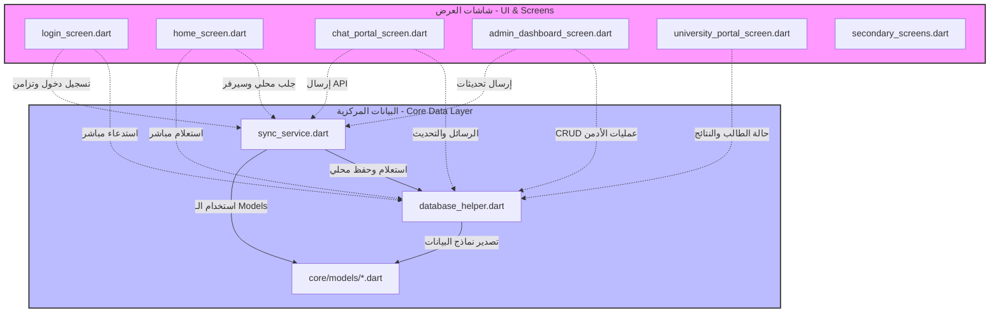
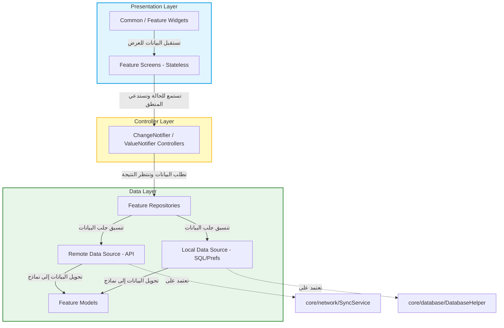

# تقرير التحليل المعماري وخطة العمل لإعادة الهيكلة (Refactoring Plan)
## تطبيق SASP - بوابة الطالب الأكاديمية الذكية (Smart Academic Student Portal)

مرحباً بك. بصفتي خبيراً في معمارية البرمجيات ومطور Flutter محترف، قمت بإجراء تحليل شامل للمشروع الحالي. يهدف هذا التقرير إلى تشخيص المشاكل المعمارية وتوضيح الملفات الضخمة ورسم خريطة الاعتمادية الحالية والمستقبلية، وتقديم خطة عمل تفصيلية لإعادة الهيكلة بنظام **Feature-First Clean Architecture**.

---

## 1. المشاكل المعمارية الحالية (Architectural Issues)

أظهر التحليل عدة نقاط ضعف في التصميم الحالي تعيق الصيانة، التوسع، واختبار التطبيق (Testing):

1. **غياب فصل المهام (Lack of Separation of Concerns)**:
   - تتصل شاشات العرض (UI) مباشرة بطبقة البيانات والشبكة عبر استدعاءات `DatabaseHelper.instance` و `SyncService.instance`.
   - يتم معالجة طلبات الـ HTTP والـ SQLite، معالجة الاستثناءات (Error Handling)، والتوجيه (Navigation) وإدارة الحالات المحلية (`setState`) داخل ملفات الـ UI نفسها.
2. **الملفات العملاقة والمكدسة (Monster Files)**:
   - تم جمع شاشات كاملة وغير مترابطة في ملف واحد. على سبيل المثال:
     - ملف `secondary_screens.dart` يحتوي على شاشات: الملف الشخصي (Profile)، الإعدادات (Settings)، الدعم الفني، وعن التطبيق، وصفحة الويب!
     - ملف `admin_dashboard_screen.dart` يحتوي على لوحة تحكم الأدمن بالكامل بجميع أقسام الطلاب والدكاترة والنتائج والإعلانات والشكاوى!
     - ملف `doctors_chat_screen.dart` يحتوي على نماذج البيانات الخاصة بالمحادثة والصفحة العامة والصفحة الخاصة للدردشة.
3. **عدم وجود طبقة موحدة لإدارة الحالة (State Management)**:
   - يعتمد التطبيق بالكامل على `StatefulWidget` و `setState`. هذا يجعل كود الـ Widget طويلاً ومعقداً وصعب القراءة ويحمل عبء إدارة منطق العمل (Business Logic) وتحديث الواجهات معاً.
4. **استخدام الاستيراد النسبي (Relative Imports)**:
   - استخدام استيرادات مثل `../../core/database/database_helper.dart` يؤدي إلى صعوبة نقل الملفات مستقبلاً ويزيد من احتمالية حدوث اعتماديات دائرية (Circular Dependencies).
5. **انتهاك مبادئ SOLID**:
   - **مبدأ المسؤولية الواحدة (SRP)**: شاشة واحدة مثل `LoginScreen` مسؤولة عن رسم الواجهة، والتحقق من المدخلات، وحفظ البيانات في `SharedPreferences` محلياً، والتواصل مع بيومترية الهاتف، والاتصال بالـ API.
   - **مبدأ عكس الاعتمادية (DIP)**: الشاشات تعتمد بشكل مباشر على كائنات ملموسة (Concrete Implementations) مثل `SyncService` بدلاً من الاعتماد على تجريدات (Interfaces/Abstract Repositories).

---

## 2. إحصائية الملفات الضخمة (التي تتجاوز 300 سطر)

تم مسح الملفات البرمجية وحصر كافة الملفات التي تتجاوز الـ 300 سطر والمليئة بالمنطق المتداخل:

| اسم الملف والمسار الحالي | عدد الأسطر | المكونات/الشاشات المحتواة | المشكلة البرمجية |
| :--- | :---: | :--- | :--- |
| [secondary_screens.dart](file:///d:/All%20My%20Project/GitHub_Project/GSP%20Projects/SASP/Dashbord/SASP_App_API/lib/screens/secondary/secondary_screens.dart) | **2251** | `AboutScreen`, `SupportScreen`, `SupportDetailsScreen`, `ProfileScreen`, `SettingsScreen`, `DashboardWebScreen` | ملف عملاق يجمع 6 شاشات مستقلة تماماً مع منطق تغيير المظهر (Theme) والتنقل. |
| [admin_dashboard_screen.dart](file:///d:/All%20My%20Project/GitHub_Project/GSP%20Projects/SASP/Dashbord/SASP_App_API/lib/screens/secondary/admin_dashboard_screen.dart) | **2010** | `AdminDashboardScreen` + 7 شاشات فرعية لإدارة الطلاب، الدكاترة، النتائج، الإعلانات، الشكاوى، المدفوعات. | لوحة تحكم كاملة مكدسة في ملف واحد، تداخل في عمليات جلب البيانات وتحديثها. |
| [doctors_chat_screen.dart](file:///d:/All%20My%20Project/GitHub_Project/GSP%20Projects/SASP/Dashbord/SASP_App_API/lib/screens/chat/doctors_chat_screen.dart) | **1911** | `DoctorsChatScreen`, `DoctorPrivateChatScreen`, `ChatSession`, `ChatConvEntry` | يحتوي على شاشات المحادثات العامة والخاصة ونماذج البيانات والـ Sheets الخاصة بإنشاء محادثة جديدة. |
| [chat_portal_screen.dart](file:///d:/All%20My%20Project/GitHub_Project/GSP%20Projects/SASP/Dashbord/SASP_App_API/lib/screens/chat/chat_portal_screen.dart) | **1170** | `ChatPortalScreen` (التبويبات الثلاثة الرئيسية للمنتديات والقنوات والإعلانات) | إدارة معقدة لحالة المحادثات والاتصال بقاعدة البيانات المحلية مباشرة داخل الـ UI. |
| [graduation_chat_screen.dart](file:///d:/All%20My%20Project/GitHub_Project/GSP%20Projects/SASP/Dashbord/SASP_App_API/lib/screens/graduation/graduation_chat_screen.dart) | **1162** | `GraduationChatScreen` | معالجة ملفات الصوت والوسائط ومستندات التخرج مع عمليات التخزين. |
| [attendance_portal_screen.dart](file:///d:/All%20My%20Project/GitHub_Project/GSP%20Projects/SASP/Dashbord/SASP_App_API/lib/screens/university/attendance_portal_screen.dart) | **1064** | `AttendancePortalScreen`, `TakeAttendanceScreen` | جمع شاشتي عرض الحضور وتسجيل الحضور في ملف واحد مع منطق معالجة التاريخ والشبكة. |
| [database_helper.dart](file:///d:/All%20My%20Project/GitHub_Project/GSP%20Projects/SASP/Dashbord/SASP_App_API/lib/core/database/database_helper.dart) | **961** | `DatabaseHelper` | ملف واحد يحتوي على تهيئة قاعدة البيانات المحلية وكتابة كافة استعلامات SQL لكل الجداول. |
| [home_screen.dart](file:///d:/All%20My%20Project/GitHub_Project/GSP%20Projects/SASP/Dashbord/SASP_App_API/lib/screens/home/home_screen.dart) | **767** | `HomeScreen`, `_PortalCard`, `_AnnouncementCard` | شاشة القائمة الرئيسية تحتوي على استدعاءات التزامن ومنطق تبديل اللغات/الأيقونات محلياً. |
| [login_screen.dart](file:///d:/All%20My%20Project/GitHub_Project/GSP%20Projects/SASP/Dashbord/SASP_App_API/lib/screens/auth/login_screen.dart) | **708** | `LoginScreen`, `_showChangePasswordDialog` | يحتوي على واجهة الدخول، منطق التحقق البيومتري، ديالوج تغيير كلمة المرور الإجباري، وحفظ الجلسة. |
| [doctors_screens.dart](file:///d:/All%20My%20Project/GitHub_Project/GSP%20Projects/SASP/Dashbord/SASP_App_API/lib/screens/doctors/doctors_screens.dart) | **638** | `DoctorsListScreen`, `DoctorDetailsScreen` | قائمة وعرض تفاصيل الأطباء واستعراض ملفاتهم وسيرتهم الذاتية. |
| [curriculum_options_screen.dart](file:///d:/All%20My%20Project/GitHub_Project/GSP%20Projects/SASP/Dashbord/SASP_App_API/lib/screens/curriculum/curriculum_options_screen.dart) | **587** | `CurriculumOptionsScreen` | منطق فرز وتصفية المناهج والمواد حسب المستويات الدراسية مدمج بالكامل مع الـ UI. |
| [questions_screen.dart](file:///d:/All%20My%20Project/GitHub_Project/GSP%20Projects/SASP/Dashbord/SASP_App_API/lib/screens/curriculum/questions_screen.dart) | **569** | `QuestionsScreen` | عرض بنك الأسئلة والفرز والتنزيل التلقائي. |
| [sync_service.dart](file:///d:/All%20My%20Project/GitHub_Project/GSP%20Projects/SASP/Dashbord/SASP_App_API/lib/core/network/sync_service.dart) | **582** | `SyncService` | معالج نقل وتزامن البيانات بين SQLite والـ Laravel API، يحتوي على منطق الـ HTTP بالكامل. |
| [ai_tools_screens.dart](file:///d:/All%20My%20Project/GitHub_Project/GSP%20Projects/SASP/Dashbord/SASP_App_API/lib/screens/ai_tools/ai_tools_screens.dart) | **501** | `AiToolsListScreen`, `AiToolDetailsScreen` | استعلامات الذكاء الاصطناعي ومعالجة النصوص. |
| [app_theme.dart](file:///d:/All%20My%20Project/GitHub_Project/GSP%20Projects/SASP/Dashbord/SASP_App_API/lib/theme/app_theme.dart) | **481** | `AppTheme` | تعريفات الألوان والتصميم بالكامل للتطبيق. |
| [books_pdf_screen.dart](file:///d:/All%20My%20Project/GitHub_Project/GSP%20Projects/SASP/Dashbord/SASP_App_API/lib/screens/curriculum/books_pdf_screen.dart) | **420** | `BooksPdfScreen` | قارئ كتب الـ PDF المدمج وعمليات التحميل. |
| [graduation_hub_screen.dart](file:///d:/All%20My%20Project/GitHub_Project/GSP%20Projects/SASP/Dashbord/SASP_App_API/lib/screens/graduation/graduation_hub_screen.dart) | **404** | `GraduationHubScreen` | لوحة مشاريع التخرج وعرض المهام المسندة للفريق. |
| [complaints_portal_screen.dart](file:///d:/All%20My%20Project/GitHub_Project/GSP%20Projects/SASP/Dashbord/SASP_App_API/lib/screens/university/complaints_portal_screen.dart) | **397** | `ComplaintsPortalScreen` | معالجة إرسال واستعراض الشكاوى وتنزيل المرفقات. |
| [audio_books_screen.dart](file:///d:/All%20My%20Project/GitHub_Project/GSP%20Projects/SASP/Dashbord/SASP_App_API/lib/screens/curriculum/audio_books_screen.dart) | **375** | `AudioBooksScreen` | معالجة مشغل الصوت والبودكاست للمواد الدراسية. |
| [programs_screens.dart](file:///d:/All%20My%20Project/GitHub_Project/GSP%20Projects/SASP/Dashbord/SASP_App_API/lib/screens/programs/programs_screens.dart) | **375** | `ProgramsListScreen`, `ProgramDetailsScreen` | تفاصيل البرامج التعليمية. |
| [results_portal_screen.dart](file:///d:/All%20My%20Project/GitHub_Project/GSP%20Projects/SASP/Dashbord/SASP_App_API/lib/screens/university/results_portal_screen.dart) | **369** | `ResultsPortalScreen` | استعراض كشوف الدرجات والمعدلات التراكمية وتصديرها. |
| [ai_portal_screen.dart](file:///d:/All%20My%20Project/GitHub_Project/GSP%20Projects/SASP/Dashbord/SASP_App_API/lib/screens/ai/ai_portal_screen.dart) | **369** | `AiPortalScreen` | محادثات الـ AI والدردشة الذكية. |

---

## 3. خريطة الاعتمادية الحالية (Current Dependency Map)

يوضح المخطط التالي كيف تتداخل ملفات الـ UI الحالية بشكل مباشر مع النماذج، وقاعدة البيانات، وخدمات التراسل والشبكة دون وجود طبقات وسيطة:



---

## 4. الهيكلة المقترحة بنظام الميزات (Proposed Feature-First Architecture)

سنقوم بإعادة هيكلة كود التطبيق لتبني المفهوم المعماري المستقل لكل ميزة (Feature Module). الميزة الواحدة تحتوي على الطبقات الثلاث لضمان الاستقلالية التامة:

```
lib/
  ├── app.dart                   # إعدادات التطبيق والتوجيه المركزي
  ├── main.dart                  # نقطة الدخول
  ├── core/                      # المكونات المشتركة بين كل الميزات
  │     ├── config/              # إعدادات البيئة (AppConfig)
  │     ├── database/            # تهيئة قاعدة البيانات الأساسية (DatabaseHelper)
  │     ├── network/             # عميل Dio والإعدادات المشتركة للشبكة
  │     ├── theme/               # أنظمة الألوان والخطوط (AppTheme)
  │     └── widgets/             # الـ Widgets المشتركة (BottomNavBar, Drawer, TopBar)
  │
  └── features/                  # موديولات الميزات المستقلة
        ├── auth/                # ميزة المصادقة
        │     ├── data/          # النماذج، الريبوزيتوري، ومصادر البيانات
        │     ├── presentation/  # شاشة تسجيل الدخول والـ Widgets التابعة لها
        │     └── controllers/   # إدارة حالة المصادقة (AuthNotifier / Controller)
        ├── chat/                # ميزة الدردشة والاتصالات
        ├── home/                # الصفحة الرئيسية والإعلانات العامة
        ├── curriculum/          # المناهج، الكتب، الصوتيات، والأسئلة
        ├── graduation/          # مشاريع التخرج، المهام، والمكتبة الخاصة بالتخرج
        ├── university/          # الخدمات الجامعية (الحضور، الشكاوى، النتائج، المدفوعات)
        ├── admin/               # لوحة تحكم الأدمن (الطلاب، الدكاترة، المواد، التقارير)
        ├── profile/             # الملف الشخصي للطالب
        └── settings/            # الإعدادات العامة والدعم وعن التطبيق
```

### هيكل الميزة الواحدة بالتفصيل (Example: Auth Module)
```
features/auth/
  ├── data/
  │    ├── models/               # user_model.dart
  │    ├── datasources/
  │    │    ├── auth_remote_datasource.dart # مكالمات الـ API
  │    │    └── auth_local_datasource.dart  # مكالمات الـ SQLite / SharedPrefs
  │    └── repositories/
  │         └── auth_repository.dart        # يقرر إحضار البيانات محلياً أو من السيرفر
  ├── controllers/
  │    └── auth_controller.dart             # إدارة الحالة ومعالجة المنطق (Business Logic)
  └── presentation/
       ├── screens/
       │    └── login_screen.dart           # شاشة تسجيل دخول Stateless نظيفة تماماً
       └── widgets/
            └── change_password_dialog.dart # ديالوج تغيير كلمة المرور منفصل
```

---

## 5. منهجية إدارة الحالة وفصل المنطق (State Management Separation)

للالتزام التام بالقاعدة: **"أمنع تماماً وجود أي Business Logic داخل ملفات الـ UI"**، وبدون تغيير طريقة عمل التطبيق حالياً، سنتبع الأسلوب التالي:

1. **الاعتماد على الـ Controllers القائمة على `ChangeNotifier` أو `ValueNotifier`**:
   - كونهما مدمجين في Flutter (لا يتطلبان حزم خارجية جديدة، ويحافظان على نفس المنطق الحالي بمرونة ممتازة).
   - بدلاً من استدعاء `setState` مباشرة داخل الشاشة، تقوم الشاشة بالاستماع إلى الـ Controller عبر `ListenableBuilder` أو `AnimatedBuilder` أو `ValueListenableBuilder`.
2. **فصل عمليات معالجة البيانات**:
   - سيتم نقل كود مثل: البيومترية، الفحوصات الأمنية، حفظ البيانات في الكاش، استدعاء الـ API من ملف الـ UI إلى الـ `Controller`.
3. **تحويل الواجهات**:
   - تحويل الواجهات المعقدة إلى `StatelessWidget`.
   - استخدام الـ Mixins لمعالجة الحالات السلوكية الخاصة بالـ UI فقط (مثل تشغيل الـ SingleTickerProviderStateMixin للـ TabController).

---

## 6. خريطة الاعتمادية المستهدفة (Target Architecture Dependency Map)

المخطط المعماري بعد إعادة الهيكلة يوضح كيف ينساب تدفق البيانات في اتجاه واحد (Unidirectional Data Flow) ويمنع الاعتماديات الدائرية:



---

## 7. خطة التنفيذ خطوة بخطوة (Execution Action Plan)

لحماية التطبيق من الانهيار البرمجي أثناء النقل، سنقوم بالعمل خطوة بخطوة وفق المسار الآتي:

1. **الخطوة الأولى: تهيئة البنية التحتية والـ Core**:
   - إنشاء المجلدات الأساسية: `lib/core` و `lib/features`.
   - نقل الملفات العامة مثل `AppTheme` و `AppConfig` و `DatabaseHelper` و `SyncService` إلى مجلداتها الجديدة داخل `lib/core`.
   - تعديل جميع استيرادات هذه الملفات في الشاشات إلى **Absolute Imports** (مثال: `package:sasp_university/core/database/database_helper.dart`).
2. **الخطوة الثانية: تفكيك الملفات العملاقة (Monster Files Refactoring)**:
   - تفكيك ملف `secondary_screens.dart` إلى 6 ملفات منفصلة داخل ميزاتهم الخاصة.
   - تفكيك ملف `admin_dashboard_screen.dart` إلى 8 شاشات مستقلة تماماً داخل ميزة الـ `admin`.
   - تفكيك ملف `doctors_chat_screen.dart` وفصل النماذج المدمجة إلى ملفات خاصة بها.
3. **الخطوة الثالثة: ترحيل الميزات واحدة تلو الأخرى**:
   - البدء بميزة **Auth** (الاستيراد المطلق، تحويل `LoginScreen` إلى Stateless، إنشاء `AuthController` لنقل منطق البيومترية وتأكيد الدخول، إنشاء `AuthRepository` و `AuthLocalDataSource`).
   - ترحيل ميزة **Home** وتأسيس لوحة التحكم والتبويبات.
   - ترحيل بقية الميزات بالتسلسل: **Chat** -> **Curriculum** -> **University** -> **Graduation** -> **Admin** -> **Profile/Settings**.
4. **الخطوة الرابعة: تنظيف وتحديث التوجيه (Routing)**:
   - تحديث ملف `app.dart` لاستيراد الشاشات من مساراتها الجديدة المطلقة وتعديل تعريفات المسارات.
5. **الخطوة الخامسة: الفحص والاختبار (Verification & Testing)**:
   - تشغيل الـ static analysis والـ compiler للتأكد من خلو المشروع من أخطاء الـ imports أو الاعتماديات الدائرية.
   - تشغيل التطبيق بالكامل للتحقق من أن الواجهات تعمل وبنفس منطق التزامن والدخول المعتاد.

---

### طلب المراجعة والموافقة (Request for Approval)

يرجى مراجعة التقرير والمخططات المرفقة، وعند موافقتك على خطة العمل المقترحة سنبدأ مباشرة بالخطوة الأولى (ترحيل المكونات الأساسية وتعديل الـ Imports إلى المطلقة). 

بانتظار توجيهاتك للمتابعة!
