# 📊 تقرير التحليل المعماري وتوثيق الهيكلية الحالية — مشروع SASP Dashboard API

> **الحالة:** تم التنفيذ بنجاح بنسبة 100% 🟢 | **تاريخ التحديث:** 12 يوليو 2026  
> **الهيكل الحالي:** Modular Architecture (Domain-Driven style)  
> **المشروع:** Laravel Backend Dashboard + Mobile API  

---

## 1. نظرة عامة على المشروع

| البُعد | التفاصيل |
|--------|----------|
| **Framework** | Laravel 11 |
| **النمط الحالي** | Monolithic MVC — بدون Service Layer |
| **الاتجاه المستهدف** | Feature-Based Modular Architecture |
| **عدد الـ Controllers** | 13 controller |
| **عدد الـ Models** | 26 model |
| **عدد الـ Views** | 30+ Blade file |
| **Routes** | 250 سطر في ملف واحد |

---

## 2. 🔴 المشاكل المعمارية الحرجة

### 2.1 God Controllers (أكبر مشكلة)

| الملف | عدد السطور | عدد المسؤوليات |
|-------|-----------|----------------|
| [`SaspDashboardController.php`](file:///d:/All%20My%20Project/GitHub_Project/GSP%20Projects/SASP/Dashbord/SASP_Dashbord_API/app/Http/Controllers/Sasp/SaspDashboardController.php) | **899 سطر** 🔴 | 14 مسؤولية مختلفة |
| [`SaspApiController.php`](file:///d:/All%20My%20Project/GitHub_Project/GSP%20Projects/SASP/Dashbord/SASP_Dashbord_API/app/Http/Controllers/Sasp/SaspApiController.php) | **671 سطر** 🔴 | 12 مسؤولية مختلفة |
| [`UserController.php`](file:///d:/All%20My%20Project/GitHub_Project/GSP%20Projects/SASP/Dashbord/SASP_Dashbord_API/app/Http/Controllers/UserController.php) | **280 سطر** 🟡 | يتضمن image processing مباشرة |
| [`routes/web.php`](file:///d:/All%20My%20Project/GitHub_Project/GSP%20Projects/SASP/Dashbord/SASP_Dashbord_API/routes/web.php) | **250 سطر** 🟡 | كل الـ routes في ملف واحد |

#### ماذا يفعل SaspDashboardController.php الواحد؟
يحتوي على **14 domain مختلفة** في ملف واحد:
1. Dashboard Stats
2. Students CRUD + Import
3. Results/Grades
4. Complaints
5. Payments
6. Settings (App Name & Logo)
7. Announcements CRUD
8. Doctors CRUD
9. Educational Materials CRUD (مع file upload معقد)
10. Courses (Ajax)
11. Programs (AcademicTools)
12. AI Tools
13. Graduation Projects + Tasks + Reports
14. Attendance Management

### 2.2 Business Logic في الـ Routes مباشرة 🔴

في [`web.php` السطور 34-81](file:///d:/All%20My%20Project/GitHub_Project/GSP%20Projects/SASP/Dashbord/SASP_Dashbord_API/routes/web.php):

```php
// هذا خطأ معماري خطير — Query منطق business داخل route closure
Route::get('/sasp_university', function () {
    $appName = Setting::where('key', 'app_name')->value('value');
    $announcements = Announcement::latest()->get()->map(function ($a) { ... });
    $books = EducationalMaterial::where('type', 'pdf')->get()->map(...);
    // ... 10+ queries مباشرة في route!
})->name('sasp_university');
```

### 2.3 تكرار كود (Code Duplication) 🔴

نفس المنطق مكرر بين:
- **Dashboard Controller** و **API Controller** للعمليات:
  - `settings()` — متطابق تقريباً في كلا الـ controller
  - `storeStudent()` / `destroyStudent()` — نفس المنطق
  - `storeDoctor()` / `destroyDoctor()` — نفس المنطق
  - `resolveComplaint()` / `approvePayment()` — نفس المنطق

### 2.4 Private Method لا تستخدم Helper موجود 🟡

في [`SaspDashboardController.php` السطر 625](file:///d:/All%20My%20Project/GitHub_Project/GSP%20Projects/SASP/Dashbord/SASP_Dashbord_API/app/Http/Controllers/Sasp/SaspDashboardController.php#L625-L635):
```php
private function formatFileSize($bytes) { ... } // مكررة!
```
بينما يوجد [`FileHelper::formatBytes()`](file:///d:/All%20My%20Project/GitHub_Project/GSP%20Projects/SASP/Dashbord/SASP_Dashbord_API/app/Helpers/FileHelper.php) لكنه **لا يُستخدم** في Dashboard Controller.

### 2.5 Hardcoded Data داخل Controllers 🟡

في [`materials()` السطور 382-396](file:///d:/All%20My%20Project/GitHub_Project/GSP%20Projects/SASP/Dashbord/SASP_Dashbord_API/app/Http/Controllers/Sasp/SaspDashboardController.php#L382-L396):
```php
$defaultDepartments = [
    'هندسة برمجيات',
    'هندسة حاسوب',
    // ... 10 قيم مبرمجة يدوياً
];
```

### 2.6 AppServiceProvider يشير لـ Observer محذوف 🟡

في [`AppServiceProvider.php` السطر 6](file:///d:/All%20My%20Project/GitHub_Project/GSP%20Projects/SASP/Dashbord/SASP_Dashbord_API/app/Providers/AppServiceProvider.php):
```php
use App\Observers\ArticleObserver; // ← import لملف غير موجود!
```

### 2.7 Missing Form Request Classes 🟡

التحقق من البيانات (Validation) مضمّن مباشرة في Controller methods بدلاً من استخدام `FormRequest` classes — بينما توجد مجلد [`Requests/`](file:///d:/All%20My%20Project/GitHub_Project/GSP%20Projects/SASP/Dashbord/SASP_Dashbord_API/app/Http/Requests) ولكنه شبه فارغ.

### 2.8 ملفات Blade ضخمة جداً 🔴

| الملف | الحجم |
|-------|-------|
| [`welcome.blade.php`](file:///d:/All%20My%20Project/GitHub_Project/GSP%20Projects/SASP/Dashbord/SASP_Dashbord_API/resources/views/welcome.blade.php) | **211,133 bytes** 🔴 |
| [`sasp_university.blade.php`](file:///d:/All%20My%20Project/GitHub_Project/GSP%20Projects/SASP/Dashbord/SASP_Dashbord_API/resources/views/sasp_university.blade.php) | **238,418 bytes** 🔴 |
| [`materials.blade.php`](file:///d:/All%20My%20Project/GitHub_Project/GSP%20Projects/SASP/Dashbord/SASP_Dashbord_API/resources/views/sasp/materials.blade.php) | **64,582 bytes** 🟡 |
| [`graduation.blade.php`](file:///d:/All%20My%20Project/GitHub_Project/GSP%20Projects/SASP/Dashbord/SASP_Dashbord_API/resources/views/sasp/graduation.blade.php) | **21,898 bytes** 🟡 |
| [`announcements.blade.php`](file:///d:/All%20My%20Project/GitHub_Project/GSP%20Projects/SASP/Dashbord/SASP_Dashbord_API/resources/views/sasp/announcements.blade.php) | **19,678 bytes** 🟡 |

### 2.9 Token Authentication ضعيف في API 🔴

في [`SaspApiController.php` السطر 72](file:///d:/All%20My%20Project/GitHub_Project/GSP%20Projects/SASP/Dashbord/SASP_Dashbord_API/app/Http/Controllers/Sasp/SaspApiController.php):
```php
$token = 'sasp_token_' . md5($user->id . 'salt'); // ← token ثابت وغير آمن!
```
المشروع يستخدم Laravel Sanctum (موجود في `User.php`) لكنه غير مُفعَّل للـ API routes.

---

## 3. 🗺️ خريطة الاعتماديات (Dependency Map)

```mermaid
graph TD
    Routes["routes/web.php<br/>(250 lines)"] --> SDC["SaspDashboardController<br/>(899 lines)"]
    Routes --> SAC["SaspApiController<br/>(671 lines)"]
    Routes --> UC["UserController<br/>(280 lines)"]
    Routes --> RC["RoleController"]
    Routes --> PC["PermissionController"]
    Routes --> AC["Admin/SettingController"]
    Routes --> NC["Admin/NotificationController"]
    Routes --> CC["Admin/ConversationController"]

    SDC --> M_User["Model: User"]
    SDC --> M_Setting["Model: Setting"]
    SDC --> M_Student["Model: StudentDetail"]
    SDC --> M_Course["Model: Course"]
    SDC --> M_Result["Model: Result"]
    SDC --> M_Payment["Model: Payment"]
    SDC --> M_Complaint["Model: Complaint"]
    SDC --> M_Announcement["Model: Announcement"]
    SDC --> M_Material["Model: EducationalMaterial"]
    SDC --> M_Attendance["Model: Attendance"]
    SDC --> M_AcademicTool["Model: AcademicTool"]
    SDC --> M_AiTool["Model: AiTool"]
    SDC --> M_GradProject["Model: GraduationProject"]
    SDC --> M_GradTask["Model: GraduationTask"]
    SDC --> M_Report["Model: ResearchReport"]
    SDC --> Import["App/Imports/StudentsImport"]

    SAC --> M_User
    SAC --> M_Setting
    SAC --> M_Student
    SAC --> M_Course
    SAC --> M_Material
    SAC --> M_Announcement
    SAC --> M_Result
    SAC --> M_Payment
    SAC --> M_Complaint
    SAC --> M_Attendance
    SAC --> M_AcademicTool
    SAC --> M_AiTool
    SAC --> M_GradProject
    SAC --> M_Report
    SAC --> M_ChatRoom["Model: ChatRoom"]
    SAC --> M_ChatMsg["Model: ChatMessage"]
    SAC --> M_HomeItem["Model: HomeItem"]
    SAC --> M_Curriculum["Model: CurriculumOption"]
    SAC --> M_Question["Model: Question"]

    style SDC fill:#ff6b6b,color:#fff
    style SAC fill:#ff6b6b,color:#fff
    style Routes fill:#ffd93d,color:#333
```



> ⚠️ **الملاحظة:** كلا الـ SaspDashboardController و SaspApiController يعتمدان على نفس 14-17 Model مباشرة — هذا يعني أي تغيير في Model يؤثر على كلا الملفين.

---

## 4. ✅ ما هو جيد في المشروع

| العنصر | الملاحظة |
|--------|----------|
| **Spatie Permissions** | مُطبَّق بشكل صحيح في Admin section |
| **SoftDeletes** | مُطبَّق في User model |
| **Model Relations** | واضحة ومنظمة في User.php |
| **Helpers** | FileHelper موجود (لكن غير مستخدم بالكامل) |
| **i18n** | LaravelLocalization مُدمج |
| **StudentsImport** | منفصل في مجلد Imports |
| **Admin vs Sasp** | يوجد فصل نسبي في مجلدات Controllers |
| **Middleware** | CheckPermission موجود |

---

## 5. 🏗️ الهيكلة البرمجية المعتمدة (Modular Clean Architecture)

### بنية الوحدات الحالية (Module Directory Layout)

تمت إعادة هيكلة المشروع بالكامل في مجلد `app/Modules` لتبني معمارية الوحدات المستقلة والمنظمة بشكل شبيه بـ Domain-Driven Design (DDD). تم تقسيم كل وحدة (Module) إلى ثلاث طبقات رئيسية:

```
app/
└── Modules/
    ├── Auth/                             ← وحدة المصادقة والتحقق والـ Tokens
    ├── Chat/                             ← وحدة الرسائل والدردشة والمنتديات والقنوات
    ├── Curriculum/                       ← وحدة المناهج والكتب والأسئلة والاختبارات
    ├── Doctor/                           ← وحدة الدكاترة وإحصاءاتهم وموادهم
    ├── Graduation/                       ← وحدة مشاريع التخرج وتكليفات المهام والتقارير
    ├── Setting/                          ← وحدة الإعدادات وتخصيص الاسم والشعار
    ├── Student/                          ← وحدة الطلاب وعمليات الاستيراد وإدارة الحسابات
    └── University/                       ← وحدة الخدمات الأكاديمية (النتائج، الحضور، الشكاوى، المدفوعات)
```

#### الهيكل التفصيلي للوحدة الواحدة (مثال: وحدة Student):
```
app/Modules/Student/
├── Business/
│   └── Services/
│       └── StudentService.php             ← طبقة منطق العمل (Business Logic Layer)
├── Data/
│   └── Models/
│       └── StudentDetail.php              ← طبقة البيانات والنماذج (Data Layer)
└── Transport/
    └── HTTP/
        ├── Controllers/
        │   ├── StudentController.php       ← متحكم لوحة التحكم (Blade Controller)
        │   └── Api/
        │       └── StudentApiController.php ← متحكم واجهة برمجة التطبيقات (API Controller)
        └── Requests/
            └── StoreStudentRequest.php    ← التحقق من صحة البيانات (Validation Requests)
```

---

### الهيكل الفعلي لملفات التوجيه (Routes Structure)

تم تقسيم مسارات التطبيق في مجلد `routes` إلى ملفات مستقلة لمنع تكدس المسارات وتضاربها وتسهيل صيانتها:

```
routes/
├── web.php          ← مسارات لوحة التحكم الإدارية العامة والتحويل الرئيسي
├── auth.php         ← مسارات تسجيل دخول لوحة التحكم والإشراف
├── sasp.php         ← جميع مسارات موديولات وخدمات الطلاب والدكاترة (SASP Modules)
└── console.php      ← مسارات الأوامر النصية في لوحة التحكم
```

---

## 6. ✅ حالة التنفيذ الفعلية (Actual Execution Status)

تم الانتهاء من جميع مراحل إعادة الهيكلة والتطوير بنجاح وجاءت النتائج كالتالي:

1. **تقسيم المتحكمات العملاقة (Splitting God Controllers)**:
   - تم تقسيم `SaspDashboardController` و `SaspApiController` بالكامل وتوزيع مسؤوليتهما على 8 وحدات مستقلة.
   - يحتوي كل متحكم الآن على مسؤولية واحدة فقط ولا يتجاوز متوسط حجم الملف 80 سطرًا.
2. **إنشاء طبقة الخدمات المشتركة (Shared Services Layer)**:
   - تم بناء `Services` داخل مجلد `Business` لكل وحدة.
   - يتشارك متحكم لوحة التحكم (Web) ومتحكم التطبيق (API) في نفس الـ Service تمامًا لمنع تكرار كود الاستعلامات والتحقق.
3. **تحديث مسارات التوجيه (Routes Separation)**:
   - تم عزل منطق الـ Web Routes بالكامل داخل `web.php` و `sasp.php` و `auth.php` وتطهيره من أي استعلامات مباشرة (Route Closures logic).
4. **التحقق المستقل (Form Requests Validation)**:
   - تم إنشاء كلاسات `FormRequest` مخصصة لكل عملية تخزين أو تعديل لمنع كتابة منطق التحقق في المتحكمات.
5. **معالجة التوكنات وتكامل الأمان**:
   - تم تفعيل Laravel Sanctum وتطبيق التوكنات الآمنة بدلاً من تشفير `md5` الثابت.
6. **حل مشكلات التداخل البرمجي واستيراد المكتبات**:
   - تم إصلاح كافة الاستيرادات الدائرية والاعتماديات بين موديول الـ `Auth` وموديول الـ `Chat` للنماذج (مثل `User` و `Conversation` و `Message`).

---

## 7. ملخص المعمارية المنجزة

```
┌─────────────────────────────────────────┐
│              الوضع السابق                │
│  SaspDashboardController (899 lines)    │
│  SaspApiController (671 lines)          │
│  Business Logic in Routes Closure       │
│  Zero Service Layer                     │
│  Duplicated Logic & md5 Security token  │
└─────────────────────────────────────────┘
                    ↓
┌─────────────────────────────────────────┐
│            الوضع الحالي المنجز           │
│  8 Module Controllers (≤80 lines each)  │
│  8 Module Services (Shared Logic)       │
│  15+ FormRequest Validation Classes     │
│  3 Independent Route Files              │
│  Laravel Sanctum Integrated Security   │
│  Clean Architecture & DDD Layout        │
└─────────────────────────────────────────┘

***
*🔖 هذه الوثيقة تم تحديثها بالكامل لتوثيق الهيكلية البرمجية الفعلية والمنجزة للمشروع.*
***
