# 📊 تقرير التحليل المعماري — مشروع SASP Dashboard API

> **الحالة:** تحليل فقط — لم يُعدَّل أي كود بعد  
> **التاريخ:** 2026-07-07  
> **المشروع:** Laravel Backend Dashboard + Mobile API  

---

## 1. نظرة عامة على المشروع

| البُعد | التفاصيل |
|--------|----------|
| **Framework** | Laravel 11 |
| **النمط الحالي** | Monolithic MVC — بدون Service Layer |
| **الاتجاه المستهدف** | Feature-Based Modular Architecture |
| **عدد الـ Controllers** | 13 controller |
| **عدد الـ Models** | 26 model |
| **عدد الـ Views** | 30+ Blade file |
| **Routes** | 250 سطر في ملف واحد |

---

## 2. 🔴 المشاكل المعمارية الحرجة

### 2.1 God Controllers (أكبر مشكلة)

| الملف | عدد السطور | عدد المسؤوليات |
|-------|-----------|----------------|
| [`SaspDashboardController.php`](file:///d:/All%20My%20Project/GitHub_Project/GSP%20Projects/SASP/Dashbord/SASP_Dashbord_API/app/Http/Controllers/Sasp/SaspDashboardController.php) | **899 سطر** 🔴 | 14 مسؤولية مختلفة |
| [`SaspApiController.php`](file:///d:/All%20My%20Project/GitHub_Project/GSP%20Projects/SASP/Dashbord/SASP_Dashbord_API/app/Http/Controllers/Sasp/SaspApiController.php) | **671 سطر** 🔴 | 12 مسؤولية مختلفة |
| [`UserController.php`](file:///d:/All%20My%20Project/GitHub_Project/GSP%20Projects/SASP/Dashbord/SASP_Dashbord_API/app/Http/Controllers/UserController.php) | **280 سطر** 🟡 | يتضمن image processing مباشرة |
| [`routes/web.php`](file:///d:/All%20My%20Project/GitHub_Project/GSP%20Projects/SASP/Dashbord/SASP_Dashbord_API/routes/web.php) | **250 سطر** 🟡 | كل الـ routes في ملف واحد |

#### ماذا يفعل SaspDashboardController.php الواحد؟
يحتوي على **14 domain مختلفة** في ملف واحد:
1. Dashboard Stats
2. Students CRUD + Import
3. Results/Grades
4. Complaints
5. Payments
6. Settings (App Name & Logo)
7. Announcements CRUD
8. Doctors CRUD
9. Educational Materials CRUD (مع file upload معقد)
10. Courses (Ajax)
11. Programs (AcademicTools)
12. AI Tools
13. Graduation Projects + Tasks + Reports
14. Attendance Management

### 2.2 Business Logic في الـ Routes مباشرة 🔴

في [`web.php` السطور 34-81](file:///d:/All%20My%20Project/GitHub_Project/GSP%20Projects/SASP/Dashbord/SASP_Dashbord_API/routes/web.php):

```php
// هذا خطأ معماري خطير — Query منطق business داخل route closure
Route::get('/sasp_university', function () {
    $appName = Setting::where('key', 'app_name')->value('value');
    $announcements = Announcement::latest()->get()->map(function ($a) { ... });
    $books = EducationalMaterial::where('type', 'pdf')->get()->map(...);
    // ... 10+ queries مباشرة في route!
})->name('sasp_university');
```

### 2.3 تكرار كود (Code Duplication) 🔴

نفس المنطق مكرر بين:
- **Dashboard Controller** و **API Controller** للعمليات:
  - `settings()` — متطابق تقريباً في كلا الـ controller
  - `storeStudent()` / `destroyStudent()` — نفس المنطق
  - `storeDoctor()` / `destroyDoctor()` — نفس المنطق
  - `resolveComplaint()` / `approvePayment()` — نفس المنطق

### 2.4 Private Method لا تستخدم Helper موجود 🟡

في [`SaspDashboardController.php` السطر 625](file:///d:/All%20My%20Project/GitHub_Project/GSP%20Projects/SASP/Dashbord/SASP_Dashbord_API/app/Http/Controllers/Sasp/SaspDashboardController.php#L625-L635):
```php
private function formatFileSize($bytes) { ... } // مكررة!
```
بينما يوجد [`FileHelper::formatBytes()`](file:///d:/All%20My%20Project/GitHub_Project/GSP%20Projects/SASP/Dashbord/SASP_Dashbord_API/app/Helpers/FileHelper.php) لكنه **لا يُستخدم** في Dashboard Controller.

### 2.5 Hardcoded Data داخل Controllers 🟡

في [`materials()` السطور 382-396](file:///d:/All%20My%20Project/GitHub_Project/GSP%20Projects/SASP/Dashbord/SASP_Dashbord_API/app/Http/Controllers/Sasp/SaspDashboardController.php#L382-L396):
```php
$defaultDepartments = [
    'هندسة برمجيات',
    'هندسة حاسوب',
    // ... 10 قيم مبرمجة يدوياً
];
```

### 2.6 AppServiceProvider يشير لـ Observer محذوف 🟡

في [`AppServiceProvider.php` السطر 6](file:///d:/All%20My%20Project/GitHub_Project/GSP%20Projects/SASP/Dashbord/SASP_Dashbord_API/app/Providers/AppServiceProvider.php):
```php
use App\Observers\ArticleObserver; // ← import لملف غير موجود!
```

### 2.7 Missing Form Request Classes 🟡

التحقق من البيانات (Validation) مضمّن مباشرة في Controller methods بدلاً من استخدام `FormRequest` classes — بينما توجد مجلد [`Requests/`](file:///d:/All%20My%20Project/GitHub_Project/GSP%20Projects/SASP/Dashbord/SASP_Dashbord_API/app/Http/Requests) ولكنه شبه فارغ.

### 2.8 ملفات Blade ضخمة جداً 🔴

| الملف | الحجم |
|-------|-------|
| [`welcome.blade.php`](file:///d:/All%20My%20Project/GitHub_Project/GSP%20Projects/SASP/Dashbord/SASP_Dashbord_API/resources/views/welcome.blade.php) | **211,133 bytes** 🔴 |
| [`sasp_university.blade.php`](file:///d:/All%20My%20Project/GitHub_Project/GSP%20Projects/SASP/Dashbord/SASP_Dashbord_API/resources/views/sasp_university.blade.php) | **238,418 bytes** 🔴 |
| [`materials.blade.php`](file:///d:/All%20My%20Project/GitHub_Project/GSP%20Projects/SASP/Dashbord/SASP_Dashbord_API/resources/views/sasp/materials.blade.php) | **64,582 bytes** 🟡 |
| [`graduation.blade.php`](file:///d:/All%20My%20Project/GitHub_Project/GSP%20Projects/SASP/Dashbord/SASP_Dashbord_API/resources/views/sasp/graduation.blade.php) | **21,898 bytes** 🟡 |
| [`announcements.blade.php`](file:///d:/All%20My%20Project/GitHub_Project/GSP%20Projects/SASP/Dashbord/SASP_Dashbord_API/resources/views/sasp/announcements.blade.php) | **19,678 bytes** 🟡 |

### 2.9 Token Authentication ضعيف في API 🔴

في [`SaspApiController.php` السطر 72](file:///d:/All%20My%20Project/GitHub_Project/GSP%20Projects/SASP/Dashbord/SASP_Dashbord_API/app/Http/Controllers/Sasp/SaspApiController.php):
```php
$token = 'sasp_token_' . md5($user->id . 'salt'); // ← token ثابت وغير آمن!
```
المشروع يستخدم Laravel Sanctum (موجود في `User.php`) لكنه غير مُفعَّل للـ API routes.

---

## 3. 🗺️ خريطة الاعتماديات (Dependency Map)

```mermaid
graph TD
    Routes["routes/web.php<br/>(250 lines)"] --> SDC["SaspDashboardController<br/>(899 lines)"]
    Routes --> SAC["SaspApiController<br/>(671 lines)"]
    Routes --> UC["UserController<br/>(280 lines)"]
    Routes --> RC["RoleController"]
    Routes --> PC["PermissionController"]
    Routes --> AC["Admin/SettingController"]
    Routes --> NC["Admin/NotificationController"]
    Routes --> CC["Admin/ConversationController"]

    SDC --> M_User["Model: User"]
    SDC --> M_Setting["Model: Setting"]
    SDC --> M_Student["Model: StudentDetail"]
    SDC --> M_Course["Model: Course"]
    SDC --> M_Result["Model: Result"]
    SDC --> M_Payment["Model: Payment"]
    SDC --> M_Complaint["Model: Complaint"]
    SDC --> M_Announcement["Model: Announcement"]
    SDC --> M_Material["Model: EducationalMaterial"]
    SDC --> M_Attendance["Model: Attendance"]
    SDC --> M_AcademicTool["Model: AcademicTool"]
    SDC --> M_AiTool["Model: AiTool"]
    SDC --> M_GradProject["Model: GraduationProject"]
    SDC --> M_GradTask["Model: GraduationTask"]
    SDC --> M_Report["Model: ResearchReport"]
    SDC --> Import["App/Imports/StudentsImport"]

    SAC --> M_User
    SAC --> M_Setting
    SAC --> M_Student
    SAC --> M_Course
    SAC --> M_Material
    SAC --> M_Announcement
    SAC --> M_Result
    SAC --> M_Payment
    SAC --> M_Complaint
    SAC --> M_Attendance
    SAC --> M_AcademicTool
    SAC --> M_AiTool
    SAC --> M_GradProject
    SAC --> M_Report
    SAC --> M_ChatRoom["Model: ChatRoom"]
    SAC --> M_ChatMsg["Model: ChatMessage"]
    SAC --> M_HomeItem["Model: HomeItem"]
    SAC --> M_Curriculum["Model: CurriculumOption"]
    SAC --> M_Question["Model: Question"]

    style SDC fill:#ff6b6b,color:#fff
    style SAC fill:#ff6b6b,color:#fff
    style Routes fill:#ffd93d,color:#333
```



> ⚠️ **الملاحظة:** كلا الـ SaspDashboardController و SaspApiController يعتمدان على نفس 14-17 Model مباشرة — هذا يعني أي تغيير في Model يؤثر على كلا الملفين.

---

## 4. ✅ ما هو جيد في المشروع

| العنصر | الملاحظة |
|--------|----------|
| **Spatie Permissions** | مُطبَّق بشكل صحيح في Admin section |
| **SoftDeletes** | مُطبَّق في User model |
| **Model Relations** | واضحة ومنظمة في User.php |
| **Helpers** | FileHelper موجود (لكن غير مستخدم بالكامل) |
| **i18n** | LaravelLocalization مُدمج |
| **StudentsImport** | منفصل في مجلد Imports |
| **Admin vs Sasp** | يوجد فصل نسبي في مجلدات Controllers |
| **Middleware** | CheckPermission موجود |

---

## 5. 🏗️ الهيكلة المقترحة (Feature-Based Architecture)

### البنية الجديدة المقترحة

```
app/
├── Features/
│   ├── Auth/
│   │   ├── Controllers/
│   │   │   └── LoginController.php
│   │   └── Services/
│   │       └── AuthService.php
│   │
│   ├── Students/
│   │   ├── Controllers/
│   │   │   └── StudentController.php          ← من SaspDashboard (students)
│   │   ├── Requests/
│   │   │   ├── StoreStudentRequest.php
│   │   │   └── ImportStudentsRequest.php
│   │   └── Services/
│   │       └── StudentService.php             ← Business Logic منفصل
│   │
│   ├── Attendance/
│   │   ├── Controllers/
│   │   │   └── AttendanceController.php
│   │   ├── Requests/
│   │   │   └── StoreAttendanceRequest.php
│   │   └── Services/
│   │       └── AttendanceService.php
│   │
│   ├── Grades/
│   │   ├── Controllers/
│   │   │   └── ResultController.php
│   │   ├── Requests/
│   │   │   └── StoreResultRequest.php
│   │   └── Services/
│   │       └── ResultService.php
│   │
│   ├── Complaints/
│   │   ├── Controllers/
│   │   │   └── ComplaintController.php
│   │   └── Services/
│   │       └── ComplaintService.php
│   │
│   ├── Payments/
│   │   ├── Controllers/
│   │   │   └── PaymentController.php
│   │   └── Services/
│   │       └── PaymentService.php
│   │
│   ├── Announcements/
│   │   ├── Controllers/
│   │   │   └── AnnouncementController.php
│   │   ├── Requests/
│   │   │   ├── StoreAnnouncementRequest.php
│   │   │   └── UpdateAnnouncementRequest.php
│   │   └── Services/
│   │       └── AnnouncementService.php
│   │
│   ├── Doctors/
│   │   ├── Controllers/
│   │   │   └── DoctorController.php
│   │   ├── Requests/
│   │   │   └── StoreDoctorRequest.php
│   │   └── Services/
│   │       └── DoctorService.php
│   │
│   ├── Materials/
│   │   ├── Controllers/
│   │   │   └── MaterialController.php
│   │   ├── Requests/
│   │   │   ├── StoreMaterialRequest.php
│   │   │   └── UpdateMaterialRequest.php
│   │   └── Services/
│   │       └── MaterialService.php           ← file upload logic هنا
│   │
│   ├── Graduation/
│   │   ├── Controllers/
│   │   │   └── GraduationController.php
│   │   ├── Requests/
│   │   │   └── StoreGraduationRequest.php
│   │   └── Services/
│   │       └── GraduationService.php
│   │
│   ├── Programs/
│   │   ├── Controllers/
│   │   │   └── ProgramController.php
│   │   └── Services/
│   │       └── ProgramService.php
│   │
│   ├── AiTools/
│   │   ├── Controllers/
│   │   │   └── AiToolController.php
│   │   └── Services/
│   │       └── AiToolService.php
│   │
│   └── Settings/
│       ├── Controllers/
│       │   └── SaspSettingController.php
│       └── Services/
│           └── SettingService.php            ← shared بين Dashboard & API
│
├── Http/
│   └── Controllers/
│       ├── Admin/                            ← كما هو (Admin section)
│       ├── Auth/                             ← كما هو
│       └── Api/
│           └── SaspApiController.php         ← يُعيد استخدام Features Services
│
├── Helpers/
│   └── FileHelper.php                        ← توسيع (مستخدم بالكامل)
│
└── Models/                                   ← كما هي (لا تحتاج تغيير)
```

### Routes المقترحة

```
routes/
├── web.php          ← فقط: locale + redirect + require
├── auth.php         ← كما هو
├── admin.php        ← admin routes
└── sasp.php         ← كل SASP dashboard routes
```

---

## 6. 📋 خطة التنفيذ (بالأولوية)

### المرحلة 1 — إصلاحات فورية (لا تغيير في Logic)

| الأولوية | المهمة | الملفات المتأثرة |
|----------|--------|-----------------|
| 🔴 P1 | نقل Business Logic من `web.php` إلى Controller | `routes/web.php` → `SaspUniversityController` |
| 🔴 P1 | تقسيم `SaspDashboardController` إلى 11 controller | Controller + Routes |
| 🔴 P1 | إنشاء `Service` classes لكل Feature | 11 service class جديدة |
| 🟡 P2 | إنشاء `FormRequest` classes للـ validation | 15+ request class |
| 🟡 P2 | تفعيل `FileHelper` في MaterialService | `SaspDashboardController` |
| 🟡 P2 | تقسيم `routes/web.php` | 3 ملفات routes |
| 🟢 P3 | إصلاح import في `AppServiceProvider` | `AppServiceProvider.php` |
| 🟢 P3 | إنشاء API Services باستخدام نفس Feature Services | `SaspApiController` |
| 🟢 P3 | نقل `defaultDepartments` إلى config/database | `MaterialController` |

### المرحلة 2 — تحسينات الأمان

| الأولوية | المهمة |
|----------|--------|
| 🔴 P1 | استبدال `md5` token بـ Laravel Sanctum في API |
| 🟡 P2 | إضافة Rate Limiting للـ API routes |
| 🟡 P2 | إضافة Authorization Policies للـ Features |

---

## 7. ⚠️ تحذيرات مهمة قبل البدء

> [!CAUTION]
> ملفا `welcome.blade.php` (211KB) و `sasp_university.blade.php` (238KB) كبيران جداً — تقسيمهما إلى Blade Components منفصلة مستقلة **حرج** ويجب التعامل معه بحذر شديد.

> [!WARNING]
> `SaspApiController` و `SaspDashboardController` يشتركان في **نفس business logic** — يجب نقل هذا المنطق إلى **Service classes مشتركة** لضمان عدم تعارض التغييرات.

> [!WARNING]
> الـ token في `SaspApiController::login()` هو `md5($user->id . 'salt')` — ثابت ولا يُصلَح بالـ session. يجب معالجته قبل أي deployment إضافي.

> [!NOTE]
> أي تعديل على الـ routes يجب مصحوباً بتحديث فوري للـ route names لأنها مُستخدمة في Blade views (`route('sasp.students')` إلخ).

---

## 8. ملخص: ماذا أبنى وماذا أعيد هيكلته

```
┌─────────────────────────────────────────┐
│         الوضع الحالي                    │
│  SaspDashboardController (899 lines)    │
│  SaspApiController (671 lines)          │
│  Business Logic in Routes               │
│  Zero Service Layer                     │
│  Duplicated Logic ×2                   │
└─────────────────────────────────────────┘
                    ↓
┌─────────────────────────────────────────┐
│       الهدف المعماري                    │
│  11 Feature Controller (≤100 lines each)│
│  11 Feature Service (Business Logic)    │
│  15+ FormRequest Classes               │
│  3 Route Files                         │
│  1 Shared Service Layer (no duplication)│
│  API & Dashboard = Same Services        │
└─────────────────────────────────────────┘
```

---

*🔖 هذا تقرير تحليل فقط — لم يُعدَّل أي ملف.*  
*في انتظار موافقتك للبدء بمرحلة التنفيذ.*
