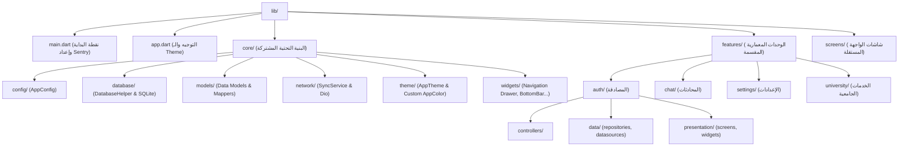
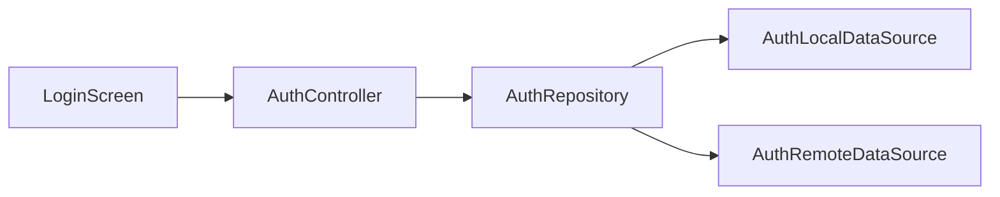

# تقرير تحليل أسلوب كتابة الكود وتقسيم الملفات (Code Style & Architecture Analysis Report)
**المشروع:** تطبيق SASP - Smart Academic Student Portal (Flutter App)  
**مسار المشروع:** `d:\All My Project\AstroDev GitHub\SASP\SASP_App_API`  
**تاريخ التحليل:** يوليو 2026  

---

## 1. المقدمة والنظرة العامة (Introduction & Overview)

يقدم هذا التقرير تحليلاً مفصلاً ودقيقاً لأسلوب كتابة الكود (Coding Style)، والأبعاد الهندسية (Architecture Pattern)، ونمط تقسيم الملفات (Directory Structure) في تطبيق Flutter الخاص بمشروع **SASP**.

يتضح من خلال فحص البرمجية أن المشروع بني على أساس متين يجمع بين **الأداء، الأمان، وإمكانية العمل بدون اتصال (Offline-first)**، مع اعتماد أنماط تصميمية حديثة تميّز الكود بالنظافة والتنظيم والقابلية للتوسع.

---

## 2. هيكلية المشروع وتقسيم الملفات (Project Architecture & Directory Structure)

يعتمد المشروع على **هيكلية هجينة متطورة (Hybrid Architecture)** تجمع بين نمطين شهيرين في تطوير تطبيقات Flutter:
1. **النمط القائم على الميزات (Feature-First Architecture):** المتواجد تحت مجلد `lib/features/` والذي يمثّل الأجزاء الحديثة والمعمارية المقسّمة بأسلوب Clean Architecture مبسط.
2. **النمط القائم على الطبقات والشاشات المباشرة (Layer-First / Screen-Based):** المتواجد تحت مجلد `lib/screens/` ومجلد `lib/core/`.



### شجرة المجلدات المفصلة (Detailed Directory Tree)

* **`lib/`**: المجلد الرئيسي للكود.
  * **`main.dart`**: نقطة انطلاق التطبيق (Entry Point)؛ تحتوي على تهيئة الخدمات مثل التدويل (`date_symbol_data_local`) ونظام تتبع الأخطاء `SentryFlutter`.
  * **`app.dart`**: الكلاس الأساسي `SaspApp`؛ يدير المسارات المسمّاة (`routes`) والاستماع لتغييرات الثيم (`ValueListenableBuilder`).
  * **`core/`**: يحتوي على البنية التحتية الشاملة والمحتويات التي تخدم التطبيق كاملاً:
    * **`config/`**: ملف `app_config.dart` لتحديد الإعدادات العامة والمتغيرات مثل `baseUrl` وأوقات الانتظار.
    * **`database/`**: ملف `database_helper.dart` لإدارة قاعدة البيانات المحلية SQLite باستخدام `sqflite`.
    * **`models/`**: النماذج الهيكلية للبيانات (`UserModel`, `CourseModel`, `ChatModel`, `AttendanceModel` وغيرها).
    * **`network/`**: خدمة المزامنة مع السيرفر `sync_service.dart` عبر مكتبة `Dio`.
    * **`theme/`**: نظام التصميم والألوان المبتكر `app_theme.dart`.
    * **`widgets/`**: عناصر الواجهة المشتركة مثل `TopAppBar`, `BottomNavBar`, و `NavigationDrawer`.
  * **`features/`**: الموديولات ذات النمط المعماري المقسم (Presentation, Controllers/Logic, Data/Repositories):
    * **`admin/`**, **`auth/`**, **`chat/`**, **`profile/`**, **`settings/`**, **`university/`**.
  * **`screens/`**: شاشات الواجهة المقسمة حسب الوظائف والمجالات الحيوية:
    * **`ai/`**, **`ai_tools/`**, **`chat/`**, **`curriculum/`**, **`doctors/`**, **`graduation/`**, **`home/`**, **`programs/`**, **`splash/`**, **`university/`**.

---

## 3. تحليلات أسلوب كتابة الكود والأنماط البرمجية (Coding Style & Design Patterns)

### 3.1. التسمية والاصطلاحات (Naming Conventions)
يلتزم الكود بالدقة العالية في اتباع الإرشادات القياسية لـ Dart & Flutter:
* **`snake_case` للملفات والمجلدات:** مثل `database_helper.dart`, `user_model.dart`, `doctors_chat_screen.dart`.
* **`PascalCase` للكلاسات والأنواع:** مثل `DatabaseHelper`, `SyncService`, `AuthController`, `LoginScreen`.
* **`camelCase` للمتغيرات والدوال:** مثل `emailController`, `loadSavedCredentials()`, `obscurePassword`.
* **`UPPER_SNAKE_CASE` للمتغيرات الثابتة الهامة إن وجدت.**

---

### 3.2. الأنماط التصميمية البارزة (Design Patterns Used)

#### أ. نمط المفردة (Singleton Pattern)
تم استخدام نمط المفردة بأسلوب احترافي لمنع تكرار إنشاء كائنات من الخدمات المركزية التي تتطلب إدارة حالة واحدة أو اتصالاً موحداً:
```dart
// في ملف database_helper.dart
class DatabaseHelper {
  static final DatabaseHelper instance = DatabaseHelper._init();
  static Database? _database;
  DatabaseHelper._init();
  ...
}

// في ملف sync_service.dart
class SyncService {
  static final SyncService instance = SyncService._init();
  String baseUrl = AppConfig.baseUrl;
  ...
}
```

#### ب. نمط المستودع والمصدر (Repository & DataSource Pattern)
في موديول المصادقة `features/auth/` تم تطبيق نمط المستودع للفصل التام بين مصدر البيانات (سواء محلي أو عبر API) وبين منطق التحكم بالواجهة:


#### ج. النماذج والتحويل الآمن للبيانات (Model Factories & Safe Parsing)
تتميّز كلاسات الـ Models بتوفير دالة `fromMap` و `toMap` مع حماية عالية من أخطاء تحويل الأنواع (Type Casting Exceptions) الناتجة عن اختلاف استجابة الـ API بين `int` و `String` و `double`:
```dart
factory StudentDetailModel.fromMap(Map<String, dynamic> map) {
  return StudentDetailModel(
    userId: map['user_id'] is String ? int.parse(map['user_id']) : map['user_id'],
    universityId: map['university_id'],
    major: map['major'],
    level: map['level'] is String ? int.parse(map['level']) : map['level'],
    gpa: map['gpa'] is int ? (map['gpa'] as int).toDouble() : (map['gpa'] is String ? double.parse(map['gpa']) : map['gpa']),
  );
}
```

---

### 3.3. نظام الثيم والابتكار في الألوان (Custom Dynamic Color System)

من أكثر النقاط تميزاً في هذا المشروع هو ابتكار كلاس مخصص يسمى `AppColor` يرث من كلاس `Color` في Flutter، حيث يقبل قيمتين للألوان (واحدة للثيم الفاتح Light والأخرى للثيم الداكن Dark) ويقوم بالتحويل الديناميكي الفوري بناءً على قيمة `AppTheme.isDark`:

```dart
class AppColor implements Color {
  final int lightValue;
  final int darkValue;

  const AppColor(this.lightValue, this.darkValue);

  @override
  int get value => AppTheme.isDark ? darkValue : lightValue;
  ...
}

// الاستخدام الفعلي في تعريف الألوان:
static const Color primary = AppColor(0xFF001A48, 0xFF38BDF8);
static const Color surface = AppColor(0xFFF9F9F9, 0xFF1E293B);
```
تسمح هذه الطريقة باستعمال `AppTheme.primary` في الكود مباشرة، ويتغير اللون تلقائياً عند تغيير الثيم دون الحاجة لكتابة شروط `Theme.of(context)` متكررة في الواجهات.

---

## 4. إدارة الحالة والشبكات وقواعد البيانات (State Management, Networking & DB)

### 4.1. إدارة الحالة (State Management)
* يتم استخدام **`ChangeNotifier`** كنمط رئيسي في الكنترولرات (مثل `AuthController`).
* يتم التحديث عبر **`notifyListeners()`** وربطه بالواجهة.
* كما يتم استخدام **`ValueNotifier`** مع **`ValueListenableBuilder`** في إدارة مظهر التطبيق (ThemeMode) لضمان إعادة بناء فقط الأجزاء المتأثرة بالمرونة العالية وبأداء متفوق.

---

### 4.2. إدارة اتصالات الشبكة (Networking with Dio & Interceptors)
* يعتمد المشروع على مكتبة `Dio` مع ربط **Interceptors** لحقن رمز المصادقة (`Authorization Bearer Token`) تلقائياً في الترويسات بعد جلبه من قاعدة البيانات المحلية SQLite (`settings` table).
* **إدارة العناوين التلقائية (Auto-Migration & BaseUrl Handling):** توجد آلية ذكية لتفادي مشاكل تغير عناوين הـ Localhost والأيبيهات المحلية في بيئات التطوير المختلفة عبر مطابقة وتحديث الـ BaseUrl تلقائياً في قاعدة البيانات.

---

### 4.3. قاعدة البيانات المحلية (Local Storage & SQLite Migration)
* يعتمد التطبيق على مكتبة `sqflite` للعمل أوفلاين.
* يوجد نظام تتبع لإصدارات قاعدة البيانات (`version: 8`) مع معالجة عملية الترقية (`onUpgrade`) عبر إضافة الأعمدة والجداول الجديدة مع تدارك الاستثناءات `try/catch`.
* تشتمل الجداول على علامات المزامنة (`is_synced INTEGER DEFAULT 1`) لدعم آليات المزامنة اللاحقة مع السيرفر.

---

## 5. الأمان والتوجيه وتتبع الأخطاء (Security, Navigation & Monitoring)

| المجال | التقنية / الأسلوب المستخدم | التفاصيل |
| :--- | :--- | :--- |
| **الأمان والمصادقة البيومترية** | `local_auth` | دعم الدخول ببصمة الأصبع/الوجه وحفظ بيانات الدخول المشفّرة محلياً بناءً على اختيار المستخدم. |
| **التوجيه (Navigation)** | `MaterialApp.routes` | استخدام المسارات المسمّاة (`Named Routes`) المركزية في `app.dart` لسهولة الانتقال بين عشرات الشاشات. |
| **تتبع الأخطاء أونلاين** | `sentry_flutter` | تغليف تشغيل التطبيق بـ `SentryFlutter.init` لتسجيل الاستثناءات والأخطاء أثناء التشغيل الفعلي. |
| **الدعم اللغوي و RTL** | `intl` + `Directionality` | تهيئة تنسيق التواريخ باللغة العربية `initializeDateFormatting('ar', null)` واستخدام اتجاه النص من اليمين لليسار. |

---

## 6. تقييم نقاط القوة والتوصيات للتحسين (Strengths & Recommendations)

### 6.1. نقاط القوة (Strengths)
1. **نظام ثيمات مبتكر فريد:** كلاس `AppColor` يعكس إبداعاً في التغلب على تعقيدات Dual-theme في Flutter.
2. **مرونة العمل بدون إنترنت (Offline-First Ready):** الاعتماد القوي على SQLite والمزامنة عبر `SyncService`.
3. **أمان ممتاز:** دمج البصمة الحيوية ومرونة إدارة الجلسات والتوكنز.
4. **تغطية شاملة للخدمات الجامعية:** تقسيم منطقي ومتكامل بين الطلاب، أعضاء الهيئة التدريسية، والمواد الدراسية.

---

### 6.2. التوصيات المستقبلية للتحسين (Future Recommendations)
1. **توحيد الهيكلية التنظيمية (Architecture Standardization):**
   * يفضل دمج الشاشات المتواجدة تحت `lib/screens/` تدريجياً داخل المجلد المعماري `lib/features/` لتصبح الهيكلية موحدة تماماً ومبنية بالكامل على النمط القائم على الميزات (Feature-First Clean Architecture).
2. **استخدام حقن التبعيات (Dependency Injection):**
   * يفضل استخدام مكتبة مثل `get_it` لإدارة الكائنات وحقن الخدمات ( مثل `AuthRepository` و `AuthController`) بدلاً من إنشائها يدوياً داخل `initState` بالشاشات.
3. **اعتماد كلاسات الاستجابة المحددة (Sealed Classes / Either Pattern):**
   * استبدال `Map<String, dynamic>` الصريحة التي ترجع من الدوال في الكنترولر بكلاسات استجابة محددة الأنماط (مثل `Result<T>` أو نمط `Either<Failure, Success>`) لزيادة أمان كتابة الأكواد وتقليل الأخطاء في أوقات التشغيل.

---
**تم إعداد هذا التقرير بناءً على الفحص المباشر لأكواد ومجلدات المشروع.**
