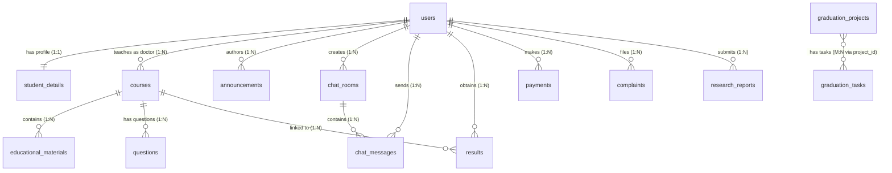

# 📋 وثيقة تحليل وتصميم النظام — System Proposal
## مشروع SASP — بوابة الطالب الأكاديمية الذكية
### Smart Academic Student Portal — الجامعة

> **تاريخ الإصدار:** 27 يونيو 2026 | **الإصدار:** 1.0
> **المُعِد:** فريق تحليل وتصميم الأنظمة
> **التقنيات الأساسية:** Flutter (Frontend) | Laravel 12 (Backend/API) | MySQL/SQLite

---

## 📌 نظرة عامة على المشروع

**SASP (Smart Academic Student Portal)** هو نظام أكاديمي متكامل مصمم لخدمة طلاب وأعضاء هيئة التدريس وإدارة **الجامعة**. يتكون النظام من ثلاثة مكونات رئيسية متكاملة:

| المكوّن | التقنية | الغرض |
|---------|---------|--------|
| **تطبيق الجوال** | Flutter | واجهة الطلاب والدكاترة (Offline-First) |
| **Backend وAPI** | Laravel 12 + REST API | الخادم المركزي لإدارة البيانات |
| **لوحة التحكم الإدارية** | Laravel Blade + Spatie | واجهة الإدارة والإشراف الكامل |

---

# القسم الأول: تحديد المتطلبات (Requirements Determination)

## 1.1 المتطلبات الوظيفية (Functional Requirements)

### 🎓 وحدة إدارة المستخدمين والمصادقة
| # | المتطلب | الأدوار المعنية |
|---|---------|----------------|
| FR-01 | تسجيل دخول الطالب بالرقم الأكاديمي | Student |
| FR-02 | تسجيل دخول الدكتور والإدارة بالبريد الإلكتروني | Doctor, Admin, SuperAdmin |
| FR-03 | إجبار الطالب على تغيير كلمة المرور الافتراضية (123456) عند أول دخول | Student |
| FR-04 | دعم تغيير كلمة المرور في أي وقت | All |
| FR-05 | إدارة الملف الشخصي (الصورة، الاسم، معلومات الاتصال) | All |
| FR-06 | منع الطلاب من الوصول إلى لوحة التحكم الإدارية | System |

### 📚 وحدة المناهج الدراسية (Curriculum Management)
| # | المتطلب | الأدوار المعنية |
|---|---------|----------------|
| FR-07 | تصفح وقراءة الكتب الرقمية (PDF) مع قارئ مدمج | Student |
| FR-08 | الاستماع للكتب الصوتية مع مشغل صوتي عائم | Student |
| FR-09 | خوض اختبارات تفاعلية من بنك الأسئلة | Student |
| FR-10 | عرض تقرير أداء ذكي بعد كل اختبار | Student |
| FR-11 | إخفاء قسم المناهج عن حسابات الدكاترة | System |
| FR-12 | رفع وإدارة المواد التعليمية (PDF، صوت، فيديو، روابط) | Doctor, Admin |

### 📢 وحدة الإعلانات والتواصل (Announcements & Communication)
| # | المتطلب | الأدوار المعنية |
|---|---------|----------------|
| FR-13 | إنشاء وعرض الإعلانات مع صور وتحديد الجمهور المستهدف | Admin, SuperAdmin |
| FR-14 | عرض الإعلانات على الشاشة الرئيسية مع مؤشر قراءة | All |
| FR-15 | منتدى نقاش للطلاب (Student Forum) | Student, Admin |
| FR-16 | دردشة خاصة بين الطلاب والدكاترة | Student, Doctor |
| FR-17 | إرسال الصور والفيديوهات والملفات في المحادثات | All |
| FR-18 | إنشاء محادثة جديدة مع دكتور محدد أو طالب محدد | Student, Doctor, Admin |

### 📊 وحدة النتائج والدرجات (Academic Results)
| # | المتطلب | الأدوار المعنية |
|---|---------|----------------|
| FR-19 | عرض كشف الدرجات التفصيلي للطالب | Student |
| FR-20 | إدخال وإدارة درجات الطلاب | Doctor, Admin |
| FR-21 | احتساب المعدل التراكمي (GPA) تلقائياً | System |
| FR-22 | عرض إحصائيات الدرجات والمستوى الدراسي | Student |

### 💳 وحدة المدفوعات والرسوم (Payments)
| # | المتطلب | الأدوار المعنية |
|---|---------|----------------|
| FR-23 | عرض حالة الدفع (مدفوع/معلق/متأخر) | Student |
| FR-24 | رفع إيصال الدفع من الهاتف | Student |
| FR-25 | الموافقة أو رفض إيصالات الدفع | Admin, SuperAdmin |
| FR-26 | إدارة سجلات الرسوم الدراسية | Admin, SuperAdmin |

### 📋 وحدة الشكاوى والاقتراحات (Complaints)
| # | المتطلب | الأدوار المعنية |
|---|---------|----------------|
| FR-27 | تقديم شكوى جديدة مع وصف تفصيلي | Student, Doctor |
| FR-28 | متابعة حالة الشكوى (معلقة/قيد المراجعة/محلولة) | All |
| FR-29 | حل وإغلاق الشكاوى مع تعليق الرد | Admin, SuperAdmin |

### 🎓 وحدة مشاريع التخرج والبحث العلمي (Graduation & Research)
| # | المتطلب | الأدوار المعنية |
|---|---------|----------------|
| FR-30 | عرض مشاريع التخرج الجارية والمكتملة | All |
| FR-31 | رفع التقارير البحثية للمراجعة | Student |
| FR-32 | مراجعة التقارير البحثية (قبول/رفض/ملاحظات) | Doctor, Admin |
| FR-33 | إدارة مهام التخرج وتتبع الإنجاز | Doctor, Admin |

### 🤖 وحدة الذكاء الاصطناعي والأدوات الأكاديمية (AI & Academic Tools)
| # | المتطلب | الأدوار المعنية |
|---|---------|----------------|
| FR-34 | عرض أدوات الذكاء الاصطناعي الأكاديمي مع تفاصيل وروابط | All |
| FR-35 | عرض البرامج والتطبيقات الأكاديمية المفيدة | All |
| FR-36 | إضافة وإدارة أدوات الذكاء الاصطناعي والبرامج | Admin, SuperAdmin |

### ⚙️ وحدة الإعدادات وتخصيص النظام (Settings & Customization)
| # | المتطلب | الأدوار المعنية |
|---|---------|----------------|
| FR-37 | تغيير اسم التطبيق وشعاره من لوحة التحكم ديناميكياً | SuperAdmin |
| FR-38 | تهيئة عنوان IP سيرفر الـ API من داخل التطبيق | Student |
| FR-39 | إدارة المستخدمين (إضافة/تعديل/حذف/استعادة) | Admin, SuperAdmin |
| FR-40 | إدارة الأدوار والصلاحيات بمرونة كاملة | SuperAdmin |
| FR-41 | النسخ الاحتياطي للنظام وإدارته | SuperAdmin |

### 🔄 وحدة المزامنة (Offline-First Sync)
| # | المتطلب | الأدوار المعنية |
|---|---------|----------------|
| FR-42 | تخزين بيانات المستخدم محلياً بـ SQLite للعمل بلا إنترنت | System |
| FR-43 | مزامنة تلقائية شاملة عند عودة الاتصال | System |
| FR-44 | دفع المسودات المحلية (رسائل، شكاوى، مدفوعات) للسيرفر | System |
| FR-45 | مزامنة يدوية بالسحب للأسفل (Pull to Refresh) | All |

---

## 1.2 المتطلبات غير الوظيفية (Non-Functional Requirements)

### 🔐 الأمان (Security Requirements)
| # | المتطلب | الأولوية |
|---|---------|---------|
| NFR-S01 | استخدام Laravel Sanctum لتوليد توكنات المصادقة الآمنة | عالية 🔴 |
| NFR-S02 | تشفير كلمات المرور بخوارزمية bcrypt | عالية 🔴 |
| NFR-S03 | تطبيق CSRF Protection على جميع مسارات الويب | عالية 🔴 |
| NFR-S04 | تطبيق middleware الأدوار والصلاحيات على كل نقطة API | عالية 🔴 |
| NFR-S05 | التحقق من التوكن في جميع عمليات المزامنة | عالية 🔴 |
| NFR-S06 | تطبيق API Rate Limiting لمنع هجمات الـ Brute Force | متوسطة 🟡 |
| NFR-S07 | استخدام HTTPS في بيئة الإنتاج | عالية 🔴 |
| NFR-S08 | التحقق من نوع الملفات المرفوعة لمنع رفع ملفات ضارة | عالية 🔴 |
| NFR-S09 | تطبيق مبدأ الحد الأدنى من الصلاحيات (Least Privilege) | عالية 🔴 |

### ⚡ الأداء (Performance Requirements)
| # | المتطلب | المعيار المطلوب |
|---|---------|----------------|
| NFR-P01 | زمن استجابة API للمزامنة الشاملة | ≤ 3 ثوانٍ |
| NFR-P02 | زمن استجابة عمليات المصادقة (Login) | ≤ 1 ثانية |
| NFR-P03 | زمن تحميل الشاشة الرئيسية من قاعدة البيانات المحلية | ≤ 500ms |
| NFR-P04 | دعم عدد متزامن من المستخدمين | ≥ 500 مستخدم |
| NFR-P05 | معدل توافر النظام (System Uptime) | ≥ 99.5% |
| NFR-P06 | حجم الملفات المرفوعة في الرسائل | ≤ 50MB |

### 🖥️ البيئة التشغيلية (Operational Requirements)
| # | المتطلب | التفاصيل |
|---|---------|---------|
| NFR-O01 | دعم أنظمة تشغيل الجوال | Android 8.0+ و iOS 14+ |
| NFR-O02 | متصفحات الويب للوحة التحكم | Chrome 90+، Firefox 88+، Edge 90+ |
| NFR-O03 | قاعدة البيانات للإنتاج | MySQL 8.0+ (بدلاً من SQLite) |
| NFR-O04 | إصدار PHP | PHP 8.2+ |
| NFR-O05 | إصدار Laravel | Laravel 12.x |
| NFR-O06 | إصدار Flutter SDK | Flutter 3.x+ / Dart 3.x |
| NFR-O07 | دعم اللغة العربية | RTL بشكل كامل في التطبيق |
| NFR-O08 | التوافق مع Offline-First | SQLite محلي مع مزامنة ذكية |

---

# القسم الثاني: النمذجة الوظيفية (Functional Modeling)

## 2.1 تحديد الفاعلين في النظام (System Actors)

```
┌─────────────────────────────────────────────────────────────────┐
│                      فاعلو نظام SASP                          │
├──────────────┬──────────────┬──────────────┬───────────────────┤
│   🎓 الطالب  │ 👨‍⚕️ الدكتور  │  🏢 الإدارة  │  👑 الإدارة العليا│
│   Student    │   Doctor     │    Admin     │    SuperAdmin     │
├──────────────┼──────────────┼──────────────┼───────────────────┤
│يدخل بالرقم  │ يدخل بالبريد │ يدخل بالبريد │  يدخل بالبريد    │
│الأكاديمي    │ الإلكتروني  │ الإلكتروني   │  الإلكتروني      │
│              │              │              │                   │
│واجهة:        │ واجهتان:     │ لوحة التحكم  │  كامل الصلاحيات   │
│التطبيق فقط  │ التطبيق +    │ + التطبيق    │  في كلا الواجهتين │
│              │ لوحة التحكم │              │                   │
└──────────────┴──────────────┴──────────────┴───────────────────┘
```

### مستخدمون إضافيون في النظام:
- **نظام المزامنة (Sync Engine):** وكيل تقني يعمل خلف الكواليس لضمان تناسق البيانات
- **نظام الإشعارات:** يرسل التنبيهات للمستخدمين

---

## 2.2 حالات الاستخدام الرئيسية (Use Cases)

### 🎓 حالات استخدام الطالب (Student Use Cases)
| # | حالة الاستخدام | المشغّل | الوصف المختصر |
|---|--------------|---------|--------------|
| UC-01 | تسجيل الدخول بالرقم الأكاديمي | Student | إدخال الرقم + كلمة المرور، مع إجبار التغيير عند أول دخول |
| UC-02 | مزامنة البيانات | Student | سحب الشاشة للأسفل أو عند الدخول لتحديث البيانات من السيرفر |
| UC-03 | تصفح المكتبة الرقمية | Student | عرض وتصفيح الكتب PDF مع قارئ مدمج |
| UC-04 | الاستماع للكتب الصوتية | Student | تشغيل الكتاب الصوتي مع تحكم صوتي |
| UC-05 | خوض اختبار تفاعلي | Student | اختيار مادة ووحدات والبدء في الاختبار |
| UC-06 | عرض نتائج الدرجات | Student | الاطلاع على كشف الدرجات التفصيلي |
| UC-07 | متابعة المدفوعات | Student | عرض حالة الدفع ورفع إيصال |
| UC-08 | تقديم شكوى | Student | إنشاء شكوى جديدة ومتابعة حالتها |
| UC-09 | المشاركة في المنتدى | Student | قراءة وإرسال رسائل في منتدى الطلاب |
| UC-10 | مراسلة دكتور | Student | بدء محادثة خاصة مع دكتور محدد |
| UC-11 | رفع تقرير بحثي | Student | رفع ملف التقرير للمراجعة |
| UC-12 | تعديل الملف الشخصي | Student | تحديث الصورة الشخصية وكلمة المرور |

### 👨‍⚕️ حالات استخدام الدكتور (Doctor Use Cases)
| # | حالة الاستخدام | المشغّل | الوصف المختصر |
|---|--------------|---------|--------------|
| UC-13 | عرض قائمة طلابه | Doctor | مشاهدة الطلاب المسجلين في مقرراته |
| UC-14 | إدخال درجات الطلاب | Doctor | رصد الدرجات لكل مادة |
| UC-15 | رفع مادة تعليمية | Doctor | رفع ملفات PDF أو صوت أو فيديو |
| UC-16 | مراجعة تقرير بحثي | Doctor | قبول أو رفض التقارير مع ملاحظات |
| UC-17 | مراسلة الطلاب | Doctor | فتح محادثة مع طالب محدد |
| UC-18 | عرض شكاوى الطلاب | Doctor | الاطلاع على الشكاوى المتعلقة به |
| UC-19 | الوصول للوحة التحكم | Doctor | دخول الداشبورد بصلاحيات محدودة |

### 🏢 حالات استخدام الإدارة (Admin Use Cases)
| # | حالة الاستخدام | المشغّل | الوصف المختصر |
|---|--------------|---------|--------------|
| UC-20 | إدارة الطلاب (CRUD) | Admin | إضافة وتعديل وحذف سجلات الطلاب |
| UC-21 | إدارة الدكاترة | Admin | إنشاء وتعديل حسابات الدكاترة |
| UC-22 | نشر الإعلانات | Admin | إنشاء إعلانات مع صور وتحديد الجمهور |
| UC-23 | الموافقة على المدفوعات | Admin | مراجعة إيصالات الدفع وتأكيدها |
| UC-24 | حل الشكاوى | Admin | إغلاق الشكاوى مع الرد المناسب |
| UC-25 | إدارة المواد التعليمية | Admin | رفع وإدارة كامل المكتبة الرقمية |
| UC-26 | عرض إحصائيات النظام | Admin | الاطلاع على لوحة البيانات الشاملة |
| UC-27 | إدارة مشاريع التخرج | Admin | إضافة وتحديث المشاريع والمهام |

### 👑 حالات استخدام الإدارة العليا (SuperAdmin Use Cases)
| # | حالة الاستخدام | المشغّل | الوصف المختصر |
|---|--------------|---------|--------------|
| UC-28 | تخصيص التطبيق | SuperAdmin | تغيير اسم التطبيق والشعار |
| UC-29 | إدارة الأدوار والصلاحيات | SuperAdmin | إنشاء وتعديل الأدوار وصلاحياتها |
| UC-30 | إدارة النسخ الاحتياطية | SuperAdmin | إنشاء وتنزيل وحذف النسخ الاحتياطية |
| UC-31 | منح صلاحيات للإدارة | SuperAdmin | تخصيص صلاحيات محددة لحسابات الإدارة |
| UC-32 | حذف نهائي للمستخدمين | SuperAdmin | الحذف الكامل مع حذف الملفات المرتبطة |

---

## 2.3 قصص المستخدمين الرئيسية (User Stories)

> الصيغة: **"بصفتي [فاعل]، أريد [إجراء] حتى أتمكن من [الفائدة]"**

---

### US-01 — مزامنة البيانات (الطالب)
> **بصفتي طالباً**، أريد أن يعمل التطبيق بالكامل دون اتصال بالإنترنت وأن تُمزامن بياناتي تلقائياً عند عودة الاتصال، **حتى أتمكن** من الاستمرار في الدراسة في أي مكان بغض النظر عن جودة الشبكة.

**معايير القبول (Acceptance Criteria):**
- [ ] يستطيع الطالب تسجيل الدخول بلا إنترنت إذا سبق له الدخول مرة واحدة على الأقل
- [ ] يُحفظ أي عمل (رسالة، شكوى، إيصال) محلياً وترفع عند عودة الاتصال
- [ ] تظهر مؤشر المزامنة الجارية والناجحة في واجهة المستخدم
- [ ] عند السحب للأسفل تتم مزامنة فورية مع السيرفر

---

### US-02 — الاختبار التفاعلي (الطالب)
> **بصفتي طالباً**، أريد خوض اختبارات تفاعلية من بنك الأسئلة وتلقي تقرير أداء فوري بعد كل اختبار، **حتى أتمكن** من تقييم مستواي الأكاديمي والتحسين منه قبل الامتحانات الرسمية.

**معايير القبول:**
- [ ] يستطيع الطالب اختيار المادة ومستوى الصعوبة والوحدات الدراسية
- [ ] تُعرض الأسئلة بشكل تفاعلي مع خيارات متعددة (A، B، C، D)
- [ ] يظهر تقرير الأداء فور الإنهاء مع النسبة المئوية والمستوى
- [ ] تُحفظ سجلات الاختبارات السابقة وتعرض للطالب

---

### US-03 — رفع مادة تعليمية (الدكتور)
> **بصفتي دكتوراً**، أريد رفع المواد التعليمية (كتب PDF، تسجيلات صوتية، مقاطع فيديو) من لوحة التحكم وربطها بالمقررات الدراسية، **حتى أتمكن** من توفير المحتوى الأكاديمي لطلابي بسهولة وفعالية.

**معايير القبول:**
- [ ] يدعم رفع أنواع ملفات: PDF، MP3/AAC، MP4، روابط خارجية
- [ ] يرتبط كل ملف بمقرر دراسي محدد وفصل دراسي
- [ ] يظهر الملف فوراً للطلاب في التطبيق عند المزامنة التالية
- [ ] تظهر معلومات الملف: الحجم، المدة (للصوت/الفيديو)، الراوي

---

### US-04 — إدارة المدفوعات (الإدارة)
> **بصفتي موظفاً إدارياً**، أريد استعراض إيصالات الدفع المرفوعة من الطلاب والموافقة عليها أو ردها مع إضافة ملاحظة، **حتى أتمكن** من إدارة الرسوم الدراسية بدقة وشفافية وتحديث حالة الطالب المالية فوراً.

**معايير القبول:**
- [ ] تظهر قائمة بجميع إيصالات الدفع مرتبة بحسب التاريخ مع فلترة الحالة
- [ ] يمكن عرض صورة الإيصال المرفوعة بوضوح
- [ ] عند الموافقة تتغير حالة الدفع إلى "مدفوع" ويتلقى الطالب تأكيداً
- [ ] عند الرفض يمكن إدخال سبب الرفض للطالب

---

### US-05 — تخصيص النظام (الإدارة العليا)
> **بصفتي مدير النظام الأعلى**، أريد تغيير اسم التطبيق والشعار والألوان الرئيسية من لوحة التحكم مباشرة بدون الحاجة لأي تدخل تقني، **حتى أتمكن** من تخصيص النظام لمتطلبات جامعتي وضمان التوافق مع الهوية البصرية المؤسسية.

**معايير القبول:**
- [ ] يمكن تغيير اسم التطبيق من خلال حقل نصي مع حفظ فوري
- [ ] يمكن رفع شعار جديد بصيغ PNG/SVG ويُحدّث في التطبيق عند المزامنة
- [ ] التغييرات تنعكس على التطبيق بعد أول عملية مزامنة للمستخدمين
- [ ] تُحفظ إعدادات التخصيص في جدول `settings` في قاعدة البيانات

---

# القسم الثالث: تصميم قاعدة البيانات والنمذجة الهيكلية

## 3.1 مخطط الكيانات والعلاقات — ERD (نصي تفصيلي)

### 📐 رسم بياني للعلاقات



---

## 3.2 تفاصيل الجداول وهيكل قاعدة البيانات

### 🔑 [1] جدول `users` — المستخدمون
**الغرض:** تخزين جميع حسابات المستخدمين مع أدوارهم وحالتهم

| العمود | النوع | القيود | الوصف |
|--------|-------|--------|-------|
| `id` | BIGINT UNSIGNED | **PK**, AUTO_INCREMENT | المعرف الفريد |
| `name` | VARCHAR(255) | NOT NULL | الاسم الكامل |
| `email` | VARCHAR(255) | UNIQUE, NOT NULL | البريد الإلكتروني (للدكتور/الإدارة) |
| `email_verified_at` | TIMESTAMP | NULL | تاريخ التحقق |
| `password` | VARCHAR(255) | NOT NULL | كلمة المرور (bcrypt) |
| `profile_image` | VARCHAR(255) | NULL | مسار صورة الملف الشخصي |
| `thumbnail` | VARCHAR(255) | NULL | النسخة المصغرة للصورة |
| `status` | TINYINT | DEFAULT 1 | 1=نشط، 0=معطل |
| `role` | ENUM | NOT NULL | 'Student','Doctor','Admin','SuperAdmin' |
| `phone_number` | VARCHAR(20) | NULL | رقم الهاتف |
| `must_change_password` | TINYINT | DEFAULT 0 | ⭐ إجبار تغيير كلمة المرور (للطلاب) |
| `remember_token` | VARCHAR(100) | NULL | توكن التذكر |
| `created_at` | TIMESTAMP | | تاريخ الإنشاء |
| `updated_at` | TIMESTAMP | | تاريخ آخر تعديل |
| `deleted_at` | TIMESTAMP | NULL | SoftDelete |

**العلاقات:** `1:1` مع `student_details` | `1:N` مع `courses`, `results`, `payments`, `complaints`, `announcements`, `chat_rooms`, `chat_messages`, `research_reports`

---

### 🎓 [2] جدول `student_details` — تفاصيل الطالب الأكاديمية
**الغرض:** تخزين المعلومات الأكاديمية التفصيلية للطالب

| العمود | النوع | القيود | الوصف |
|--------|-------|--------|-------|
| `user_id` | BIGINT UNSIGNED | **PK**, **FK**→users.id | معرف الطالب |
| `university_id` | VARCHAR(50) | UNIQUE, NOT NULL | الرقم الأكاديمي (مثال: 20261001) |
| `major` | VARCHAR(255) | NOT NULL | التخصص الدراسي |
| `level` | INT | DEFAULT 1 | المستوى الدراسي (1-8) |
| `gpa` | DOUBLE | DEFAULT 0.0 | المعدل التراكمي |
| `created_at` | TIMESTAMP | | |
| `updated_at` | TIMESTAMP | | |

**العلاقة:** `1:1` مع `users` (CASCADE DELETE)

---

### 📚 [3] جدول `courses` — المقررات الدراسية
**الغرض:** تعريف المواد الدراسية وربطها بأعضاء هيئة التدريس

| العمود | النوع | القيود | الوصف |
|--------|-------|--------|-------|
| `course_id` | VARCHAR(50) | **PK** | معرف المقرر (مثال: cs411) |
| `title` | VARCHAR(255) | NOT NULL | اسم المقرر |
| `description` | TEXT | NULL | وصف المقرر |
| `doctor_id` | BIGINT UNSIGNED | **FK**→users.id, NULL | الدكتور المسؤول |
| `credit_hours` | INT | DEFAULT 3 | عدد الساعات المعتمدة |
| `department` | VARCHAR(255) | NULL | القسم الأكاديمي |
| `created_at` | TIMESTAMP | | |
| `updated_at` | TIMESTAMP | | |

**العلاقات:** `N:1` مع `users` (المدرّس) | `1:N` مع `educational_materials`, `questions`, `results`

---

### 📁 [4] جدول `educational_materials` — المواد التعليمية
**الغرض:** تخزين معلومات وروابط المواد التعليمية بجميع أنواعها

| العمود | النوع | القيود | الوصف |
|--------|-------|--------|-------|
| `material_id` | VARCHAR(50) | **PK** | المعرف الفريد |
| `course_id` | VARCHAR(50) | **FK**→courses.course_id | المقرر المرتبط |
| `title` | VARCHAR(255) | NOT NULL | عنوان المادة |
| `type` | ENUM | NOT NULL | 'pdf','audio','video','link' |
| `file_url` | TEXT | NOT NULL | رابط الملف |
| `file_path` | VARCHAR(255) | NULL | المسار المحلي على السيرفر |
| `file_size` | VARCHAR(50) | NULL | حجم الملف |
| `academic_year` | VARCHAR(20) | NULL | السنة الأكاديمية |
| `semester` | VARCHAR(50) | NULL | الفصل الدراسي |
| `department` | VARCHAR(255) | NULL | القسم |
| `description` | TEXT | NULL | وصف المادة |
| `narrator` | VARCHAR(255) | NULL | اسم الراوي (للصوتيات) |
| `duration` | VARCHAR(50) | NULL | المدة الزمنية |
| `image_path` | VARCHAR(255) | NULL | صورة الغلاف |
| `uploaded_at` | TIMESTAMP | DEFAULT NOW | تاريخ الرفع |

**العلاقة:** `N:1` مع `courses` (CASCADE DELETE)

---

### ❓ [5] جدول `questions` — بنك الأسئلة
**الغرض:** تخزين أسئلة الاختبارات لكل مقرر دراسي

| العمود | النوع | القيود | الوصف |
|--------|-------|--------|-------|
| `question_id` | VARCHAR(50) | **PK** | معرف السؤال |
| `course_id` | VARCHAR(50) | **FK**→courses.course_id | المقرر المرتبط |
| `question_text` | TEXT | NOT NULL | نص السؤال |
| `options` | TEXT | NOT NULL | الخيارات مفصولة بـ `;` |
| `correct_answer` | VARCHAR(255) | NOT NULL | الإجابة الصحيحة |
| `difficulty_level` | ENUM | DEFAULT 'medium' | 'easy','medium','hard' |
| `unit_number` | INT | NULL | رقم الوحدة الدراسية |

**العلاقة:** `N:1` مع `courses` (CASCADE DELETE)

---

### 📢 [6] جدول `sasp_announcements` — الإعلانات
**الغرض:** نشر الإعلانات الأكاديمية لجمهور محدد مع دعم الصور

| العمود | النوع | القيود | الوصف |
|--------|-------|--------|-------|
| `announcement_id` | VARCHAR(50) | **PK** | المعرف الفريد |
| `title` | VARCHAR(255) | NOT NULL | عنوان الإعلان |
| `content` | TEXT | NOT NULL | محتوى الإعلان |
| `author_id` | BIGINT UNSIGNED | **FK**→users.id | معرف المُنشئ |
| `date_posted` | TIMESTAMP | DEFAULT NOW | تاريخ النشر |
| `target_audience` | ENUM | DEFAULT 'All' | 'All','Student','Doctor','Admin','SuperAdmin' |
| `image_url` | VARCHAR(255) | NULL | رابط صورة الإعلان |
| `image_extension` | VARCHAR(10) | NULL | امتداد الصورة |

---

### 💬 [7] جدول `sasp_chat_rooms` — غرف الدردشة
**الغرض:** تعريف قنوات وغرف التواصل المختلفة

| العمود | النوع | القيود | الوصف |
|--------|-------|--------|-------|
| `room_id` | VARCHAR(50) | **PK** | المعرف (مثال: private_1_2، student_forum) |
| `title` | VARCHAR(255) | NOT NULL | اسم الغرفة |
| `type` | ENUM | NOT NULL | 'Private','Group','Forum' |
| `created_by` | BIGINT UNSIGNED | **FK**→users.id | منشئ الغرفة |
| `created_at` | TIMESTAMP | | |
| `updated_at` | TIMESTAMP | | |

---

### 📨 [8] جدول `sasp_chat_messages` — رسائل الدردشة
**الغرض:** تخزين كل رسائل النصوص والوسائط مع حالة المزامنة

| العمود | النوع | القيود | الوصف |
|--------|-------|--------|-------|
| `message_id` | VARCHAR(50) | **PK** | المعرف الفريد |
| `room_id` | VARCHAR(50) | **FK**→chat_rooms | الغرفة المنتمية |
| `sender_id` | BIGINT UNSIGNED | **FK**→users.id | معرف المرسل |
| `sender_name` | VARCHAR(255) | NOT NULL | اسم المرسل |
| `message_text` | TEXT | NOT NULL | نص الرسالة |
| `media_type` | VARCHAR(20) | NULL | 'image','video','file',NULL |
| `media_path` | VARCHAR(255) | NULL | مسار الوسيط المرفق |
| `timestamp` | TIMESTAMP | DEFAULT NOW | وقت الإرسال |
| `is_synced` | INT | DEFAULT 0 | 0=محلي، 1=مزامن (للتطبيق) |

---

### 📊 [9] جدول `results` — النتائج والدرجات
**الغرض:** تخزين درجات الطلاب لكل مادة وفصل دراسي

| العمود | النوع | القيود | الوصف |
|--------|-------|--------|-------|
| `result_id` | VARCHAR(50) | **PK** | المعرف |
| `student_id` | BIGINT UNSIGNED | **FK**→users.id | معرف الطالب |
| `course_id` | VARCHAR(50) | **FK**→courses | معرف المقرر |
| `course_title` | VARCHAR(255) | NOT NULL | اسم المقرر |
| `grade` | VARCHAR(10) | NOT NULL | التقدير (A+، B، C...) |
| `semester` | VARCHAR(50) | NOT NULL | الفصل الدراسي |

---

### 💳 [10] جدول `payments` — المدفوعات

| العمود | النوع | القيود | الوصف |
|--------|-------|--------|-------|
| `payment_id` | VARCHAR(50) | **PK** | المعرف |
| `student_id` | BIGINT UNSIGNED | **FK**→users.id | معرف الطالب |
| `amount` | DOUBLE | NOT NULL | مبلغ الدفع |
| `payment_status` | ENUM | DEFAULT 'Pending' | 'Paid','Pending','Overdue' |
| `payment_date` | TIMESTAMP | NULL | تاريخ الدفع |
| `receipt_url` | TEXT | NULL | رابط إيصال الدفع |
| `is_synced` | INT | DEFAULT 0 | حالة المزامنة |

---

### 📋 [11] جدول `complaints` — الشكاوى

| العمود | النوع | القيود | الوصف |
|--------|-------|--------|-------|
| `complaint_id` | VARCHAR(50) | **PK** | المعرف |
| `user_id` | BIGINT UNSIGNED | **FK**→users.id | مقدم الشكوى |
| `subject` | VARCHAR(255) | NOT NULL | موضوع الشكوى |
| `description` | TEXT | NOT NULL | تفاصيل الشكوى |
| `status` | ENUM | DEFAULT 'Pending' | 'Pending','Reviewed','Resolved' |
| `submitted_at` | TIMESTAMP | DEFAULT NOW | تاريخ التقديم |
| `is_synced` | INT | DEFAULT 0 | حالة المزامنة |

---

### 📝 [12] جدول `research_reports` — التقارير البحثية

| العمود | النوع | القيود | الوصف |
|--------|-------|--------|-------|
| `id` | BIGINT | **PK** AUTO | المعرف |
| `student_id` | BIGINT | **FK**→users.id | معرف الطالب |
| `title` | VARCHAR(255) | NOT NULL | عنوان التقرير |
| `department` | VARCHAR(255) | NULL | القسم |
| `file_url` | VARCHAR(255) | NULL | رابط ملف التقرير |
| `status` | VARCHAR(50) | DEFAULT 'قيد المراجعة' | الحالة |
| `feedback` | TEXT | NULL | تعليق المراجع |

---

### 🎓 [13] جدول `graduation_projects` — مشاريع التخرج

| العمود | النوع | القيود | الوصف |
|--------|-------|--------|-------|
| `id` | BIGINT | **PK** AUTO | المعرف |
| `title` | VARCHAR(255) | NOT NULL | عنوان المشروع |
| `description` | TEXT | NULL | وصف المشروع |
| `students` | JSON | NULL | أسماء طلاب الفريق |
| `supervisor` | VARCHAR(255) | NULL | اسم المشرف |
| `department` | VARCHAR(255) | NULL | القسم |
| `year` | VARCHAR(10) | NULL | سنة المشروع |
| `status` | ENUM | DEFAULT 'Ongoing' | 'Ongoing','Completed' |

---

### ✅ [14] جدول `graduation_tasks` — مهام التخرج

| العمود | النوع | القيود | الوصف |
|--------|-------|--------|-------|
| `id` | BIGINT | **PK** AUTO | المعرف |
| `student_name` | VARCHAR(255) | NOT NULL | اسم الطالب |
| `task_title` | VARCHAR(255) | NOT NULL | عنوان المهمة |
| `status` | ENUM | DEFAULT 'Pending' | 'Pending','Completed' |

---

### 🔧 [15] جدول `academic_tools` — الأدوات الأكاديمية

| العمود | النوع | القيود | الوصف |
|--------|-------|--------|-------|
| `id` | BIGINT | **PK** AUTO | المعرف |
| `name` | VARCHAR(255) | NOT NULL | اسم الأداة |
| `description` | TEXT | NOT NULL | الوصف |
| `image_url` | VARCHAR(255) | NULL | صورة الأداة |
| `theme_color` | VARCHAR(50) | NULL | اللون الرئيسي |
| `version` | VARCHAR(20) | NULL | الإصدار |
| `developer` | VARCHAR(255) | NULL | المطوّر |
| `category` | VARCHAR(100) | NULL | الفئة |
| `academic_uses` | JSON | NULL | قائمة الاستخدامات الأكاديمية |

---

### 🤖 [16] جدول `ai_tools` — أدوات الذكاء الاصطناعي
*(بنية مشابهة لـ academic_tools مع حقول إضافية: `long_description`, `key_features` JSON, `website_url`, `play_store_url`)*

---

### 🏠 [17] جدول `home_items` — عناصر الشاشة الرئيسية

| العمود | النوع | الوصف |
|--------|-------|-------|
| `id` | BIGINT PK | المعرف |
| `title` | VARCHAR | عنوان الخدمة |
| `icon` | VARCHAR | أيقونة العنصر |
| `route` | VARCHAR | مسار التنقل في التطبيق |
| `image_url` | VARCHAR | صورة البطاقة |
| `color` | VARCHAR | لون البطاقة |
| `is_featured` | BOOLEAN | هل هو مميز؟ |
| `sort_order` | INT | ترتيب العرض |

---

### ⚙️ [18] جدول `settings` — إعدادات التطبيق

| العمود | النوع | الوصف |
|--------|-------|-------|
| `id` | BIGINT PK | المعرف |
| `key` | VARCHAR UNIQUE | مفتاح الإعداد (مثال: app_name) |
| `value` | TEXT | قيمة الإعداد |

**البيانات الافتراضية:**
```sql
INSERT INTO settings (key, value) VALUES
  ('app_name', 'SASP'),
  ('app_logo', 'assets/images/app_logo.png'),
  ('api_base_url', 'http://192.168.1.x:8000');
```

---

### 🔐 [19-23] جداول Spatie Permission — الأدوار والصلاحيات

| الجدول | الوصف |
|--------|-------|
| `permissions` | قائمة جميع الصلاحيات (view_students, create_students...) |
| `roles` | الأدوار الأربعة: student, doctor, admin, super-admin |
| `model_has_roles` | ربط المستخدم بدوره |
| `role_has_permissions` | ربط الدور بصلاحياته |
| `model_has_permissions` | صلاحيات استثنائية مباشرة للمستخدم |

---

## 3.3 خلاصة العلاقات بين الجداول

```
users ────────── student_details        [1:1] حسابات الطلاب ↔ تفاصيلهم الأكاديمية
users ────────── courses                [1:N] الدكتور ↔ مقرراته الدراسية
courses ──────── educational_materials  [1:N] المقرر ↔ موادة التعليمية
courses ──────── questions              [1:N] المقرر ↔ أسئلته
courses ──────── results                [1:N] المقرر ↔ درجات الطلاب
users ────────── results                [1:N] الطالب ↔ درجاته
users ────────── payments               [1:N] الطالب ↔ مدفوعاته
users ────────── complaints             [1:N] المستخدم ↔ شكاواه
users ────────── announcements          [1:N] الإدارة ↔ إعلاناتها
users ────────── chat_rooms             [1:N] المستخدم ↔ غرف أنشأها
users ────────── chat_messages          [1:N] المستخدم ↔ رسائله المرسلة
chat_rooms ────── chat_messages         [1:N] الغرفة ↔ رسائلها
users ────────── research_reports       [1:N] الطالب ↔ تقاريره البحثية
graduation_projects ── graduation_tasks [1:N] المشروع ↔ مهامه
```

---

## 3.4 قواعد التطبيع (Normalization)

| الشرط | التطبيق في SASP |
|-------|----------------|
| **1NF** | جميع الجداول ذات قيم ذرية (Atomic)، باستثناء `options` في `questions` (مفصولة بـ ;) وهو تصميم مقصود |
| **2NF** | جميع الحقول غير المفتاحية تعتمد على المفتاح الأساسي الكامل |
| **3NF** | لا يوجد اعتماد متعدٍّ (Transitive Dependency) بين الحقول غير المفتاحية |
| **تكرار مُتعمد** | حقل `course_title` في `results` يُكرر لأداء أفضل وتوثيق تاريخي |

---

# القسم الرابع: تصميم بنية التطبيق (Application Architecture Layer)

## 4.1 المعمارية العامة للنظام

```
┌─────────────────────────────────────────────────────────────┐
│              معمارية نظام SASP                             │
│                                                             │
│  ┌─────────────────────────────────────────────┐           │
│  │          تطبيق Flutter (Mobile App)          │           │
│  │                                             │           │
│  │  ┌───────────┐   ┌───────────┐  ┌────────┐ │           │
│  │  │   UI      │   │  SQLite   │  │  Sync  │ │           │
│  │  │ Screens   │ ↔ │  Local DB │ ↔ │Service │ │           │
│  │  │  (Dart)   │   │ (Offline) │  │  (Dio) │ │           │
│  │  └───────────┘   └───────────┘  └────┬───┘ │           │
│  └────────────────────────────────────┬──┘           │
│                                       │  REST API / JSON    │
│  ┌────────────────────────────────────▼──────────────────┐ │
│  │              Laravel 12 Backend                        │ │
│  │                                                        │ │
│  │  ┌────────────┐  ┌─────────────┐  ┌───────────────┐  │ │
│  │  │ API Routes │  │ Controllers │  │    Models     │  │ │
│  │  │ /api/*     │→ │ ApiCtrl     │→ │  Eloquent ORM │  │ │
│  │  │            │  │ DashCtrl    │  │               │  │ │
│  │  └────────────┘  └─────────────┘  └───────┬───────┘  │ │
│  │                                           │          │ │
│  │  ┌────────────┐  ┌─────────────┐  ┌───────▼───────┐  │ │
│  │  │ Web Routes │  │ Blade Views │  │   MySQL/SQLite│  │ │
│  │  │ /dashboard │→ │ (Dashboard) │  │    Database   │  │ │
│  │  └────────────┘  └─────────────┘  └───────────────┘  │ │
│  └──────────────────────────────────────────────────────┘ │
└─────────────────────────────────────────────────────────────┘
```

---

## 4.2 آلية التواصل بين Flutter و Laravel

### الخطوة 1 — تهيئة الاتصال
```
Flutter App → يقرأ api_base_url من SQLite المحلي
           → يرسل طلب POST /api/login
           → يستقبل { token, user, must_change_password }
           → يحفظ التوكن في SQLite محلياً
```

### الخطوة 2 — مزامنة البيانات (Sync Flow)
```
Flutter App → يرسل GET /api/sync مع التوكن في الـ Header
           → Laravel يجمّع جميع البيانات المرتبطة بالمستخدم
           → يرجع JSON ضخم بكل الجداول
           → Flutter يُحدّث SQLite المحلي بالبيانات الجديدة
```

### الخطوة 3 — دفع المسودات (Push Drafts)
```
Flutter App → يبحث في SQLite عن سجلات is_synced = 0
           → يرسل POST /api/sync/{entity} مع البيانات
           → عند النجاح يُحدّث is_synced = 1 محلياً
```

---

## 4.3 نقاط API الرئيسية (API Endpoints)

### 🔐 المصادقة (Authentication)
| Method | Endpoint | الوصف | الدور |
|--------|----------|-------|-------|
| `POST` | `/api/login` | تسجيل الدخول (رقم أكاديمي أو بريد) | Public |
| `POST` | `/api/logout` | تسجيل الخروج وإلغاء التوكن | Authenticated |
| `POST` | `/api/change-password` | تغيير كلمة المرور | Authenticated |

### ⚙️ الإعدادات والمزامنة (Settings & Sync)
| Method | Endpoint | الوصف | الدور |
|--------|----------|-------|-------|
| `GET` | `/api/settings` | جلب إعدادات التطبيق (الاسم، الشعار) | Public |
| `GET` | `/api/sync` | مزامنة شاملة لجميع بيانات المستخدم | Authenticated |

### 📤 دفع البيانات المحلية (Push Local Data)
| Method | Endpoint | الوصف | الدور |
|--------|----------|-------|-------|
| `POST` | `/api/sync/complaints` | رفع الشكاوى المُنشأة أوفلاين | Student |
| `POST` | `/api/sync/messages` | رفع رسائل الدردشة المحلية | All |
| `POST` | `/api/sync/payments` | رفع إيصالات الدفع | Student |
| `POST` | `/api/sync/reports` | رفع التقارير البحثية | Student |

### 📊 لوحة التحكم — الطلاب (Dashboard - Students)
| Method | Endpoint | الوصف | الدور |
|--------|----------|-------|-------|
| `GET` | `/dashboard/students` | قائمة جميع الطلاب | Admin, SuperAdmin |
| `POST` | `/dashboard/students` | إضافة طالب جديد | Admin, SuperAdmin |
| `GET` | `/dashboard/students/{id}` | عرض تفاصيل طالب | Admin, Doctor |
| `PUT` | `/dashboard/students/{id}` | تعديل بيانات طالب | Admin, SuperAdmin |
| `DELETE` | `/dashboard/students/{id}` | حذف طالب | SuperAdmin |

### 📚 لوحة التحكم — المواد (Dashboard - Materials)
| Method | Endpoint | الوصف | الدور |
|--------|----------|-------|-------|
| `GET` | `/dashboard/materials` | قائمة المواد التعليمية | Admin, Doctor |
| `POST` | `/dashboard/materials` | رفع مادة جديدة | Admin, Doctor |
| `PUT` | `/dashboard/materials/{id}` | تعديل المادة | Admin, Doctor |
| `DELETE` | `/dashboard/materials/{id}` | حذف المادة | Admin, SuperAdmin |

### 📢 لوحة التحكم — الإعلانات (Dashboard - Announcements)
| Method | Endpoint | الوصف | الدور |
|--------|----------|-------|-------|
| `GET` | `/dashboard/announcements` | قائمة الإعلانات | Admin |
| `POST` | `/dashboard/announcements` | نشر إعلان جديد | Admin |
| `PUT` | `/dashboard/announcements/{id}` | تعديل إعلان | Admin |
| `DELETE` | `/dashboard/announcements/{id}` | حذف إعلان | Admin, SuperAdmin |

### 💳 لوحة التحكم — المدفوعات (Dashboard - Payments)
| Method | Endpoint | الوصف | الدور |
|--------|----------|-------|-------|
| `GET` | `/dashboard/payments` | قائمة المدفوعات | Admin |
| `POST` | `/dashboard/payments/{id}/approve` | الموافقة على دفعة | Admin |
| `POST` | `/dashboard/payments/{id}/reject` | رفض إيصال | Admin |

### 📋 لوحة التحكم — الشكاوى والنتائج
| Method | Endpoint | الوصف | الدور |
|--------|----------|-------|-------|
| `GET` | `/dashboard/complaints` | قائمة الشكاوى | Admin, Doctor |
| `POST` | `/dashboard/complaints/{id}/resolve` | حل شكوى | Admin |
| `GET` | `/dashboard/results` | قائمة النتائج | Admin, Doctor |
| `POST` | `/dashboard/results` | إدخال نتائج | Admin, Doctor |

### ⚙️ لوحة التحكم — الإعدادات والنظام
| Method | Endpoint | الوصف | الدور |
|--------|----------|-------|-------|
| `GET` | `/dashboard/settings` | عرض الإعدادات | Admin, SuperAdmin |
| `POST` | `/dashboard/settings` | تحديث الإعدادات (اسم التطبيق/الشعار) | SuperAdmin |
| `GET` | `/dashboard/roles` | قائمة الأدوار | SuperAdmin |
| `POST` | `/dashboard/roles` | إنشاء دور جديد | SuperAdmin |
| `GET` | `/dashboard/backup` | إنشاء نسخة احتياطية | SuperAdmin |

### 🎓 لوحة التحكم — التخرج والبحث
| Method | Endpoint | الوصف | الدور |
|--------|----------|-------|-------|
| `GET` | `/dashboard/graduation` | مشاريع التخرج | Admin, Doctor |
| `POST` | `/dashboard/graduation` | إضافة مشروع | Admin |
| `GET` | `/dashboard/reports` | التقارير البحثية | Admin, Doctor |
| `POST` | `/dashboard/reports/{id}/review` | مراجعة تقرير | Admin, Doctor |

---

## 4.4 هيكل مشروع Flutter (Frontend Architecture)

```
lib/
├── main.dart                    ← نقطة البداية
├── app.dart                     ← إعدادات التطبيق والتوجيه (Routes)
├── theme/
│   └── app_theme.dart           ← نظام الألوان والخطوط (Material 3)
├── core/
│   ├── database/
│   │   └── database_helper.dart  ← SQLite CRUD Operations
│   ├── models/                   ← نماذج البيانات (DTOs)
│   │   ├── user_model.dart
│   │   ├── course_model.dart
│   │   ├── material_model.dart
│   │   ├── question_model.dart
│   │   ├── announcement_model.dart
│   │   ├── chat_model.dart
│   │   ├── result_model.dart
│   │   ├── payment_model.dart
│   │   ├── complaint_model.dart
│   │   └── settings_model.dart
│   ├── network/
│   │   └── sync_service.dart     ← محرك الـ API (Dio)
│   └── widgets/                  ← عناصر UI مشتركة
│       ├── top_app_bar.dart
│       ├── bottom_nav_bar.dart
│       └── navigation_drawer.dart
└── screens/                      ← شاشات التطبيق
    ├── splash/                   ← شاشة الترحيب المتحركة
    ├── auth/                     ← تسجيل الدخول وتغيير المرور
    ├── home/                     ← الشاشة الرئيسية
    ├── curriculum/               ← المناهج (PDF، صوت، أسئلة)
    ├── chat/                     ← المنتدى والمراسلة الخاصة
    ├── university/               ← المدفوعات، النتائج، الشكاوى
    ├── doctors/                  ← قائمة الدكاترة
    ├── ai/                       ← أدوات الذكاء الاصطناعي
    ├── research/                 ← التقارير البحثية
    ├── graduation/               ← مشاريع التخرج
    └── secondary/                ← الإعدادات والملف الشخصي
```

---

# القسم الخامس: خطة إدارة المشروع (Project Management & WBS)

## 5.1 هيكل تجزئة العمل — WBS (Work Breakdown Structure)

---

### 🔵 المرحلة 0: إعداد البيئة (Setup Phase) — مشتركة

| # | المهمة | المسؤول | الأولوية | التقدير |
|---|--------|---------|---------|---------|
| 0.1 | إعداد مستودع Git وهيكل المشروع | فريق كامل | 🔴 حرجة | 1 يوم |
| 0.2 | تهيئة بيئة Laravel (composer install, .env) | Backend | 🔴 حرجة | 1 يوم |
| 0.3 | تهيئة بيئة Flutter (flutter pub get) | Frontend | 🔴 حرجة | 1 يوم |
| 0.4 | إعداد قاعدة بيانات MySQL للإنتاج | Backend | 🔴 حرجة | 1 يوم |
| 0.5 | تعريف هيكل الـ API وتوثيقه (Swagger/Postman) | Backend | 🟡 عالية | 2 يوم |

---

### 🟠 المرحلة 1: قاعدة البيانات والـ Backend الأساسي — Backend

| # | المهمة | الملف/المكوّن | التقدير |
|---|--------|--------------|---------|
| **1.1 Migrations** | | | |
| 1.1.1 | كتابة Migration لجدول users مع حقل must_change_password | `create_users_table.php` | 2 ساعة |
| 1.1.2 | كتابة Migrations لجداول النظام الأكاديمي (18 جدول) | `create_academy_tables.php` | 1 يوم |
| 1.1.3 | كتابة Migrations لجداول Spatie Permission | `spatie_tables.php` | 2 ساعة |
| 1.1.4 | تشغيل `php artisan migrate:fresh --seed` | CLI | 30 دقيقة |
| **1.2 Models & Relationships** | | | |
| 1.2.1 | كتابة نماذج Eloquent لجميع الجداول (19 نموذج) | `app/Models/` | 1 يوم |
| 1.2.2 | تعريف علاقات `hasOne`, `hasMany`, `belongsTo` | Models | 4 ساعات |
| **1.3 Seeders** | | | |
| 1.3.1 | كتابة RolePermissionSeeder (الأدوار الأربعة + الصلاحيات) | `RolePermissionSeeder.php` | 4 ساعات |
| 1.3.2 | كتابة UserSeeder (بيانات تجريبية لجميع الأدوار) | `UserSeeder.php` | 3 ساعات |
| 1.3.3 | كتابة بيانات تجريبية (مواد، أسئلة، إعلانات) | `DatabaseSeeder.php` | 1 يوم |
| **1.4 المصادقة والأمان** | | | |
| 1.4.1 | ترقية توكن المصادقة من MD5 إلى Laravel Sanctum | `ApiController.php` | 4 ساعات |
| 1.4.2 | كتابة Middleware للتحقق من الأدوار | `CheckRole.php` | 3 ساعات |
| 1.4.3 | تطبيق CSRF Exception لمسارات الـ API | `bootstrap/app.php` | 1 ساعة |
| 1.4.4 | تطبيق Rate Limiting على نقاط API الحساسة | `RouteServiceProvider.php` | 2 ساعة |

---

### 🟠 المرحلة 2: تطوير الـ API — Backend

| # | المهمة | Controller | التقدير |
|---|--------|-----------|---------|
| **2.1 API للتطبيق** | | | |
| 2.1.1 | تطوير `POST /api/login` مع دعم الرقم الأكاديمي والبريد | `SaspApiController` | 4 ساعات |
| 2.1.2 | تطوير `GET /api/settings` لإعدادات التطبيق | `SaspApiController` | 2 ساعة |
| 2.1.3 | تطوير `GET /api/sync` (مزامنة شاملة حسب الدور) | `SaspApiController` | 2 يوم |
| 2.1.4 | تطوير `POST /api/sync/complaints` | `SaspApiController` | 3 ساعات |
| 2.1.5 | تطوير `POST /api/sync/messages` | `SaspApiController` | 3 ساعات |
| 2.1.6 | تطوير `POST /api/sync/payments` | `SaspApiController` | 3 ساعات |
| 2.1.7 | تطوير `POST /api/sync/reports` | `SaspApiController` | 3 ساعات |
| 2.1.8 | تطوير `POST /api/change-password` | `SaspApiController` | 2 ساعة |
| **2.2 لوحة التحكم** | | | |
| 2.2.1 | تطوير إحصائيات الداشبورد الرئيسية | `DashboardController` | 1 يوم |
| 2.2.2 | تطوير CRUD للطلاب والدكاترة | `DashboardController` | 1 يوم |
| 2.2.3 | تطوير إدارة المواد التعليمية (رفع ملفات) | `DashboardController` | 1 يوم |
| 2.2.4 | تطوير إدارة الإعلانات (نصوص + صور) | `DashboardController` | 1 يوم |
| 2.2.5 | تطوير إدارة النتائج والدرجات | `DashboardController` | 4 ساعات |
| 2.2.6 | تطوير إدارة المدفوعات (موافقة/رفض) | `DashboardController` | 4 ساعات |
| 2.2.7 | تطوير إدارة الشكاوى (حل/رد) | `DashboardController` | 3 ساعات |
| 2.2.8 | تطوير صفحة الإعدادات (اسم التطبيق/الشعار) | `DashboardController` | 3 ساعات |
| 2.2.9 | تطوير إدارة مشاريع التخرج والتقارير | `DashboardController` | 1 يوم |
| 2.2.10 | تطوير إدارة أدوات AI والبرامج الأكاديمية | `DashboardController` | 4 ساعات |
| **2.3 Blade Views (لوحة التحكم)** | | | |
| 2.3.1 | تصميم الصفحة الرئيسية للداشبورد مع الإحصائيات | `dashboard/index.blade.php` | 1 يوم |
| 2.3.2 | تصميم صفحات CRUD للطلاب والدكاترة | Blade Files | 2 يوم |
| 2.3.3 | تصميم صفحات المواد التعليمية | Blade Files | 1 يوم |
| 2.3.4 | تصميم صفحات المدفوعات والشكاوى والنتائج | Blade Files | 1 يوم |
| 2.3.5 | تصميم صفحات التخرج والإعدادات | Blade Files | 1 يوم |

---

### 🟢 المرحلة 3: تطوير التطبيق (Flutter) — Frontend

| # | المهمة | الملف | التقدير |
|---|--------|-------|---------|
| **3.1 البنية الأساسية** | | | |
| 3.1.1 | إعداد نظام الألوان والخطوط والثيم العام | `app_theme.dart` | 4 ساعات |
| 3.1.2 | كتابة نماذج البيانات (Data Models) مع JSON parsing | `core/models/` | 1 يوم |
| 3.1.3 | بناء DatabaseHelper (SQLite CRUD كامل) | `database_helper.dart` | 2 يوم |
| 3.1.4 | بناء SyncService (تسجيل دخول + مزامنة + رفع) | `sync_service.dart` | 2 يوم |
| 3.1.5 | بناء عناصر UI المشتركة (AppBar, BottomNav, Drawer) | `core/widgets/` | 1 يوم |
| 3.1.6 | إعداد ملف المسارات الكامل | `app.dart` | 3 ساعات |
| **3.2 شاشات المصادقة** | | | |
| 3.2.1 | شاشة Splash المتحركة (مع تحميل إعدادات السيرفر) | `splash_screen1.dart` | 4 ساعات |
| 3.2.2 | شاشة تسجيل الدخول مع زر ضبط الـ IP | `login_screen.dart` | 1 يوم |
| 3.2.3 | شاشة تغيير كلمة المرور الإجبارية للطلاب | `change_password_screen.dart` | 4 ساعات |
| **3.3 الشاشة الرئيسية** | | | |
| 3.3.1 | الشاشة الرئيسية ديناميكية (GPA، الإعلانات، الخدمات) | `home_screen.dart` | 1 يوم |
| 3.3.2 | ربط عناصر الشاشة الرئيسية بـ SQLite | `home_screen.dart` | 4 ساعات |
| 3.3.3 | إخفاء/إظهار المناهج حسب دور المستخدم | `home_screen.dart` | 2 ساعة |
| **3.4 قسم المناهج** | | | |
| 3.4.1 | شاشة خيارات المنهج (Hub) | `curriculum_options_screen.dart` | 4 ساعات |
| 3.4.2 | مكتبة الكتب الرقمية مع قارئ PDF مدمج | `books_pdf_screen.dart` | 2 يوم |
| 3.4.3 | مكتبة الكتب الصوتية مع مشغل صوتي | `audio_books_screen.dart` | 2 يوم |
| 3.4.4 | بنك الأسئلة التفاعلي مع تقرير الأداء | `questions_screen.dart` | 2 يوم |
| 3.4.5 | ربط الكتب والأسئلة بـ SQLite وإلغاء البيانات الثابتة | الملفات الثلاثة | 1 يوم |
| **3.5 قسم التواصل والدردشة** | | | |
| 3.5.1 | بوابة التواصل الرئيسية (التابات) | `chat_portal_screen.dart` | 4 ساعات |
| 3.5.2 | منتدى الطلاب (قراءة وإرسال رسائل) | `student_forum_screen.dart` | 1 يوم |
| 3.5.3 | دردشة خاصة مع الدكاترة | `doctors_chat_screen.dart` | 2 يوم |
| 3.5.4 | إرسال الوسائط (صور/فيديو/ملفات) في الدردشة | `image_picker/file_picker` | 1 يوم |
| **3.6 الخدمات الجامعية** | | | |
| 3.6.1 | بوابة الجامعة الرئيسية | `university_portal_screen.dart` | 4 ساعات |
| 3.6.2 | شاشة النتائج والدرجات | `results_portal_screen.dart` | 4 ساعات |
| 3.6.3 | شاشة المدفوعات ورفع الإيصالات | `payments_portal_screen.dart` | 1 يوم |
| 3.6.4 | شاشة الشكاوى والاقتراحات | `complaints_portal_screen.dart` | 4 ساعات |
| **3.7 الشاشات الأخرى** | | | |
| 3.7.1 | شاشة الدكاترة والملفات الشخصية | `doctors_screens.dart` | 4 ساعات |
| 3.7.2 | بوابة الذكاء الاصطناعي والأدوات الأكاديمية | `ai_portal_screen.dart` | 4 ساعات |
| 3.7.3 | شاشة التقارير البحثية | `research_screen.dart` | 4 ساعات |
| 3.7.4 | شاشة مشاريع التخرج | `graduation_screen.dart` | 4 ساعات |
| 3.7.5 | الإعدادات والملف الشخصي وتغيير المرور | `secondary_screens.dart` | 1 يوم |

---

### 🟡 المرحلة 4: التكامل والاختبار — مشتركة

| # | المهمة | المسؤول | التقدير |
|---|--------|---------|---------|
| **4.1 اختبارات API** | | | |
| 4.1.1 | كتابة اختبارات Postman لجميع Endpoints | Backend | 2 يوم |
| 4.1.2 | اختبار سيناريوهات تسجيل الدخول (رقم أكاديمي/بريد/خطأ) | Backend | 4 ساعات |
| 4.1.3 | اختبار دورة المزامنة الكاملة (Offline → Online) | Backend + Frontend | 1 يوم |
| **4.2 اختبارات التطبيق** | | | |
| 4.2.1 | اختبار جميع الشاشات بأدوار مختلفة | Frontend | 2 يوم |
| 4.2.2 | اختبار وضع بلا إنترنت والمزامنة | Frontend | 1 يوم |
| 4.2.3 | اختبار رفع الملفات (PDF، صور، ملفات) | Frontend | 4 ساعات |
| **4.3 اختبارات الأمان** | | | |
| 4.3.1 | التحقق من صلاحيات الأدوار (يجب أن يفشل الوصول غير المصرح) | Backend | 1 يوم |
| 4.3.2 | اختبار Rate Limiting والحماية من Brute Force | Backend | 4 ساعات |
| **4.4 إصلاح الأخطاء** | | | |
| 4.4.1 | جلسة Bug Fixing مشتركة | مشتركة | 2 يوم |

---

### 🔵 المرحلة 5: النشر والتوثيق (Deployment & Documentation)

| # | المهمة | المسؤول | التقدير |
|---|--------|---------|---------|
| 5.1 | ترقية قاعدة البيانات من SQLite إلى MySQL للإنتاج | Backend | 4 ساعات |
| 5.2 | تهيئة متغيرات الإنتاج في `.env` (DB, Mail, Storage) | Backend | 2 ساعة |
| 5.3 | تفعيل HTTPS وضبط CORS | Backend | 4 ساعات |
| 5.4 | بناء نسخة Flutter للإنتاج (APK/AAB) | Frontend | 4 ساعات |
| 5.5 | كتابة README.md الشامل للمشروع | مشتركة | 1 يوم |
| 5.6 | توثيق الـ API بـ Swagger/OpenAPI | Backend | 2 يوم |
| 5.7 | تدريب المستخدمين الإداريين على لوحة التحكم | مشتركة | 1 يوم |

---

## 5.2 الجدول الزمني التقديري (Timeline Summary)

```
الشهر الأول:
├── الأسبوع 1-2: إعداد البيئة + قاعدة البيانات + Seeders (Backend)
│              + إعداد Flutter + نماذج البيانات + SyncService (Frontend)
└── الأسبوع 3-4: تطوير API الأساسي + لوحة التحكم (Backend)
               + شاشات المصادقة + الشاشة الرئيسية (Frontend)

الشهر الثاني:
├── الأسبوع 5-6: تطوير API المتقدم + Blade Views (Backend)
│              + قسم المناهج (PDF، صوت، أسئلة) (Frontend)
└── الأسبوع 7-8: اختبار API + تكامل (Backend)
               + الخدمات الجامعية + الدردشة (Frontend)

الشهر الثالث:
├── الأسبوع 9-10: إصلاح الأخطاء + اختبارات شاملة (مشتركة)
└── الأسبوع 11-12: النشر + التوثيق + التدريب (مشتركة)
```

---

## 5.3 توزيع المهام (Task Assignment Summary)

### 👨‍💻 مطور Backend (Laravel)
- ✅ إعداد قاعدة البيانات (Migrations, Models, Seeders)
- ✅ تطوير جميع API Endpoints
- ✅ بناء لوحة التحكم (Controllers + Blade Views)
- ✅ نظام المصادقة والصلاحيات (Sanctum + Spatie)
- ✅ إدارة الملفات المرفوعة (Storage)
- ✅ اختبارات الأمان والأداء

### 📱 مطور Frontend (Flutter)
- ✅ تصميم نظام الثيم والمكونات المشتركة
- ✅ بناء قاعدة البيانات المحلية (SQLite)
- ✅ تطوير خدمة المزامنة (SyncService)
- ✅ تطوير جميع شاشات التطبيق (25+ شاشة)
- ✅ تطبيق الصلاحيات في واجهة المستخدم
- ✅ ميزات الوسائط (image_picker, file_picker)

### 🤝 مهام مشتركة
- ✅ تعريف هيكل JSON للمزامنة واتفاق الـ API
- ✅ اختبارات التكامل (Integration Testing)
- ✅ Bug Fixing النهائي
- ✅ التوثيق وكتابة README

---

## 5.4 المخاطر وخطط التخفيف (Risk Management)

| الخطر | الاحتمالية | التأثير | خطة التخفيف |
|-------|-----------|---------|-------------|
| تأخر ترقية التوكن إلى Sanctum | متوسط | عالٍ 🔴 | البدء بها فوراً كأولوية |
| انقطاع الـ IP عند تغيير الشبكة | عالٍ | متوسط 🟡 | واجهة ضبط IP داخل التطبيق |
| حجم ملفات صور الكتب الكبيرة | متوسط | متوسط 🟡 | ضغط الصور + lazy loading |
| صعوبة المزامنة في بيانات متعارضة | منخفض | عالٍ 🔴 | استخدام Timestamps للتزامن |
| عدم استقرار SQLite في الهاتف | منخفض | عالٍ 🔴 | اختبار مكثف + fallback |

---

## 5.5 بيانات الدخول التجريبية (Seeded Test Accounts)

| الدور | معرّف الدخول | كلمة المرور | الواجهة |
|-------|-------------|-------------|---------|
| **إدارة عليا** | `superadmin@university.edu.ye` | `SuperAdmin@2026` | لوحة التحكم |
| **إدارة** | `admin@university.edu.ye` | `Admin@2026` | لوحة التحكم |
| **دكتور** | `dr.ahmed@university.edu.ye` | `Doctor@2026` | التطبيق + لوحة التحكم |
| **طالب** | `20261001` (الرقم الأكاديمي) | `123456` → **إجباري تغييرها** | التطبيق فقط |

---

## 5.6 ملاحظات تقنية هامة للفريق (Technical Notes)

> [!WARNING]
> **الأولوية القصوى:** استبدال نظام التوكن الحالي القائم على MD5 بـ Laravel Sanctum قبل أي نشر في بيئة الإنتاج

> [!IMPORTANT]
> تشغيل السيرفر بـ `--host=0.0.0.0` لتمكين الوصول من الهواتف المحمولة:
> ```bash
> php artisan serve --host=0.0.0.0 --port=8000
> ```

> [!TIP]
> عند الانتقال للإنتاج، استبدل قاعدة البيانات من SQLite إلى MySQL في ملف `.env` وشغّل `php artisan migrate:fresh --seed`

> [!NOTE]
> ملف `run_sasp_server.bat` الموجود يشغّل السيرفر على localhost فقط — يجب تعديله لإضافة `--host=0.0.0.0`

---

*تم إعداد هذه الوثيقة بتاريخ 27 يونيو 2026 بناءً على التحليل الشامل لكود المشروع الحالي*
*يغطي هذا التحليل الإصدار الحالي من المشروع ويقترح التحسينات والاستكمالات المطلوبة*
