# 🏗️ وثيقة المخططات الهندسية — UML Diagrams
## مشروع SASP — بوابة الطالب الأكاديمية الذكية
### Smart Academic Student Portal — الجامعة

> **تاريخ الإصدار:** 27 يونيو 2026 | **الإصدار:** 1.0
> **المنهجية:** Object-Oriented Systems Analysis & Design (OOAD)
> **صيغة الرسم:** PlantUML & Mermaid.js

---

# 📌 القسم الأول: النمذجة الوظيفية (Functional Modeling)

---

## 1️⃣ مخطط حالات الاستخدام (Use-Case Diagram)

### 📋 الشرح:
يوضح هذا المخطط الفاعلين الأربعة الرئيسيين في نظام SASP (الطالب، الدكتور، الإدارة، الإدارة العليا) وحالات الاستخدام الخاصة بكل منهم. يتضمن علاقات `<<include>>` للعمليات المشتركة الإلزامية مثل المصادقة، وعلاقات `<<extend>>` للوظائف الاختيارية مثل تغيير كلمة المرور الإجبارية للطالب.

  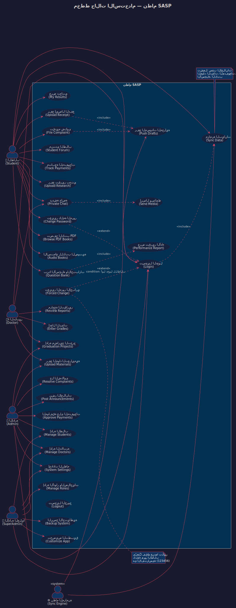

```plantuml
@startuml SASP_UseCaseDiagram
!theme blueprint
title مخطط حالات الاستخدام — نظام SASP

skinparam actorStyle awesome
skinparam backgroundColor #1a1a2e
skinparam usecase {
  BackgroundColor #16213e
  BorderColor #0f3460
  FontColor #e0e0e0
  ArrowColor #e94560
}
skinparam actor {
  BackgroundColor #0f3460
  BorderColor #e94560
  FontColor #e0e0e0
}
skinparam note {
  BackgroundColor #0f3460
  BorderColor #e94560
  FontColor white
}

left to right direction

' ========== ACTORS ==========
actor "🎓 الطالب\n(Student)" as Student
actor "👨‍⚕️ الدكتور\n(Doctor)" as Doctor
actor "🏢 الإدارة\n(Admin)" as Admin
actor "👑 الإدارة العليا\n(SuperAdmin)" as SuperAdmin
actor "⚙️ نظام المزامنة\n(Sync Engine)" as SyncEngine <<system>>

' ========== SYSTEM BOUNDARY ==========
rectangle "نظام SASP" {

  ' -- Authentication --
  usecase "تسجيل الدخول\n(Login)" as UC_Login
  usecase "تغيير كلمة المرور\n(Change Password)" as UC_ChangePass
  usecase "تغيير المرور الإجباري\n(Forced Change)" as UC_ForcedChange
  usecase "تسجيل الخروج\n(Logout)" as UC_Logout

  ' -- Sync --
  usecase "مزامنة البيانات\n(Sync Data)" as UC_Sync
  usecase "رفع المسودات المحلية\n(Push Drafts)" as UC_PushDrafts

  ' -- Curriculum --
  usecase "تصفح الكتب PDF\n(Browse PDF Books)" as UC_PDF
  usecase "الاستماع للكتب الصوتية\n(Audio Books)" as UC_Audio
  usecase "بنك الأسئلة والاختبارات\n(Question Bank)" as UC_Quiz
  usecase "عرض تقرير الأداء\n(Performance Report)" as UC_Report

  ' -- Academic Results --
  usecase "عرض درجاتي\n(My Results)" as UC_MyResults
  usecase "إدخال الدرجات\n(Enter Grades)" as UC_EnterGrades

  ' -- Payments --
  usecase "متابعة المدفوعات\n(Track Payments)" as UC_Payments
  usecase "رفع إيصال الدفع\n(Upload Receipt)" as UC_Receipt
  usecase "الموافقة على المدفوعات\n(Approve Payments)" as UC_ApprovePayments

  ' -- Complaints --
  usecase "تقديم شكوى\n(File Complaint)" as UC_Complaint
  usecase "حل الشكاوى\n(Resolve Complaints)" as UC_ResolveComplaint

  ' -- Chat --
  usecase "منتدى الطلاب\n(Student Forum)" as UC_Forum
  usecase "دردشة خاصة\n(Private Chat)" as UC_PrivateChat
  usecase "إرسال وسائط\n(Send Media)" as UC_Media

  ' -- Graduation & Research --
  usecase "رفع تقرير بحثي\n(Upload Research)" as UC_Research
  usecase "مراجعة التقارير\n(Review Reports)" as UC_ReviewReport
  usecase "إدارة مشاريع التخرج\n(Graduation Projects)" as UC_Graduation

  ' -- Admin Panel --
  usecase "إدارة الطلاب\n(Manage Students)" as UC_ManageStudents
  usecase "إدارة الدكاترة\n(Manage Doctors)" as UC_ManageDoctors
  usecase "نشر الإعلانات\n(Post Announcements)" as UC_Announcements
  usecase "رفع المواد التعليمية\n(Upload Materials)" as UC_Materials
  usecase "إعدادات النظام\n(System Settings)" as UC_Settings
  usecase "إدارة الأدوار والصلاحيات\n(Manage Roles)" as UC_Roles
  usecase "النسخ الاحتياطية\n(Backup System)" as UC_Backup
  usecase "تخصيص التطبيق\n(Customize App)" as UC_Customize
}

' ========== STUDENT ASSOCIATIONS ==========
Student --> UC_Login
Student --> UC_Sync
Student --> UC_PDF
Student --> UC_Audio
Student --> UC_Quiz
Student --> UC_MyResults
Student --> UC_Payments
Student --> UC_Receipt
Student --> UC_Complaint
Student --> UC_Forum
Student --> UC_PrivateChat
Student --> UC_Research
Student --> UC_ChangePass

' ========== DOCTOR ASSOCIATIONS ==========
Doctor --> UC_Login
Doctor --> UC_EnterGrades
Doctor --> UC_Materials
Doctor --> UC_ReviewReport
Doctor --> UC_PrivateChat
Doctor --> UC_Graduation

' ========== ADMIN ASSOCIATIONS ==========
Admin --> UC_Login
Admin --> UC_ManageStudents
Admin --> UC_ManageDoctors
Admin --> UC_Announcements
Admin --> UC_ApprovePayments
Admin --> UC_ResolveComplaint
Admin --> UC_Materials
Admin --> UC_Graduation
Admin --> UC_Settings

' ========== SUPERADMIN ASSOCIATIONS ==========
SuperAdmin --> UC_Login
SuperAdmin --> UC_ManageStudents
SuperAdmin --> UC_ManageDoctors
SuperAdmin --> UC_Roles
SuperAdmin --> UC_Backup
SuperAdmin --> UC_Customize
SuperAdmin --> UC_Settings

' ========== SYNC ENGINE ==========
SyncEngine --> UC_Sync
SyncEngine --> UC_PushDrafts

' ========== INCLUDE RELATIONSHIPS ==========
UC_Login ..> UC_Sync : <<include>>
UC_Quiz ..> UC_Report : <<include>>
UC_PrivateChat ..> UC_Media : <<include>>
UC_Receipt ..> UC_PushDrafts : <<include>>
UC_Complaint ..> UC_PushDrafts : <<include>>

' ========== EXTEND RELATIONSHIPS ==========
UC_ForcedChange ..> UC_Login : <<extend>>\ncondition: أول دخول للطالب
UC_ChangePass ..> UC_Login : <<extend>>

note right of UC_ForcedChange
  يُفعَّل فقط عندما تكون
  كلمة مرور الطالب
  هي الافتراضية (123456)
end note

note bottom of UC_Sync
  تشمل: سحب الإعلانات،
  المواد، الدرجات، المدفوعات،
  الأسئلة، الكتب
end note

@enduml
```

---

## 2️⃣ مخطط النشاط (Activity Diagram) — عملية المزامنة الكاملة

### 📋 الشرح:
يوضح هذا المخطط سير العمل الكامل لأهم عملية في نظام SASP وهي **دورة تسجيل الدخول والمزامنة**. يستخدم Swimlanes لفصل مهام الطالب عن نظام Flutter عن خادم Laravel، مع معالجة سيناريو العمل بدون إنترنت.

  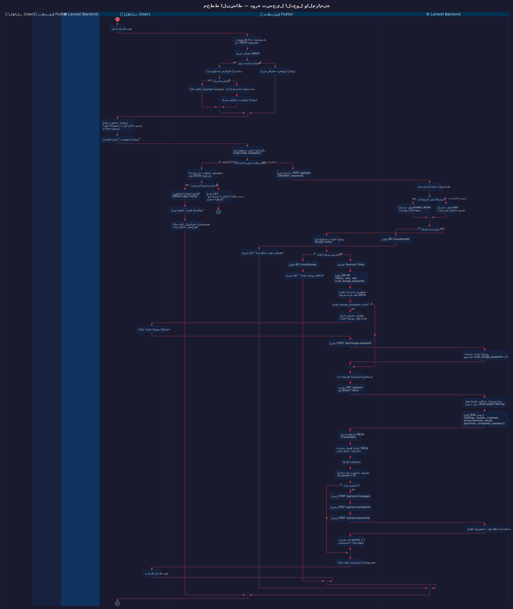

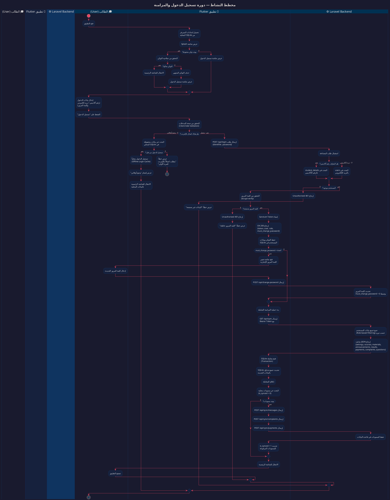
```plantuml
@startuml SASP_ActivityDiagram
!theme blueprint
title مخطط النشاط — دورة تسجيل الدخول والمزامنة

skinparam backgroundColor #1a1a2e
skinparam activity {
  BackgroundColor #16213e
  BorderColor #0f3460
  FontColor #e0e0e0
  ArrowColor #e94560
  StartColor #e94560
  EndColor #e94560
  BarColor #e94560
}
skinparam swimlane {
  TitleFontColor #e0e0e0
  BorderColor #0f3460
}

|#1a1a2e| 🎓 الطالب (User)|
|#16213e| 📱 تطبيق Flutter|
|#0f3460| ⚙️ Laravel Backend|

|🎓 الطالب (User)|
start
:فتح التطبيق;

|📱 تطبيق Flutter|
:تحميل إعدادات السيرفر\nمن SQLite المحلية;
:عرض شاشة Splash;

if (يوجد توكن محفوظ؟) then (نعم)
  :التحقق من صلاحية التوكن;
  if (التوكن صالح؟) then (نعم)
    :الانتقال للشاشة الرئيسية;
  else (لا)
    :حذف التوكن المنتهي;
    :عرض شاشة تسجيل الدخول;
  endif
else (لا)
  :عرض شاشة تسجيل الدخول;
endif

|🎓 الطالب (User)|
:إدخال بيانات الدخول\n(رقم أكاديمي / بريد إلكتروني\nوكلمة المرور);
:الضغط على "تسجيل الدخول";

|📱 تطبيق Flutter|
:التحقق من صحة المدخلات\n(Client-Side Validation);

if (هل هناك اتصال بالإنترنت؟) then (لا - وضع أوفلاين)
  :البحث عن بيانات محفوظة\nفي SQLite المحلي;
  if (تسجيل الدخول من قبل؟) then (نعم)
    :تسجيل الدخول محلياً\n(Offline Login Cache);
    :عرض إشعار "وضع أوفلاين";
    :الانتقال للشاشة الرئيسية\nبالبيانات المحلية;
  else (لا)
    :عرض خطأ:\n"يتطلب اتصالاً بالإنترنت\nللمرة الأولى";
    stop
  endif
else (نعم - متصل)

  :إرسال طلب POST /api/login\n{identifier, password};

  |⚙️ Laravel Backend|
  :استقبال طلب المصادقة;
  if (هل المعرّف رقم أكاديمي؟) then (نعم)
    :البحث في student_details\nبالرقم الأكاديمي;
  else (لا - بريد إلكتروني)
    :البحث في users\nبالبريد الإلكتروني;
  endif

  if (المستخدم موجود؟) then (لا)
    :إرجاع 401 Unauthorized;
    |📱 تطبيق Flutter|
    :عرض خطأ: "البيانات غير صحيحة";
  else (نعم)
    :التحقق من كلمة المرور\n(bcrypt verify);
    if (كلمة المرور صحيحة؟) then (لا)
      :إرجاع 401 Unauthorized;
      |📱 تطبيق Flutter|
      :عرض خطأ: "كلمة المرور خاطئة";
    else (نعم)
      :إنشاء Sanctum Token;
      :إرجاع 200 OK\n{token, user, role,\nmust_change_password};

      |📱 تطبيق Flutter|
      :حفظ التوكن وبيانات\nالمستخدم في SQLite;

      if (must_change_password = true؟) then (نعم)
        :فتح شاشة تغيير\nكلمة المرور الإجبارية;
        |🎓 الطالب (User)|
        :إدخال كلمة المرور الجديدة;
        |📱 تطبيق Flutter|
        :إرسال POST /api/change-password;
        |⚙️ Laravel Backend|
        :تحديث كلمة المرور\nوضبط must_change_password = 0;
        |📱 تطبيق Flutter|
      else (لا)
      endif

      :بدء عملية المزامنة الشاملة;
      :إرسال GET /api/sync\nمع Bearer Token;

      |⚙️ Laravel Backend|
      :جمع جميع بيانات المستخدم\nحسب دوره (Role-based Filtering);
      :إرجاع JSON شامل:\n{settings, courses, materials,\nannouncements, results,\npayments, complaints, questions};

      |📱 تطبيق Flutter|
      :فتح معاملة SQLite\n(Transaction);
      :تحديث جميع جداول SQLite\nبالبيانات الجديدة;
      :إغلاق المعاملة;

      :البحث عن مسودات محلية\n(is_synced = 0);
      if (توجد مسودات؟) then (نعم)
        :إرسال POST /api/sync/messages;
        :إرسال POST /api/sync/complaints;
        :إرسال POST /api/sync/payments;
        |⚙️ Laravel Backend|
        :حفظ المسودات في قاعدة البيانات;
        |📱 تطبيق Flutter|
        :تحديث is_synced = 1\nللمسودات المرفوعة;
      else (لا)
      endif

      :الانتقال للشاشة الرئيسية;

      |🎓 الطالب (User)|
      :تصفح التطبيق;
    endif
  endif
endif

stop
@enduml
```

---

# 📌 القسم الثاني: النمذجة الهيكلية (Structural Modeling)

---

## 3️⃣ مخطط الفئات (Class Diagram)

### 📋 الشرح:
يوضح الفئات الأساسية في مجال مشكلة SASP مع خصائصها وعملياتها والعلاقات بينها. يتضمن التراتبية (Generalization) من `User` إلى الأدوار المختلفة، والتجميع (Aggregation) بين `Course` و`EducationalMaterial`، والارتباط (Association) بين مختلف الفئات.

  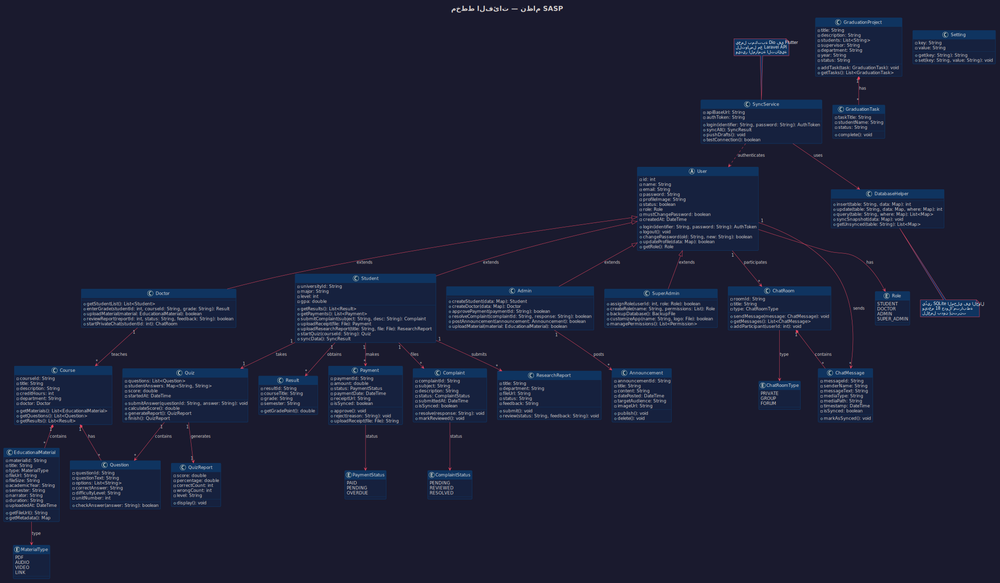

```plantuml
@startuml SASP_ClassDiagram
!theme blueprint
title مخطط الفئات — نظام SASP

skinparam backgroundColor #1a1a2e
skinparam class {
  BackgroundColor #16213e
  BorderColor #0f3460
  FontColor #e0e0e0
  ArrowColor #e94560
  HeaderBackgroundColor #0f3460
}
skinparam note {
  BackgroundColor #0f3460
  BorderColor #e94560
  FontColor white
}

' =============================================
' BASE CLASS — User
' =============================================
abstract class User {
  - id: int
  - name: String
  - email: String
  - password: String
  - profileImage: String
  - status: boolean
  - role: Role
  - mustChangePassword: boolean
  - createdAt: DateTime
  + login(identifier: String, password: String): AuthToken
  + logout(): void
  + changePassword(old: String, new: String): boolean
  + updateProfile(data: Map): boolean
  + getRole(): Role
}

enum Role {
  STUDENT
  DOCTOR
  ADMIN
  SUPER_ADMIN
}

' =============================================
' SUBCLASSES
' =============================================
class Student {
  - universityId: String
  - major: String
  - level: int
  - gpa: double
  + getResults(): List<Result>
  + getPayments(): List<Payment>
  + submitComplaint(subject: String, desc: String): Complaint
  + uploadReceipt(file: File): Payment
  + uploadResearchReport(title: String, file: File): ResearchReport
  + startQuiz(courseId: String): Quiz
  + syncData(): SyncResult
}

class Doctor {
  + getStudentList(): List<Student>
  + enterGrade(studentId: int, courseId: String, grade: String): Result
  + uploadMaterial(material: EducationalMaterial): boolean
  + reviewReport(reportId: int, status: String, feedback: String): boolean
  + startPrivateChat(studentId: int): ChatRoom
}

class Admin {
  + createStudent(data: Map): Student
  + createDoctor(data: Map): Doctor
  + approvePayment(paymentId: String): boolean
  + resolveComplaint(complaintId: String, response: String): boolean
  + postAnnouncement(announcement: Announcement): boolean
  + uploadMaterial(material: EducationalMaterial): boolean
}

class SuperAdmin {
  + assignRole(userId: int, role: Role): boolean
  + createRole(name: String, permissions: List): Role
  + backupDatabase(): BackupFile
  + customizeApp(name: String, logo: File): boolean
  + managePermissions(): List<Permission>
}

' Generalization (Inheritance)
User <|-- Student : extends
User <|-- Doctor : extends
User <|-- Admin : extends
User <|-- SuperAdmin : extends

User --> Role : has

' =============================================
' COURSE
' =============================================
class Course {
  - courseId: String
  - title: String
  - description: String
  - creditHours: int
  - department: String
  - doctor: Doctor
  + getMaterials(): List<EducationalMaterial>
  + getQuestions(): List<Question>
  + getResults(): List<Result>
}

' =============================================
' EDUCATIONAL MATERIAL
' =============================================
class EducationalMaterial {
  - materialId: String
  - title: String
  - type: MaterialType
  - fileUrl: String
  - fileSize: String
  - academicYear: String
  - semester: String
  - narrator: String
  - duration: String
  - uploadedAt: DateTime
  + getFileUrl(): String
  + getMetadata(): Map
}

enum MaterialType {
  PDF
  AUDIO
  VIDEO
  LINK
}

EducationalMaterial --> MaterialType : type

' =============================================
' QUESTION & QUIZ
' =============================================
class Question {
  - questionId: String
  - questionText: String
  - options: List<String>
  - correctAnswer: String
  - difficultyLevel: String
  - unitNumber: int
  + checkAnswer(answer: String): boolean
}

class Quiz {
  - questions: List<Question>
  - studentAnswers: Map<String, String>
  - score: double
  - startedAt: DateTime
  + submitAnswer(questionId: String, answer: String): void
  + calculateScore(): double
  + generateReport(): QuizReport
  + finish(): QuizReport
}

class QuizReport {
  - score: double
  - percentage: double
  - correctCount: int
  - wrongCount: int
  - level: String
  + display(): void
}

Quiz "1" --> "*" Question : contains
Quiz "1" --> "1" QuizReport : generates

' =============================================
' RESULT
' =============================================
class Result {
  - resultId: String
  - courseTitle: String
  - grade: String
  - semester: String
  + getGradePoint(): double
}

' =============================================
' PAYMENT
' =============================================
class Payment {
  - paymentId: String
  - amount: double
  - status: PaymentStatus
  - paymentDate: DateTime
  - receiptUrl: String
  - isSynced: boolean
  + approve(): void
  + reject(reason: String): void
  + uploadReceipt(file: File): String
}

enum PaymentStatus {
  PAID
  PENDING
  OVERDUE
}

Payment --> PaymentStatus : status

' =============================================
' COMPLAINT
' =============================================
class Complaint {
  - complaintId: String
  - subject: String
  - description: String
  - status: ComplaintStatus
  - submittedAt: DateTime
  - isSynced: boolean
  + resolve(response: String): void
  + markReviewed(): void
}

enum ComplaintStatus {
  PENDING
  REVIEWED
  RESOLVED
}

Complaint --> ComplaintStatus : status

' =============================================
' ANNOUNCEMENT
' =============================================
class Announcement {
  - announcementId: String
  - title: String
  - content: String
  - datePosted: DateTime
  - targetAudience: String
  - imageUrl: String
  + publish(): void
  + delete(): void
}

' =============================================
' CHAT
' =============================================
class ChatRoom {
  - roomId: String
  - title: String
  - type: ChatRoomType
  + sendMessage(message: ChatMessage): void
  + getMessages(): List<ChatMessage>
  + addParticipant(userId: int): void
}

enum ChatRoomType {
  PRIVATE
  GROUP
  FORUM
}

class ChatMessage {
  - messageId: String
  - senderName: String
  - messageText: String
  - mediaType: String
  - mediaPath: String
  - timestamp: DateTime
  - isSynced: boolean
  + markAsSynced(): void
}

ChatRoom --> ChatRoomType : type
ChatRoom "1" *-- "*" ChatMessage : contains

' =============================================
' RESEARCH REPORT
' =============================================
class ResearchReport {
  - title: String
  - department: String
  - fileUrl: String
  - status: String
  - feedback: String
  + submit(): void
  + review(status: String, feedback: String): void
}

' =============================================
' GRADUATION
' =============================================
class GraduationProject {
  - title: String
  - description: String
  - students: List<String>
  - supervisor: String
  - department: String
  - year: String
  - status: String
  + addTask(task: GraduationTask): void
  + getTasks(): List<GraduationTask>
}

class GraduationTask {
  - taskTitle: String
  - studentName: String
  - status: String
  + complete(): void
}

GraduationProject "1" *-- "*" GraduationTask : has

' =============================================
' SETTINGS
' =============================================
class Setting {
  - key: String
  - value: String
  + get(key: String): String
  + set(key: String, value: String): void
}

' =============================================
' SYNC SERVICE
' =============================================
class SyncService {
  - apiBaseUrl: String
  - authToken: String
  + login(identifier: String, password: String): AuthToken
  + syncAll(): SyncResult
  + pushDrafts(): void
  + testConnection(): boolean
}

class DatabaseHelper {
  + insert(table: String, data: Map): int
  + update(table: String, data: Map, where: Map): int
  + query(table: String, where: Map): List<Map>
  + syncSnapshot(data: Map): void
  + getUnsynced(table: String): List<Map>
}

' =============================================
' ASSOCIATIONS
' =============================================
Doctor "1" --> "*" Course : teaches
Course "1" *-- "*" EducationalMaterial : contains
Course "1" *-- "*" Question : has

Student "1" --> "*" Result : obtains
Student "1" --> "*" Payment : makes
Student "1" --> "*" Complaint : files
Student "1" --> "*" ResearchReport : submits
Student "1" --> "1" Quiz : takes

Admin "1" --> "*" Announcement : posts
User "1" --> "*" ChatRoom : participates
User "1" --> "*" ChatMessage : sends

SyncService --> DatabaseHelper : uses
SyncService ..> User : authenticates

note top of SyncService
  يعمل بمكتبة Dio في Flutter
  للتواصل مع Laravel API
  ويدير المزامنة الثنائية
end note

note bottom of DatabaseHelper
  يُدير SQLite المحلي في الجوال
  ويدعم 18 جدولاً مترابطة
  للعمل بدون إنترنت
end note

@enduml
```

---

# 📌 القسم الثالث: النمذجة السلوكية (Behavioral Modeling)

---

## 4️⃣ مخطط التسلسل (Sequence Diagram) — عملية الاختبار التفاعلي

### 📋 الشرح:
يوضح التفاعل الديناميكي بين الكائنات خلال تنفيذ عملية **بدء اختبار تفاعلي وعرض نتيجته**. يتضح فيه تمرير الرسائل عبر الزمن بين الطالب وتطبيق Flutter وقاعدة البيانات المحلية.

  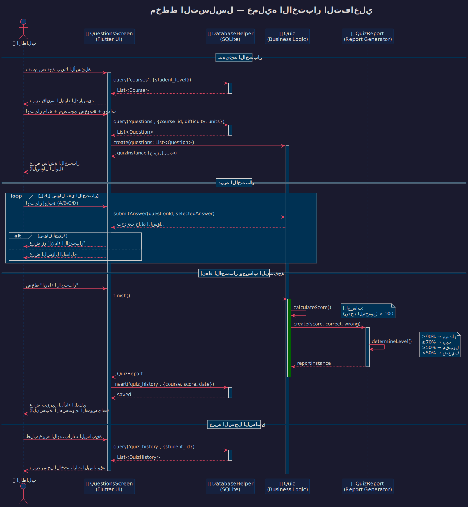

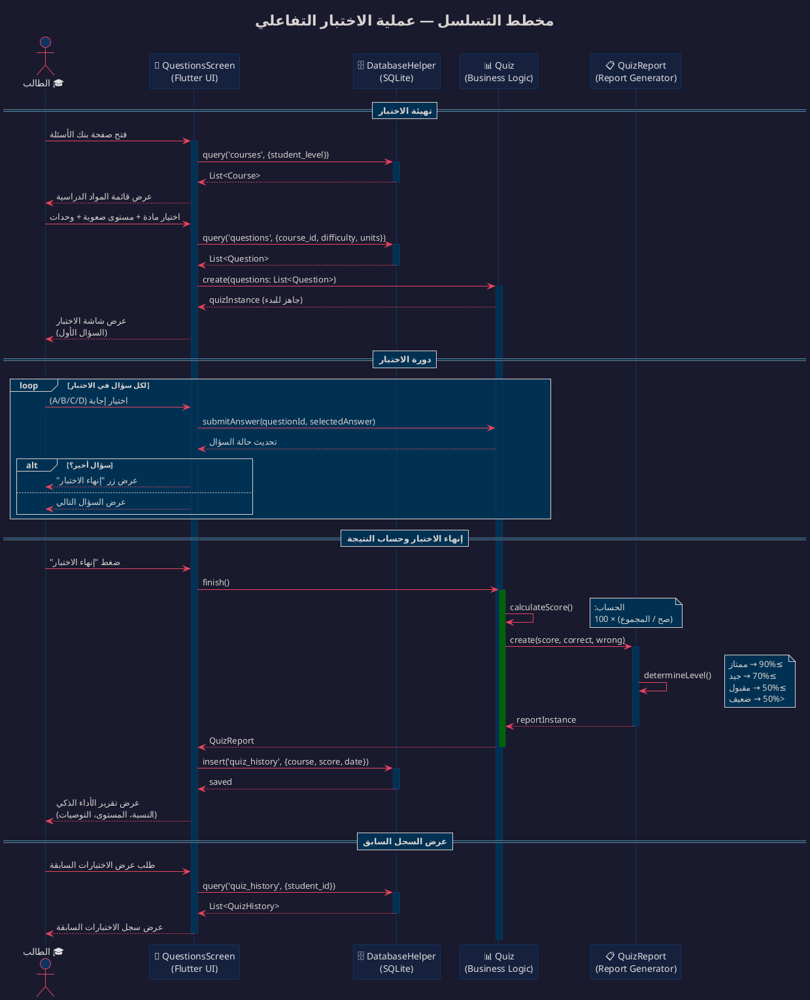
```plantuml
@startuml SASP_SequenceDiagram
!theme blueprint
title مخطط التسلسل — عملية الاختبار التفاعلي

skinparam backgroundColor #1a1a2e
skinparam sequence {
  ParticipantBackgroundColor #16213e
  ParticipantBorderColor #0f3460
  ParticipantFontColor #e0e0e0
  ArrowColor #e94560
  LifeLineBorderColor #0f3460
  ActorBackgroundColor #0f3460
  ActorBorderColor #e94560
  ActorFontColor #e0e0e0
  BoxBackgroundColor #1a1a2e
  BoxBorderColor #0f3460
  NoteBackgroundColor #0f3460
  NoteBorderColor #e94560
  NoteFontColor white
}

actor "🎓 الطالب" as Student
participant "📱 QuestionsScreen\n(Flutter UI)" as UI
participant "🗄️ DatabaseHelper\n(SQLite)" as DB
participant "📊 Quiz\n(Business Logic)" as Quiz
participant "📋 QuizReport\n(Report Generator)" as Report

== تهيئة الاختبار ==

Student -> UI : فتح صفحة بنك الأسئلة
activate UI

UI -> DB : query('courses', {student_level})
activate DB
DB --> UI : List<Course>
deactivate DB

UI --> Student : عرض قائمة المواد الدراسية

Student -> UI : اختيار مادة + مستوى صعوبة + وحدات
UI -> DB : query('questions', {course_id, difficulty, units})
activate DB
DB --> UI : List<Question>
deactivate DB

UI -> Quiz : create(questions: List<Question>)
activate Quiz
Quiz --> UI : quizInstance (جاهز للبدء)

UI --> Student : عرض شاشة الاختبار\n(السؤال الأول)

== دورة الاختبار ==

loop لكل سؤال في الاختبار

  Student -> UI : اختيار إجابة (A/B/C/D)
  UI -> Quiz : submitAnswer(questionId, selectedAnswer)
  Quiz --> UI : تحديث حالة السؤال

  alt سؤال أخير؟
    UI --> Student : عرض زر "إنهاء الاختبار"
  else
    UI --> Student : عرض السؤال التالي
  end

end

== إنهاء الاختبار وحساب النتيجة ==

Student -> UI : ضغط "إنهاء الاختبار"
UI -> Quiz : finish()
activate Quiz #darkgreen
Quiz -> Quiz : calculateScore()
note right: الحساب:\n(صح / المجموع) × 100
Quiz -> Report : create(score, correct, wrong)
activate Report
Report -> Report : determineLevel()
note right: ≥90% → ممتاز\n≥70% → جيد\n≥50% → مقبول\n<50% → ضعيف
Report --> Quiz : reportInstance
deactivate Report
Quiz --> UI : QuizReport
deactivate Quiz

UI -> DB : insert('quiz_history', {course, score, date})
activate DB
DB --> UI : saved
deactivate DB

UI --> Student : عرض تقرير الأداء الذكي\n(النسبة، المستوى، التوصيات)

== عرض السجل السابق ==

Student -> UI : طلب عرض الاختبارات السابقة
UI -> DB : query('quiz_history', {student_id})
activate DB
DB --> UI : List<QuizHistory>
deactivate DB
UI --> Student : عرض سجل الاختبارات السابقة

deactivate UI
@enduml
```

---

## 5️⃣ مخطط التسلسل — دفع البيانات المحلية (Offline Sync Push)

### 📋 الشرح:
يوضح عملية دفع البيانات المُنشأة أثناء وضع الأوفلاين (شكوى، رسالة، إيصال دفع) إلى السيرفر عند عودة الاتصال.

  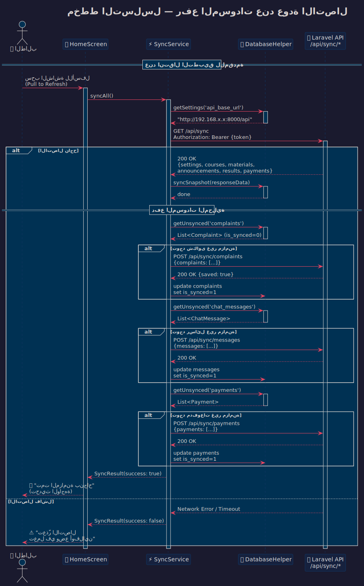

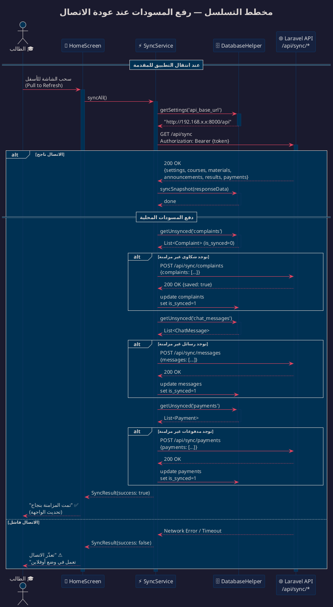
```plantuml
@startuml SASP_SequenceDiagram_Sync
!theme blueprint
title مخطط التسلسل — رفع المسودات عند عودة الاتصال

skinparam backgroundColor #1a1a2e
skinparam sequence {
  ParticipantBackgroundColor #16213e
  ParticipantBorderColor #0f3460
  ParticipantFontColor #e0e0e0
  ArrowColor #e94560
  LifeLineBorderColor #0f3460
}

actor "🎓 الطالب" as Student
participant "📱 HomeScreen" as Home
participant "⚡ SyncService" as Sync
participant "🗄️ DatabaseHelper" as DB
participant "🌐 Laravel API\n/api/sync/*" as API

== عند انتقال التطبيق للمقدمة ==

Student -> Home : سحب الشاشة للأسفل\n(Pull to Refresh)
activate Home
Home -> Sync : syncAll()
activate Sync

Sync -> DB : getSettings('api_base_url')
activate DB
DB --> Sync : "http://192.168.x.x:8000/api"
deactivate DB

Sync -> API : GET /api/sync\nAuthorization: Bearer {token}
activate API

alt الاتصال ناجح
  API --> Sync : 200 OK\n{settings, courses, materials,\nannouncements, results, payments}
  Sync -> DB : syncSnapshot(responseData)
  activate DB
  DB --> Sync : done
  deactivate DB

  == دفع المسودات المحلية ==

  Sync -> DB : getUnsynced('complaints')
  activate DB
  DB --> Sync : List<Complaint> (is_synced=0)
  deactivate DB

  alt توجد شكاوى غير مزامنة
    Sync -> API : POST /api/sync/complaints\n{complaints: [...]}
    API --> Sync : 200 OK {saved: true}
    Sync -> DB : update complaints\nset is_synced=1
  end

  Sync -> DB : getUnsynced('chat_messages')
  activate DB
  DB --> Sync : List<ChatMessage>
  deactivate DB

  alt توجد رسائل غير مزامنة
    Sync -> API : POST /api/sync/messages\n{messages: [...]}
    API --> Sync : 200 OK
    Sync -> DB : update messages\nset is_synced=1
  end

  Sync -> DB : getUnsynced('payments')
  activate DB
  DB --> Sync : List<Payment>
  deactivate DB

  alt توجد مدفوعات غير مزامنة
    Sync -> API : POST /api/sync/payments\n{payments: [...]}
    API --> Sync : 200 OK
    Sync -> DB : update payments\nset is_synced=1
  end

  Sync --> Home : SyncResult(success: true)
  Home --> Student : ✅ "تمت المزامنة بنجاح"\n(تحديث الواجهة)

else الاتصال فاشل
  API --> Sync : Network Error / Timeout
  Sync --> Home : SyncResult(success: false)
  Home --> Student : ⚠️ "تعذّر الاتصال\nتعمل في وضع أوفلاين"
end

deactivate API
deactivate Sync
deactivate Home

@enduml
```

---

## 6️⃣ مخطط آلة الحالة (State Machine Diagram) — كائن "الشكوى"

### 📋 الشرح:
يوضح الحالات المختلفة التي يمر بها كائن `Complaint` منذ إنشائه من قِبل الطالب وحتى حله من قِبل الإدارة، مع توضيح جميع الانتقالات (Transitions) والأحداث المُطلِقة لها.

  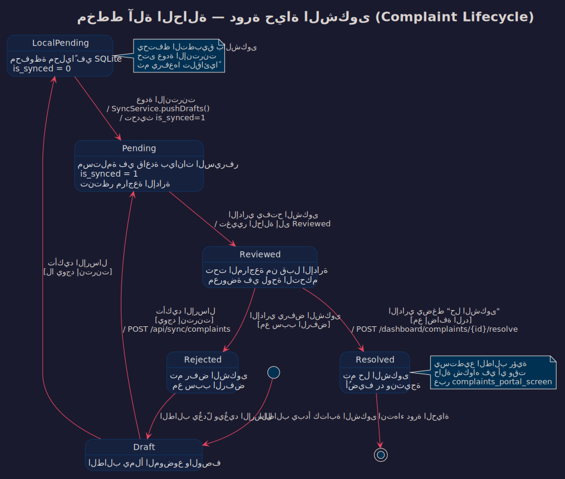

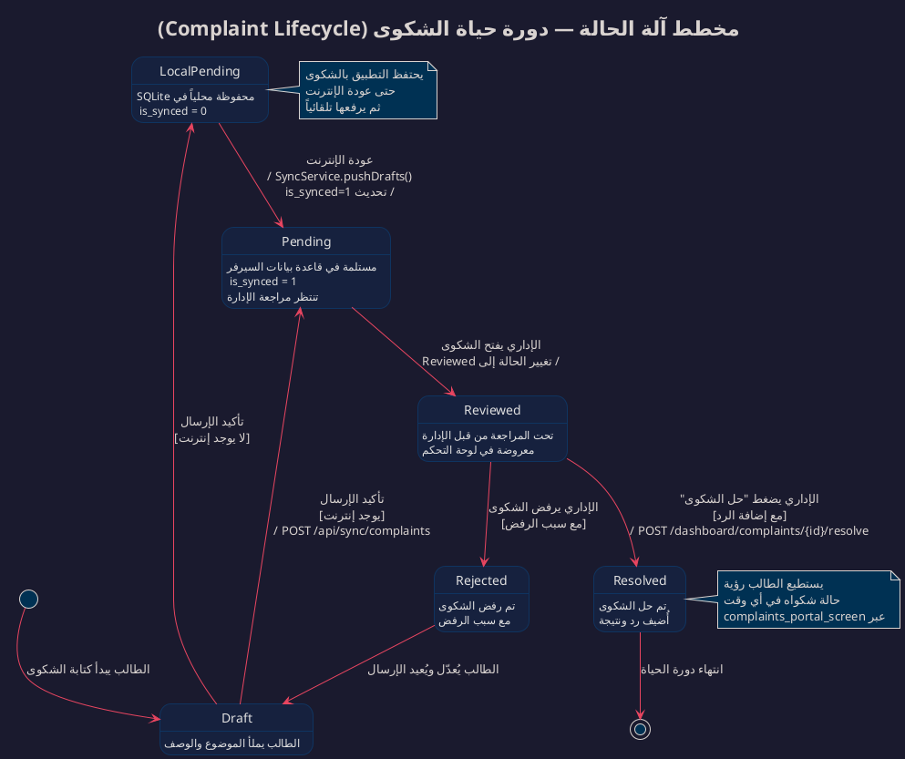
```plantuml
@startuml SASP_StateMachineDiagram_Complaint
!theme blueprint
title مخطط آلة الحالة — دورة حياة الشكوى (Complaint Lifecycle)

skinparam backgroundColor #1a1a2e
skinparam state {
  BackgroundColor #16213e
  BorderColor #0f3460
  FontColor #e0e0e0
  ArrowColor #e94560
  StartColor #e94560
  EndColor #e94560
}

[*] --> Draft : الطالب يبدأ كتابة الشكوى

state Draft : الطالب يملأ الموضوع والوصف
state LocalPending : محفوظة محلياً في SQLite\n is_synced = 0
state Pending : مستلمة في قاعدة بيانات السيرفر\n is_synced = 1\n تنتظر مراجعة الإدارة
state Reviewed : تحت المراجعة من قبل الإدارة\n معروضة في لوحة التحكم
state Resolved : تم حل الشكوى\n أُضيف رد ونتيجة
state Rejected : تم رفض الشكوى\n مع سبب الرفض

Draft --> LocalPending : تأكيد الإرسال\n[لا يوجد إنترنت]

Draft --> Pending : تأكيد الإرسال\n[يوجد إنترنت]\n/ POST /api/sync/complaints

LocalPending --> Pending : عودة الإنترنت\n/ SyncService.pushDrafts()\n/ تحديث is_synced=1

Pending --> Reviewed : الإداري يفتح الشكوى\n/ تغيير الحالة إلى Reviewed

Reviewed --> Resolved : الإداري يضغط "حل الشكوى"\n[مع إضافة الرد]\n/ POST /dashboard/complaints/{id}/resolve

Reviewed --> Rejected : الإداري يرفض الشكوى\n[مع سبب الرفض]

Resolved --> [*] : انتهاء دورة الحياة

Rejected --> Draft : الطالب يُعدّل ويُعيد الإرسال

note right of LocalPending
  يحتفظ التطبيق بالشكوى
  حتى عودة الإنترنت
  ثم يرفعها تلقائياً
end note

note right of Resolved
  يستطيع الطالب رؤية
  حالة شكواه في أي وقت
  عبر complaints_portal_screen
end note

@enduml
```

---

## 7️⃣ مخطط آلة الحالة — كائن "المدفوعات" (Payment Lifecycle)

### 📋 الشرح:
يوضح دورة حياة كائن `Payment` من لحظة إنشائه بواسطة الطالب حتى تأكيده أو تأخره.

  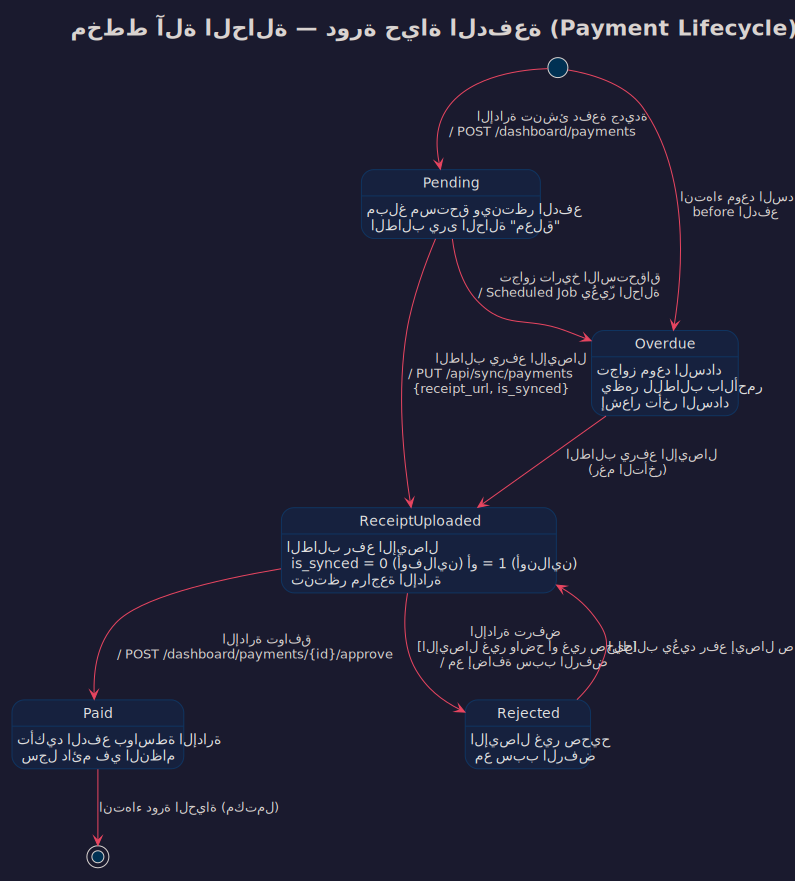

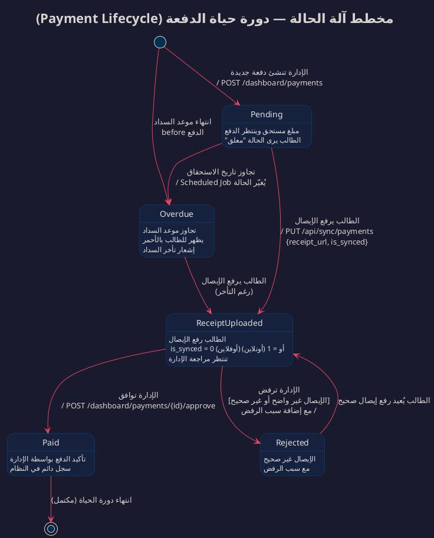
```plantuml
@startuml SASP_StateMachineDiagram_Payment
!theme blueprint
title مخطط آلة الحالة — دورة حياة الدفعة (Payment Lifecycle)

skinparam backgroundColor #1a1a2e
skinparam state {
  BackgroundColor #16213e
  BorderColor #0f3460
  FontColor #e0e0e0
  ArrowColor #e94560
}

[*] --> Overdue : انتهاء موعد السداد\nbefore الدفع

[*] --> Pending : الإدارة تنشئ دفعة جديدة\n/ POST /dashboard/payments

state Pending : مبلغ مستحق وينتظر الدفع\n الطالب يرى الحالة "معلق"
state ReceiptUploaded : الطالب رفع الإيصال\n is_synced = 0 (أوفلاين) أو = 1 (أونلاين)\n تنتظر مراجعة الإدارة
state Paid : تأكيد الدفع بواسطة الإدارة\n سجل دائم في النظام
state Overdue : تجاوز موعد السداد\n يظهر للطالب بالأحمر\n إشعار تأخر السداد
state Rejected : الإيصال غير صحيح\n مع سبب الرفض

Pending --> ReceiptUploaded : الطالب يرفع الإيصال\n/ PUT /api/sync/payments\n{receipt_url, is_synced}

Pending --> Overdue : تجاوز تاريخ الاستحقاق\n/ Scheduled Job يُغيّر الحالة

Overdue --> ReceiptUploaded : الطالب يرفع الإيصال\n(رغم التأخر)

ReceiptUploaded --> Paid : الإدارة توافق\n/ POST /dashboard/payments/{id}/approve

ReceiptUploaded --> Rejected : الإدارة ترفض\n[الإيصال غير واضح أو غير صحيح]\n/ مع إضافة سبب الرفض

Rejected --> ReceiptUploaded : الطالب يُعيد رفع إيصال صحيح

Paid --> [*] : انتهاء دورة الحياة (مكتمل)

@enduml
```

---

# 📌 القسم الرابع: إدارة البيانات (Data Management Layer)

---

## 8️⃣ مخطط الكيانات والعلاقات — ERD

### 📋 الشرح:
يوضح التصميم الكامل لقاعدة البيانات العلائقية لخادم Laravel، مع المفاتيح الأساسية والأجنبية وأنواع العلاقات بين الجداول.

  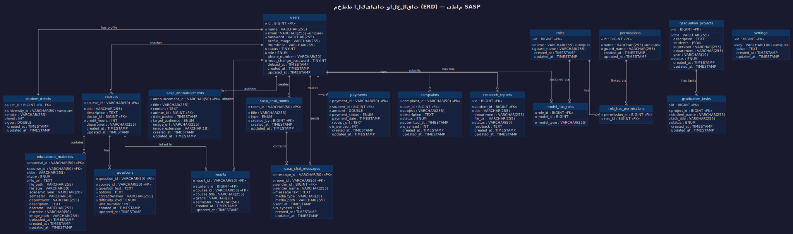

```plantuml
@startuml SASP_ERD
!theme blueprint
title مخطط الكيانات والعلاقات (ERD) — نظام SASP

' hide the spot
hide circle
' avoid problems with angled crows feet
skinparam linetype ortho

skinparam backgroundColor #1a1a2e
skinparam class {
  BackgroundColor #16213e
  BorderColor #0f3460
  FontColor #e0e0e0
  HeaderBackgroundColor #0f3460
}

entity users {
  * id : BIGINT <<PK>>
  --
  * name : VARCHAR(255)
  * email : VARCHAR(255) <<unique>>
  * password : VARCHAR(255)
  profile_image : VARCHAR(255)
  thumbnail : VARCHAR(255)
  * status : TINYINT
  * role : ENUM
  phone_number : VARCHAR(20)
  * must_change_password : TINYINT
  deleted_at : TIMESTAMP
  created_at : TIMESTAMP
  updated_at : TIMESTAMP
}

entity student_details {
  * user_id : BIGINT <<PK, FK>>
  --
  * university_id : VARCHAR(50) <<unique>>
  * major : VARCHAR(255)
  * level : INT
  * gpa : DOUBLE
  created_at : TIMESTAMP
  updated_at : TIMESTAMP
}

entity courses {
  * course_id : VARCHAR(50) <<PK>>
  --
  * title : VARCHAR(255)
  description : TEXT
  doctor_id : BIGINT <<FK>>
  * credit_hours : INT
  department : VARCHAR(255)
  created_at : TIMESTAMP
  updated_at : TIMESTAMP
}

entity educational_materials {
  * material_id : VARCHAR(50) <<PK>>
  --
  * course_id : VARCHAR(50) <<FK>>
  * title : VARCHAR(255)
  * type : ENUM
  * file_url : TEXT
  file_path : VARCHAR(255)
  file_size : VARCHAR(50)
  academic_year : VARCHAR(20)
  semester : VARCHAR(50)
  department : VARCHAR(255)
  description : TEXT
  narrator : VARCHAR(255)
  duration : VARCHAR(50)
  image_path : VARCHAR(255)
  uploaded_at : TIMESTAMP
  created_at : TIMESTAMP
  updated_at : TIMESTAMP
}

entity questions {
  * question_id : VARCHAR(50) <<PK>>
  --
  * course_id : VARCHAR(50) <<FK>>
  * question_text : TEXT
  * options : TEXT
  * correctAnswer : VARCHAR(255)
  * difficulty_level : ENUM
  unit_number : INT
  created_at : TIMESTAMP
  updated_at : TIMESTAMP
}

entity sasp_announcements {
  * announcement_id : VARCHAR(50) <<PK>>
  --
  * title : VARCHAR(255)
  * content : TEXT
  * author_id : BIGINT <<FK>>
  * date_posted : TIMESTAMP
  * target_audience : ENUM
  image_url : VARCHAR(255)
  image_extension : VARCHAR(10)
  created_at : TIMESTAMP
  updated_at : TIMESTAMP
}

entity sasp_chat_rooms {
  * room_id : VARCHAR(50) <<PK>>
  --
  * title : VARCHAR(255)
  * type : ENUM
  * created_by : BIGINT <<FK>>
  created_at : TIMESTAMP
  updated_at : TIMESTAMP
}

entity sasp_chat_messages {
  * message_id : VARCHAR(50) <<PK>>
  --
  * room_id : VARCHAR(50) <<FK>>
  * sender_id : BIGINT <<FK>>
  * sender_name : VARCHAR(255)
  * message_text : TEXT
  media_type : VARCHAR(20)
  media_path : VARCHAR(255)
  * sent_at : TIMESTAMP
  * is_synced : INT
  created_at : TIMESTAMP
  updated_at : TIMESTAMP
}

entity results {
  * result_id : VARCHAR(50) <<PK>>
  --
  * student_id : BIGINT <<FK>>
  * course_id : VARCHAR(50) <<FK>>
  * course_title : VARCHAR(255)
  * grade : VARCHAR(10)
  * semester : VARCHAR(50)
  created_at : TIMESTAMP
  updated_at : TIMESTAMP
}

entity payments {
  * payment_id : VARCHAR(50) <<PK>>
  --
  * student_id : BIGINT <<FK>>
  * amount : DOUBLE
  * payment_status : ENUM
  payment_date : TIMESTAMP
  receipt_url : TEXT
  * is_synced : INT
  created_at : TIMESTAMP
  updated_at : TIMESTAMP
}

entity complaints {
  * complaint_id : VARCHAR(50) <<PK>>
  --
  * user_id : BIGINT <<FK>>
  * subject : VARCHAR(255)
  * description : TEXT
  * status : ENUM
  * submitted_at : TIMESTAMP
  * is_synced : INT
  created_at : TIMESTAMP
  updated_at : TIMESTAMP
}

entity research_reports {
  * id : BIGINT <<PK>>
  --
  * student_id : BIGINT <<FK>>
  * title : VARCHAR(255)
  department : VARCHAR(255)
  file_url : VARCHAR(255)
  * status : VARCHAR(50)
  feedback : TEXT
  created_at : TIMESTAMP
  updated_at : TIMESTAMP
}

entity graduation_projects {
  * id : BIGINT <<PK>>
  --
  * title : VARCHAR(255)
  description : TEXT
  students : JSON
  supervisor : VARCHAR(255)
  department : VARCHAR(255)
  year : VARCHAR(10)
  * status : ENUM
  created_at : TIMESTAMP
  updated_at : TIMESTAMP
}

entity graduation_tasks {
  * id : BIGINT <<PK>>
  --
  * project_id : BIGINT <<FK>>
  * student_name : VARCHAR(255)
  * task_title : VARCHAR(255)
  * status : ENUM
  created_at : TIMESTAMP
  updated_at : TIMESTAMP
}

entity settings {
  * id : BIGINT <<PK>>
  --
  * key : VARCHAR(100) <<unique>>
  value : TEXT
  created_at : TIMESTAMP
  updated_at : TIMESTAMP
}

' Spatie tables
entity roles {
  * id : BIGINT <<PK>>
  --
  * name : VARCHAR(255) <<unique>>
  * guard_name : VARCHAR(255)
  created_at : TIMESTAMP
  updated_at : TIMESTAMP
}

entity permissions {
  * id : BIGINT <<PK>>
  --
  * name : VARCHAR(255) <<unique>>
  * guard_name : VARCHAR(255)
  created_at : TIMESTAMP
  updated_at : TIMESTAMP
}

entity model_has_roles {
  * role_id : BIGINT <<FK>>
  * model_type : VARCHAR(255)
  * model_id : BIGINT
}

entity role_has_permissions {
  * permission_id : BIGINT <<FK>>
  * role_id : BIGINT <<FK>>
}

' Relations
users ||--|| student_details : "has profile"
users ||--o{ courses : "teaches"
users ||--o{ results : "obtains"
users ||--o{ payments : "makes"
users ||--o{ complaints : "files"
users ||--o{ sasp_announcements : "authors"
users ||--o{ sasp_chat_rooms : "creates"
users ||--o{ sasp_chat_messages : "sends"
users ||--o{ research_reports : "submits"

courses ||--o{ educational_materials : "contains"
courses ||--o{ questions : "has"
courses ||--o{ results : "linked to"

sasp_chat_rooms ||--o{ sasp_chat_messages : "contains"
graduation_projects ||--o{ graduation_tasks : "has tasks"

roles ||--o{ model_has_roles : "assigned via"
permissions ||--o{ role_has_permissions : "linked via"
roles ||--o{ role_has_permissions : "has"
users ||--o{ model_has_roles : "has role"

@enduml
```
---

# 📌 القسم الخامس: بنية التطبيق (Application Architecture Layer)

---

## 9️⃣ مخطط النشر (Deployment Diagram)

### 📋 الشرح:
يوضح البنية التحتية الكاملة لنظام SASP وكيفية تواصل تطبيق Flutter مع خادم Laravel وقاعدة البيانات، مع توضيح البيئات المختلفة (التطوير والإنتاج).

  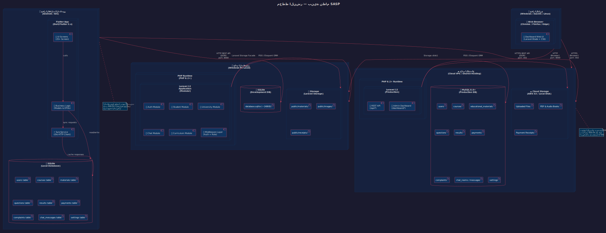

```plantuml
@startuml SASP_DeploymentDiagram
!theme blueprint
title مخطط النشر — بنية نظام SASP

skinparam backgroundColor #1a1a2e
skinparam node {
  BackgroundColor #16213e
  BorderColor #0f3460
  FontColor #e0e0e0
}
skinparam component {
  BackgroundColor #0f3460
  BorderColor #e94560
  FontColor #e0e0e0
}
skinparam database {
  BackgroundColor #16213e
  BorderColor #e94560
  FontColor #e0e0e0
}
skinparam artifact {
  BackgroundColor #0f3460
  BorderColor #e94560
  FontColor white
}
skinparam ArrowColor #e94560

' =============================================
' CLIENT — MOBILE DEVICE
' =============================================
node "📱 جهاز الطالب/الدكتور\n(Android / iOS)" as MobileDevice {

  node "Flutter App\n(Dart/Flutter 3.x)" as FlutterApp {
    component "🎨 UI Screens\n(25+ Screen)" as UIScreens
    component "⚡ SyncService\n(Dio HTTP Client)" as SyncSvc
    component "📐 Business Logic\n(Models & DTOs)" as BusinessLogic
  }

  database "🗄️ SQLite\n(Local Database)" as SQLiteDB {
    artifact "users table"
    artifact "courses table"
    artifact "materials table"
    artifact "questions table"
    artifact "results table"
    artifact "payments table"
    artifact "complaints table"
    artifact "chat_messages table"
    artifact "settings table"
  }

  UIScreens --> BusinessLogic : calls
  BusinessLogic --> SyncSvc : sync requests
  BusinessLogic --> SQLiteDB : read/write
  SyncSvc --> SQLiteDB : cache responses
}

' =============================================
' CLIENT — ADMIN BROWSER
' =============================================
node "💻 جهاز الإداري\n(Windows / macOS / Linux)" as AdminDevice {

  node "🌐 Web Browser\n(Chrome / Firefox / Edge)" as Browser {
    component "🎛️ Dashboard Web UI\n(Laravel Blade + CSS)" as WebUI
  }
}

' =============================================
' SERVER — DEVELOPMENT ENVIRONMENT
' =============================================
node "🖥️ خادم التطوير\n(Windows PC Local)" as DevServer {

  node "PHP Runtime\n(PHP 8.2+)" as PHPRuntime {

    node "Laravel 12\nApplication" as LaravelApp {
      component "🔐 AuthController\n(Login/Logout)" as AuthCtrl
      component "📡 SaspApiController\n(Mobile API)" as ApiCtrl
      component "🎛️ DashboardController\n(Admin Panel)" as DashCtrl
      component "🛡️ Middleware Layer\n(Auth + Role + CSRF)" as MiddlewareLayer
    }
  }

  database "🗄️ SQLite\n(Development DB)" as SQLiteDev {
    artifact "database.sqlite (~240KB)"
  }

  node "📂 Storage\n(Laravel Storage)" as FileStorage {
    artifact "public/materials/"
    artifact "public/images/"
    artifact "public/receipts/"
  }
}

' =============================================
' SERVER — PRODUCTION ENVIRONMENT
' =============================================
node "☁️ خادم الإنتاج\n(Cloud VPS / Shared Hosting)" as ProdServer {

  node "PHP 8.2+ Runtime" as PHPProd {
    node "Laravel 12\n(Production)" as LaravelProd {
      component "🌐 REST API\n(/api/*)" as ProdAPI
      component "🎛️ Admin Dashboard\n(/dashboard/*)" as ProdDash
    }
  }

  database "🐬 MySQL 8.0+\n(Production DB)" as MySQLProd {
    artifact "users"
    artifact "courses"
    artifact "educational_materials"
    artifact "questions"
    artifact "results"
    artifact "payments"
    artifact "complaints"
    artifact "chat_rooms / messages"
    artifact "settings"
  }

  node "☁️ Cloud Storage\n(AWS S3 / Local Disk)" as CloudStorage {
    artifact "Uploaded Files"
    artifact "PDF & Audio Books"
    artifact "Payment Receipts"
  }
}

' =============================================
' COMMUNICATION PROTOCOLS
' =============================================
MobileDevice -down-> DevServer : HTTP REST API\n(JSON)\nport: 8000
MobileDevice -down-> ProdServer : HTTPS REST API\n(JSON)\nport: 443

AdminDevice -down-> DevServer : HTTP\n(Browser)\nport: 8000
AdminDevice -down-> ProdServer : HTTPS\n(Browser)\nport: 443

LaravelApp -right-> SQLiteDev : PDO / Eloquent ORM
LaravelApp -right-> FileStorage : Laravel Storage Facade

LaravelProd -right-> MySQLProd : PDO / Eloquent ORM
LaravelProd -right-> CloudStorage : Storage::disk()

note bottom of MobileDevice
  التطبيق يعمل بدون إنترنت
  عبر SQLite المحلية ويُزامن
  عند عودة الاتصال
end note

note bottom of ProdServer
  بيئة الإنتاج تستخدم MySQL
  بدلاً من SQLite مع دعم
  اتصالات متزامنة ≥ 500
end note

@enduml
```

---

## 🔟 مخطط الحزم (Package Diagram)

### 📋 الشرح:
يوضح التنظيم المعماري لمكونات نظام SASP والاعتماديات بين الحزم (Packages) في كلٍّ من تطبيق Flutter وخادم Laravel.

  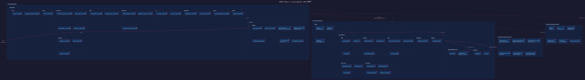

```plantuml
@startuml SASP_PackageDiagram
!theme blueprint
title مخطط الحزم — بنية مكونات نظام SASP

skinparam backgroundColor #1a1a2e
skinparam package {
  BackgroundColor #16213e
  BorderColor #0f3460
  FontColor #e0e0e0
}
skinparam component {
  BackgroundColor #0f3460
  BorderColor #e94560
  FontColor white
}
skinparam ArrowColor #e94560
skinparam note {
  BackgroundColor #0f3460
  BorderColor #e94560
  FontColor white
}

' =============================================
' FLUTTER APP PACKAGES
' =============================================
package "📱 Flutter Application" as FlutterApp {

  package "lib/core" as CorePkg {
    component "app_theme.dart\n(Colors, Fonts, Material3)"
    component "database_helper.dart\n(SQLite CRUD)"
    component "sync_service.dart\n(Dio HTTP)"
    component "config/app_config.dart"
    package "widgets" as WidgetsPkg {
      component "top_app_bar.dart"
      component "bottom_nav_bar.dart"
      component "navigation_drawer.dart"
    }
  }

  package "lib/features" as FeaturesPkg {
    package "auth" {
      component "login_screen.dart"
      component "change_password_dialog.dart"
    }
    package "home" {
      component "home_screen.dart"
    }
    package "curriculum" {
      component "curriculum_options_screen.dart"
      component "books_pdf_screen.dart"
      component "audio_books_screen.dart"
      component "questions_screen.dart"
    }
    package "chat" {
      component "chat_portal_screen.dart"
      component "student_forum_screen.dart"
    }
    package "university" {
      component "results_portal_screen.dart"
      component "payments_portal_screen.dart"
      component "complaints_portal_screen.dart"
    }
    package "ai" {
      component "ai_portal_screen.dart"
      component "ai_tools_screens.dart"
    }
    package "graduation" {
      component "graduation_screen.dart"
      component "research_screen.dart"
    }
    package "admin" {
      component "admin_dashboard_screen.dart"
    }
    package "profile" {
      component "profile_screen.dart"
    }
    package "settings" {
      component "settings_screen.dart"
      component "about_screen.dart"
      component "support_screen.dart"
    }
  }
}

' =============================================
' LARAVEL BACKEND PACKAGES
' =============================================
package "⚙️ Laravel 12 Backend" as LaravelApp {

  package "app/Modules" as ModulesLayer {
    package "Auth" {
      component "LoginController"
      component "AuthService"
      component "User Model"
    }
    package "Student" {
      component "StudentController"
      component "StudentService"
      component "StudentDetail Model"
    }
    package "Chat" {
      component "ConversationController"
      component "Conversation Model"
      component "Message Model"
    }
    package "Curriculum" {
      component "MaterialController"
      component "MaterialService"
      component "Course Model"
    }
    package "University" {
      component "ResultController"
      component "PaymentController"
      component "ComplaintController"
      component "AttendanceController"
    }
    package "Graduation" {
      component "GraduationController"
    }
    package "Setting" {
      component "SettingController"
    }
  }

  package "app/Http/Middleware" as MiddlewareLayer {
    component "CheckRole"
    component "Authenticate\n(Sanctum Token)"
  }

  package "database" as DatabaseLayer {
    component "migrations"
    component "seeders"
  }

  package "routes" as RoutesLayer {
    component "web.php\n(General Web)"
    component "auth.php\n(Web Auth)"
    component "sasp.php\n(SASP Web/API)"
  }
}

' =============================================
' EXTERNAL DEPENDENCIES
' =============================================
package "📦 External Packages (Flutter)" as FlutterDeps {
  component "sqflite\n(SQLite)"
  component "dio\n(HTTP Client)"
  component "google_fonts\n(Typography)"
  component "image_picker\n(Gallery/Camera)"
  component "file_picker\n(File Manager)"
  component "shared_preferences"
}

package "📦 External Packages (Laravel)" as LaravelDeps {
  component "laravel/sanctum\n(API Authentication)"
  component "spatie/laravel-permission\n(Roles & Permissions)"
  component "spatie/laravel-activitylog\n(Activity Log)"
  component "spatie/laravel-backup\n(Backup)"
  component "maatwebsite/excel\n(Excel Export)"
  component "intervention/image\n(Image Processing)"
}

' =============================================
' DEPENDENCIES
' =============================================
ScreensPkg --> CorePkg : uses
CorePkg --> ThemePkg : uses
NetworkPkg --> ModelsPkg : serializes
DBPkg --> ModelsPkg : stores/retrieves

ControllersLayer --> ModelsLayer : manipulates
ControllersLayer --> MiddlewareLayer : protected by
RoutesLayer --> ControllersLayer : routes to
ControllersLayer --> ViewsLayer : renders
ControllersLayer --> StorageLayer : stores files
ModelsLayer --> DatabaseLayer : migrated/seeded

FlutterApp ..> FlutterDeps : depends on
LaravelApp ..> LaravelDeps : depends on

FlutterApp ..> LaravelApp : REST API\n(JSON over HTTP/HTTPS)

@enduml
```

---

# 📌 جدول ملخص المخططات

| # | المخطط | الصيغة | الهدف |
|---|--------|--------|-------|
| 1 | Use-Case Diagram | PlantUML | الفاعلون وحالات الاستخدام |
| 2 | Activity Diagram | PlantUML | سير عملية تسجيل الدخول والمزامنة |
| 3 | Class Diagram | PlantUML | الفئات والعلاقات والتراتبية |
| 4 | Sequence Diagram (Quiz) | PlantUML | تسلسل تنفيذ الاختبار التفاعلي |
| 5 | Sequence Diagram (Sync) | PlantUML | تسلسل رفع المسودات الأوفلاين |
| 6 | State Machine (Complaint) | PlantUML | دورة حياة كائن الشكوى |
| 7 | State Machine (Payment) | PlantUML | دورة حياة كائن الدفعة |
| 8 | ERD Diagram | PlantUML | تصميم قاعدة البيانات الكامل |
| 9 | Deployment Diagram | PlantUML | البنية التحتية وبيئات النشر |
| 10 | Package Diagram | PlantUML | تنظيم الحزم والاعتماديات |

---

## 🛠️ كيفية رسم المخططات

### PlantUML (جميع المخططات العشرة):
1. افتح [plantuml.com/plantuml](https://www.plantuml.com/plantuml/uml/)
2. أو استخدم امتداد (Extension) لـ VS Code باسم **PlantUML**
3. انسخ كود أي مخطط من المخططات العشرة بين `@startuml` و `@enduml` والصقه ليظهر لك المخطط مباشرة.

---

*تم إعداد هذه الوثيقة بتاريخ 27 يونيو 2026 — مشروع SASP — الجامعة*
